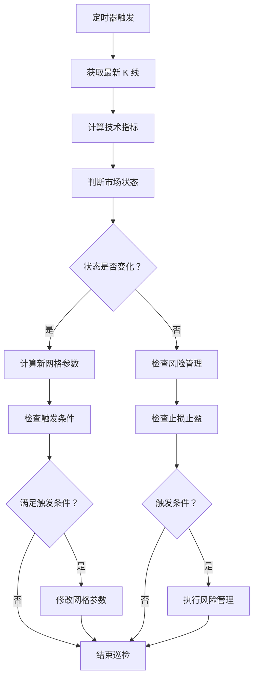
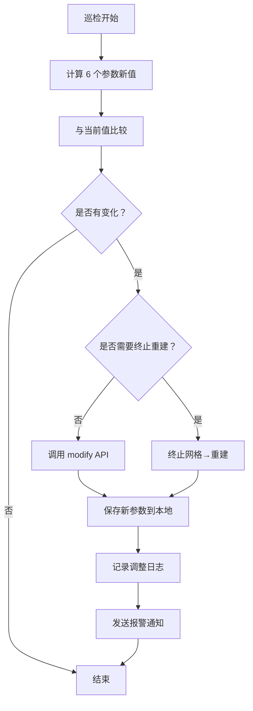

# 系统架构设计文档

## 整体架构概述

自适应趋势网格策略系统采用模块化、事件驱动的异步架构，核心组件包括数据层、策略层、执行层和监控层。

```
┌─────────────────────────────────────────────────────────────┐
│                      自适应趋势网格策略系统                   │
├─────────────────────────────────────────────────────────────┤
│  ┌─────────┐  ┌─────────┐  ┌─────────┐  ┌─────────┐       │
│  │  数据层  │  │  策略层  │  │  执行层  │  │  监控层  │       │
│  └─────────┘  └─────────┘  └─────────┘  └─────────┘       │
└─────────────────────────────────────────────────────────────┘
```

## 组件详细设计

### 1. 数据层 (Data Layer)

#### 1.1 数据获取模块
- **币安 API 客户端** (`binance_client.py`)
  - REST API 封装（K 线、账户、订单、网格）
  - WebSocket 连接管理（实时数据、订单更新）
  - 请求签名、频率限制、错误重试
  - 网格参数修改 API 封装

#### 1.2 数据处理模块
- **K 线数据管理器** (`kline_manager.py`)
  - 多时间框架 K 线数据维护（1H, 4H）
  - 历史数据存储和更新
- **技术指标计算器** (`indicators.py`)
  - ADX、ATR、EMA 计算
  - 多时间框架指标同步
  - ATR 平滑处理（EMA of ATR）

#### 1.3 本地状态存储
- **订单薄镜像** (`order_book.py`)
  - WebSocket 实时更新
  - 本地状态与交易所同步
- **数据库管理器** (`database.py`)
  - SQLite 数据库操作
  - 交易记录、状态历史持久化
  - 网格参数历史、peak_price 记录

### 2. 策略层 (Strategy Layer)

#### 2.1 市场状态识别器
- **状态检测引擎** (`market_state.py`)
  - 多时间框架趋势判断（1H+4H 确认）
  - ADX 阈值和 EMA 交叉分析
  - 状态转换逻辑（震荡↔趋势）

#### 2.2 网格参数计算器
- **参数生成器** (`grid_calculator.py`)
  - 网格边界计算（趋势偏移、ATR 基准）
  - 网格数量动态调整
  - 非对称网格分配
  - **6 个可调整参数计算**:
    - 网格价格范围（上边界/下边界）
    - 网格数量
    - 停止上移价格
    - 停止下移价格
    - 网格终止最低价格
    - 网格终止最高价格
  - **触发条件检测**:
    - ATR 变化检测（±20%）
    - 市场状态变化检测
    - 价格边界检测
    - 突破层数检测
    - 盈利状态检测

#### 2.3 风险管理器
- **风险监控** (`risk_manager.py`)
  - 硬止损和移动止盈计算
  - 紧急暂停条件检测
  - 动态仓位调整
  - **移动止盈管理**:
    - peak_price 记录与更新
    - 回撤计算与触发

### 3. 执行层 (Execution Layer)

#### 3.1 网格管理器
- **网格操作** (`grid_manager.py`)
  - 创建、修改、终止网格
  - 与币安网格 API 交互
  - 原子性操作保证
  - **参数调整执行**:
    - 直接修改 6 个可调整参数
    - 无需终止重建网格
    - 参数调整顺序和并发控制

#### 3.2 订单执行器
- **订单处理** (`order_executor.py`)
  - 滑点保护算法
  - 限价/市价订单执行
  - 订单状态跟踪

#### 3.3 定时任务调度器
- **巡检调度** (`scheduler.py`)
  - 每小时巡检任务
  - 事件触发机制（参数调整触发）
  - 任务优先级管理
  - 参数调整最小间隔控制

### 4. 监控层 (Monitoring Layer)

#### 4.1 日志管理器
- **结构化日志** (`logger.py`)
  - 文件和控制台输出
  - 日志级别和轮转
  - 参数调整日志记录

#### 4.2 报警通知器
- **消息发送** (`notifier.py`)
  - 钉钉/Telegram 集成
  - 事件触发报警
  - 报警模板管理
  - 参数调整通知

#### 4.3 性能监控
- **指标收集** (`metrics.py`)
  - 系统性能指标
  - 策略盈亏统计
  - API 调用监控
  - 参数调整频率统计

## 项目目录结构

```
adaptive_grid_trading/
├── README.md
├── requirements.txt
├── config/
│   ├── config.yaml           # 主配置文件
│   └── logging.yaml          # 日志配置
├── src/
│   ├── __init__.py
│   ├── main.py               # 程序入口
│   ├── data/
│   │   ├── __init__.py
│   │   ├── binance_client.py # 币安 API 客户端
│   │   ├── kline_manager.py  # K 线数据管理
│   │   ├── indicators.py     # 技术指标计算
│   │   └── database.py       # 数据库管理
│   ├── strategy/
│   │   ├── __init__.py
│   │   ├── market_state.py   # 市场状态识别
│   │   ├── grid_calculator.py # 网格参数计算
│   │   └── risk_manager.py   # 风险管理
│   ├── execution/
│   │   ├── __init__.py
│   │   ├── grid_manager.py   # 网格管理
│   │   ├── order_executor.py # 订单执行
│   │   └── scheduler.py      # 任务调度
│   ├── monitoring/
│   │   ├── __init__.py
│   │   ├── logger.py         # 日志管理
│   │   ├── notifier.py       # 报警通知
│   │   └── metrics.py        # 性能监控
│   └── utils/
│       ├── __init__.py
│       ├── config_loader.py  # 配置加载
│       ├── exceptions.py     # 自定义异常
│       └── helpers.py        # 工具函数
├── tests/
│   ├── __init__.py
│   ├── conftest.py
│   ├── test_data/
│   ├── test_strategy/
│   ├── test_execution/
│   └── test_monitoring/
├── scripts/
│   ├── install.sh            # 安装脚本
│   ├── start.sh              # 启动脚本
│   └── backup.sh             # 备份脚本
├── logs/                     # 日志目录
├── data/                     # 数据目录
│   ├── database.db           # SQLite 数据库
│   └── history/              # 历史数据
└── docs/                     # 文档目录
    ├── api.md                # API 文档
    └── deployment.md         # 部署文档
```

## 数据流设计

### 实时数据流


### 控制流（巡检周期）


### 参数调整流程


## 状态管理设计

### 系统状态机
```
        ┌─────────┐
        │  初始化  │
        └────┬────┘
             ↓
        ┌─────────┐
        │  运行中  │◄─────┐
        └────┬────┘      │
             ↓           │
        ┌─────────┐      │
        │  暂停中  │──────┘
        └────┬────┘
             ↓
        ┌─────────┐
        │  已终止  │
        └─────────┘
```

### 市场状态机
```
        ┌─────────┐      ┌─────────┐
        │  震荡    │◄────►│ 上升趋势 │
        └─────────┘      └─────────┘
             ↑                 ↑
             └───────┬───────┘
                     ↓
               ┌─────────┐
               │ 下降趋势 │
               └─────────┘
```

### 移动止盈状态机
```
        ┌─────────┐
        │  未启动  │
        └────┬────┘
             ↓ (总盈利>15%)
        ┌─────────┐
        │  已启动  │◄─────┐
        └────┬────┘      │
             │           │
             ├─记录 peak_price
             │           │
             ↓ (价格回撤)│
        ┌─────────┐      │
        │  触发止盈│──────┘
        └─────────┘
```

## 接口设计

### 币安 API 接口
```python
class BinanceClient:
    async def get_klines(self, symbol: str, interval: str, limit: int = 100) -> List[Dict]
    async def create_grid(self, params: Dict) -> Dict
    async def terminate_grid(self, grid_id: str) -> Dict
    async def modify_grid(self, grid_id: str, params: Dict) -> Dict  # 修改网格参数
    async def get_account_info(self) -> Dict
    async def subscribe_market_data(self, callback: Callable) -> None
```

### 策略接口
```python
class MarketStateDetector:
    async def detect(self, klines_1h: pd.DataFrame, klines_4h: pd.DataFrame) -> MarketState
    
class GridParameterCalculator:
    def calculate(self, price: float, atr: float, state: MarketState) -> GridParameters
    def calculate_stop_prices(self, grid_params: Dict, market_data: Dict) -> StopPrices
    def calculate_terminate_prices(self, grid_params: Dict, pnl: float) -> TerminatePrices
    
class RiskManager:
    async def check_conditions(self, account: AccountInfo, positions: List[Position]) -> RiskAction
    def update_peak_price(self, current_price: float, pnl_percent: float) -> Optional[float]
```

### 执行接口
```python
class GridManager:
    async def create_grid(self, params: GridParameters) -> str
    async def terminate_grid(self, grid_id: str) -> bool
    async def modify_grid(self, grid_id: str, new_params: Dict) -> bool  # 直接修改参数
    async def switch_grid(self, old_params: GridParameters, new_params: GridParameters) -> bool
```

## 配置设计

### 配置文件结构 (config.yaml)
```yaml
# 交易所配置
exchange:
  api_key: "${BINANCE_API_KEY}"
  api_secret: "${BINANCE_API_SECRET}"
  testnet: false
  symbol: "BTCUSDT"
  contract_type: "PERPETUAL"

# 策略参数
strategy:
  indicators:
    adx_period: 14
    adx_trend_threshold: 25
    adx_weak_threshold: 20
    ema_fast: 20
    ema_slow: 50
    atr_period: 14
    atr_smoothing: 14  # EMA 平滑周期
  
  grid:
    base_grid_count: 30
    min_grid_count: 20
    max_grid_count: 50
    base_atr_window: 90  # 天
    
  risk:
    hard_stop_loss: -0.08  # -8%
    trailing_profit_start: 0.15  # 15%
    trailing_profit_retrace: 0.5  # 50%
    emergency_break_layers: 3
    emergency_break_window: 300  # 秒
    position_coefficient: 0.5

# 执行配置
execution:
  inspection_interval: 3600  # 秒
  atr_change_threshold: 0.2  # 20%
  parameter_adjustment:
    min_interval: 14400  # 最小调整间隔（秒），避免频繁调整
    enabled: true  # 是否启用自动参数调整
  slippage_protection:
    limit_order_timeout: 3
    optimal_price_timeout: 2
    market_order_fallback: true

# 监控配置
monitoring:
  logging:
    level: "INFO"
    file: "logs/adaptive_grid.log"
    max_size: 10485760  # 10MB
    
  alert:
    enabled: true
    dingding_webhook: "${DINGDING_WEBHOOK}"
    telegram_bot_token: "${TELEGRAM_BOT_TOKEN}"
    telegram_chat_id: "${TELEGRAM_CHAT_ID}"
    alert_on_parameter_adjustment: true  # 参数调整时报警
```

## 数据库设计

### 表结构

#### 1. 交易记录表 (trades)
```sql
CREATE TABLE trades (
    id INTEGER PRIMARY KEY AUTOINCREMENT,
    trade_id TEXT UNIQUE,
    symbol TEXT NOT NULL,
    side TEXT NOT NULL,  -- BUY/SELL
    price REAL NOT NULL,
    quantity REAL NOT NULL,
    fee REAL,
    fee_asset TEXT,
    timestamp DATETIME NOT NULL,
    grid_id TEXT,
    created_at DATETIME DEFAULT CURRENT_TIMESTAMP
);
```

#### 2. 网格历史表 (grid_history)
```sql
CREATE TABLE grid_history (
    id INTEGER PRIMARY KEY AUTOINCREMENT,
    grid_id TEXT UNIQUE,
    symbol TEXT NOT NULL,
    upper_price REAL NOT NULL,
    lower_price REAL NOT NULL,
    grid_count INTEGER NOT NULL,
    investment REAL NOT NULL,
    state TEXT NOT NULL,  -- CREATED, RUNNING, TERMINATED
    market_state TEXT,  -- RANGING, UPTREND, DOWNTREND
    created_at DATETIME NOT NULL,
    terminated_at DATETIME,
    pnl REAL
);
```

#### 3. 系统状态表 (system_status)
```sql
CREATE TABLE system_status (
    id INTEGER PRIMARY KEY AUTOINCREMENT,
    timestamp DATETIME NOT NULL,
    market_state TEXT NOT NULL,
    price REAL NOT NULL,
    atr REAL NOT NULL,
    adx REAL NOT NULL,
    ema_fast REAL NOT NULL,
    ema_slow REAL NOT NULL,
    total_pnl REAL,
    account_balance REAL
);
```

#### 4. 风险事件表 (risk_events)
```sql
CREATE TABLE risk_events (
    id INTEGER PRIMARY KEY AUTOINCREMENT,
    event_type TEXT NOT NULL,  -- STOP_LOSS, TRAILING_PROFIT, EMERGENCY_PAUSE
    trigger_price REAL,
    trigger_pnl REAL,
    action_taken TEXT,
    timestamp DATETIME NOT NULL,
    details TEXT
);
```

#### 5. 网格参数调整历史表 (grid_parameter_adjustments)
```sql
CREATE TABLE grid_parameter_adjustments (
    id INTEGER PRIMARY KEY AUTOINCREMENT,
    grid_id TEXT NOT NULL,
    timestamp DATETIME NOT NULL,
    parameter_name TEXT NOT NULL,  -- upper_price, lower_price, grid_count, etc.
    old_value REAL,
    new_value REAL,
    trigger_reason TEXT,  -- ATR_CHANGE, STATE_CHANGE, EDGE_APPROACH, etc.
    market_state TEXT,
    atr_value REAL,
    details TEXT
);
```

#### 6. 移动止盈状态表 (trailing_profit_state)
```sql
CREATE TABLE trailing_profit_state (
    id INTEGER PRIMARY KEY AUTOINCREMENT,
    grid_id TEXT NOT NULL,
    activated_at DATETIME,
    peak_price REAL,
    peak_pnl_percent REAL,
    current_stop_price REAL,
    last_updated DATETIME NOT NULL
);
```

## 错误处理设计

### 异常层次结构
```
BaseError
├── ExchangeError
│   ├── APIError
│   ├── NetworkError
│   └── RateLimitError
├── StrategyError
│   ├── ParameterError
│   └── StateError
├── ExecutionError
│   ├── OrderError
│   └── GridError
└── MonitoringError
    └── AlertError
```

### 重试机制
- **网络错误**: 指数退避重试（最大 3 次）
- **API 限频**: 等待后重试
- **临时错误**: 延迟后重试
- **永久错误**: 记录日志并报警

## 性能考量

### 内存管理
- 限制历史数据缓存大小
- 使用生成器处理大数据
- 定期清理过期数据

### 计算优化
- 指标计算结果缓存
- 批量数据处理
- 异步并行计算

### I/O 优化
- 数据库连接池
- 文件写入缓冲
- 网络连接复用

## 安全设计

### 敏感信息保护
- API 密钥环境变量存储
- 配置文件加密选项
- 日志脱敏处理

### 操作安全
- 关键操作确认机制
- 操作审计日志
- 权限最小化原则

### 数据安全
- 数据库备份机制
- 交易记录完整性验证
- 状态恢复验证
