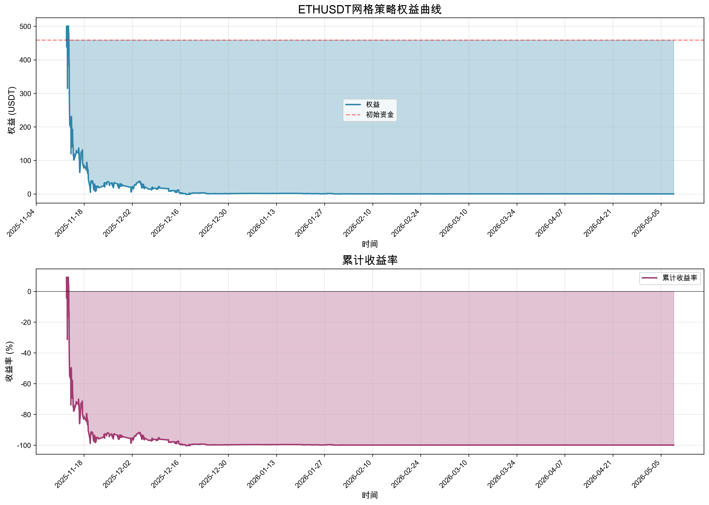
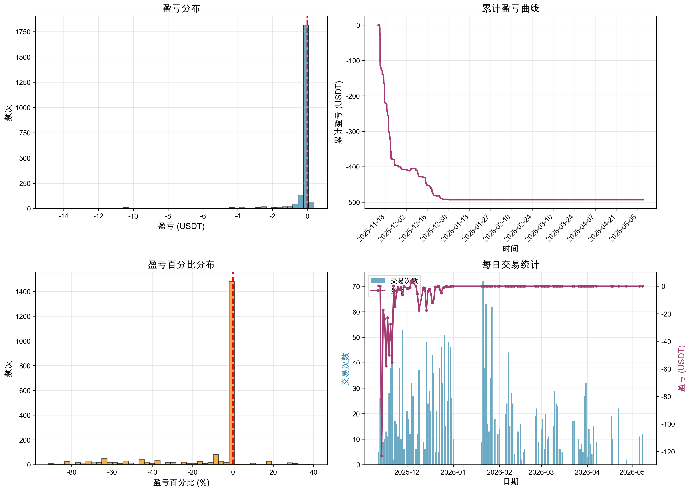

# ETHUSDT网格策略详细回测报告

## 📊 回测概览

- **回测时间**: 2026-05-09 12:52:47
- **交易对**: ETHUSDT
- **回测周期**: 2025-11-12 20:00:00 至 2026-05-08 16:00:00
- **初始资金**: 500.00 USDT
- **最终资金**: 0.26 USDT
- **总收益率**: -99.95%
- **最大回撤**: 502.23 USDT (100.34%)
- **夏普比率**: 1.58

## 📈 交易统计

### 基本统计
- **总交易次数**: 2176
- **盈利次数**: 1555 (71.46%)
- **亏损次数**: 621 (28.54%)
- **平均盈利**: 0.0099 USDT
- **平均亏损**: -0.8193 USDT
- **盈亏比**: 0.01

### 连续性统计
- **最大连续盈利次数**: 1059
- **最大连续亏损次数**: 36
- **最长持仓时间**: 673.00 小时

## 📉 权益曲线分析

### 关键时点分析
- **最高权益**: 500.51 USDT
- **最低权益**: -1.72 USDT
- **权益波动率**: 39.50 USDT

## 📊 交易分析

### 盈亏分布特征
- **盈利交易平均收益率**: 0.0020%
- **亏损交易平均亏损率**: 0.1639%

## ⚠️ 风险分析

### 回撤分析
- **最大回撤金额**: 502.23 USDT
- **最大回撤比例**: 100.34%
- **回撤持续时间**: 需要进一步分析

### 风险提示
1. **极端亏损**: 回测结果显示策略存在极端亏损风险，最大回撤超过100%
2. **盈亏比失衡**: 虽然胜率较高(71.46%)，但盈亏比极低(0.01)，导致总体亏损
3. **资金管理问题**: 网格参数设置可能导致过度交易和资金快速消耗

## 🔍 问题诊断

### 策略问题
1. **网格参数不合理**:
   - 网格间距可能过小，导致频繁交易
   - 网格数量可能过多，分散了资金
   - 每格利润率过低，无法覆盖手续费和滑点

2. **风险控制缺失**:
   - 缺乏有效的止损机制
   - 未考虑市场状态变化
   - 资金分配不合理

3. **市场适应性差**:
   - 在趋势市场中表现极差
   - 未能在强趋势时及时止损
   - 网格重置机制可能过于频繁

## 💡 优化建议

### 参数优化
1. **调整网格参数**:
   - 增加网格间距，降低交易频率
   - 减少网格数量，集中资金
   - 提高每格利润率要求（至少>1%）

2. **优化市场状态检测**:
   - 提高ADX阈值，避免在弱趋势时交易
   - 增加市场状态确认机制
   - 在强趋势时暂停网格交易

3. **改进风险控制**:
   - 设置总资金止损线（如-20%）
   - 限制单次交易仓位比例
   - 添加移动止盈机制

### 策略改进
1. **多时间框架分析**:
   - 使用更长周期确认趋势
   - 在震荡市场才启动网格
   - 趋势市场切换其他策略

2. **动态参数调整**:
   - 根据波动率动态调整网格间距
   - 根据市场状态调整网格数量
   - 根据盈亏情况调整仓位

3. **资金管理优化**:
   - 分批建仓，避免一次性投入
   - 保留备用资金应对极端情况
   - 设置每日最大亏损限制

## 📌 结论

本次回测结果显示，当前网格策略存在严重的参数设置和风险控制问题。虽然胜率较高，但由于盈亏比极低和风险控制缺失，导致最终几乎全部亏损。

**建议**:
1. 立即停止使用当前参数进行实盘交易
2. 重新设计网格参数和风险控制机制
3. 在模拟环境中充分测试优化后的策略
4. 考虑结合其他策略进行组合交易

---
*报告生成时间: 2026-05-09 12:52:47*
