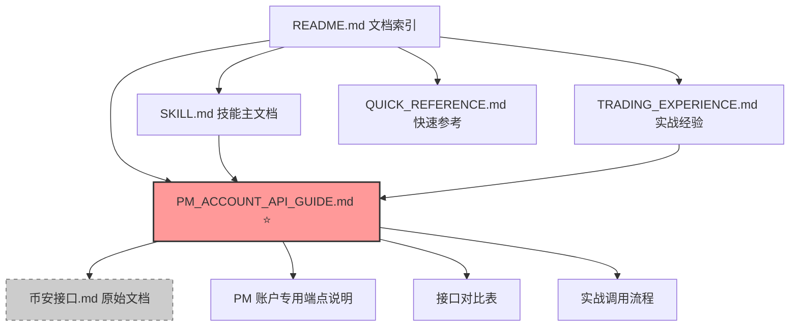

# 币安接口文档整合说明

## 📦 文档整合完成

**日期**: 2026-04-08  
**版本**: v2.2.0

---

## 🎯 整合目标

将原始的 `币安接口.md` 接口文档整合到 skill 文档体系中，并：

1. ✅ **强调 PM 账户对接** - 所有接口都标注 PM 账户兼容性
2. ✅ **区分传统账户 vs PM 账户** - 清晰的接口对比
3. ✅ **保持可更新性** - 原始接口文档可独立更新
4. ✅ **实战导向** - 添加实际调用流程和注意事项

---

## 📁 新增文档

### 1. PM_ACCOUNT_API_GUIDE.md ⭐ 核心文档

**完整的 PM 账户 API 接口文档**,包含:

#### 内容结构
- **接口分类**: 赚币接口、资金划转、U 本位合约、条件单
- **PM 账户标注**: 每个接口都标注 PM 账户兼容性
- **接口对比表**: 传统账户 vs PM 账户端点映射
- **特殊注意事项**: PM 账户的杠杆限制、持仓方向、保证金计算
- **实战调用流程**: 开仓流程、延迟控制、精度处理
- **原始接口文档**: `币安接口.md` 的 PM 账户注解版

#### PM 账户专用端点标注
```
✅ PM 账户专用：/papi/v1/um/order
✅ PM 账户专用：/papi/v1/um/conditional/order
⚠️ PM 账户特殊：MAIN_PORTFOLIO_MARGIN (资金划转类型)
✅ 通用接口：/sapi/v1/simple-earn/flexible/list
```

#### 接口对比表示例
| 功能 | 传统账户端点 | PM 账户端点 | 说明 |
|------|-------------|-----------|------|
| 合约下单 | `/fapi/v1/order` | `/papi/v1/um/order` | PM 账户必须用 papi |
| 条件单 | `/fapi/v1/conditional/order` | `/papi/v1/um/conditional/order` | PM 账户必须用 papi |
| 资金划转 | `MAIN_UMFUTURE` | `MAIN_PORTFOLIO_MARGIN` | PM 账户用统一账户 |

#### PM 账户特殊说明
- **杠杆限制**: 同一交易对只能有一个杠杆值
- **持仓方向**: 单向持仓使用 BOTH，双向持仓使用 LONG/SHORT
- **保证金计算**: 组合保证金 = Σ(各头寸风险) - 组合折扣
- **资金划转**: 现货 ↔ 统一账户，自动作为所有衍生品保证金

---

## 🔄 文档更新

### 1. README.md - 文档索引

**新增章节**:
```markdown
### PM 账户专用 ⭐ 重要

7. **PM_ACCOUNT_API_GUIDE.md** - PM 账户 API 接口文档
   - 完整接口文档 (包含原始 币安接口.md 内容)
   - PM 账户专用端点 (/papi/v1/* vs /fapi/v1/*)
   - 接口对比表 (传统账户 vs PM 账户)
   - PM 账户特殊注意事项
   - 实战调用流程
   - 原始接口文档 (币安接口.md 整合版)
```

**快速查找更新**:
```markdown
#### 了解 PM 账户
→ 查看 SKILL.md 的"PM 账户（统一账户）重要说明"章节
→ **重点查看**: PM_ACCOUNT_API_GUIDE.md (PM 账户专用接口文档)
```

**文档对比表更新**:
| 文档 | 用途 | 长度 | 适合人群 |
|------|------|------|---------|
| **PM_ACCOUNT_API_GUIDE.md** | **PM 账户接口文档** | **长** | **PM 账户对接 (重要)** |

---

### 2. SKILL.md - 技能主文档

**新增提示框**:
```markdown
## PM 账户（统一账户）重要说明

> **⭐ 完整接口文档**: 查看 PM_ACCOUNT_API_GUIDE.md 获取详细的 PM 账户 API 接口文档，
> 包含原始接口文档、接口对比表、特殊注意事项和实战调用流程。
```

**接口对比表扩展**:
```markdown
| 功能 | PM 账户 | 传统合约账户 |
|------|--------|-------------|
| 账户信息 | /papi/v1/account | /fapi/v2/account |
| 下单 | /papi/v1/um/order | /fapi/v1/order |
| 条件单 | /papi/v1/um/conditional/order | /fapi/v1/conditional/order |
| 持仓查询 | /papi/v1/um/positionRisk | /fapi/v2/positionRisk |
| 资金划转 | MAIN_PORTFOLIO_MARGIN | MAIN_UMFUTURE |
```

---

## 📂 文档结构

### 更新后的完整结构

```
binance-api-client/
├── README.md                           # 文档索引 (已更新)
├── SKILL.md                            # 技能主文档 (已更新)
├── QUICK_START.md                      # 快速开始指南
├── PM_ACCOUNT_API_GUIDE.md             # ⭐ 新增：PM 账户接口文档
├── TRADING_EXPERIENCE.md               # 实战经验总结
├── QUICK_REFERENCE.md                  # 快速参考卡片
├── SKILL_UPDATE_SUMMARY.md             # 技能更新总结
├── STOP_LOSS_TAKE_PROFIT_GUIDE.md      # 止损止盈指南
├── 币安接口.md                         # 原始接口文档 (保留)
└── DOCUMENTATION_UPDATE_NOTES.md       # 本文档
```

---

## 🔗 文档关系



**说明**:
- **PM_ACCOUNT_API_GUIDE.md** 是 PM 账户对接的核心文档
- **币安接口.md** 作为原始参考资料保留，用虚线连接表示可独立更新
- 所有 PM 账户相关问题优先查阅 PM_ACCOUNT_API_GUIDE.md

---

## 🎯 使用场景

### 场景 1: 新开发者对接 PM 账户
1. 查看 [README.md](README.md) 了解文档结构
2. 阅读 [SKILL.md](SKILL.md) 了解基本用法
3. **重点学习** [PM_ACCOUNT_API_GUIDE.md](PM_ACCOUNT_API_GUIDE.md) 掌握 PM 账户特殊性
4. 参考 [QUICK_REFERENCE.md](QUICK_REFERENCE.md) 快速查阅精度和错误码

### 场景 2: 遇到接口问题
1. 查看 [TRADING_EXPERIENCE.md](TRADING_EXPERIENCE.md) 的实战经验
2. 对比 [PM_ACCOUNT_API_GUIDE.md](PM_ACCOUNT_API_GUIDE.md) 的接口说明
3. 检查 [QUICK_REFERENCE.md](QUICK_REFERENCE.md) 的错误码速查

### 场景 3: 币安 API 更新
1. 更新 `币安接口.md` 原始文档
2. 在 [PM_ACCOUNT_API_GUIDE.md](PM_ACCOUNT_API_GUIDE.md) 中添加 PM 账户标注
3. 更新 [SKILL_UPDATE_SUMMARY.md](SKILL_UPDATE_SUMMARY.md) 记录变更

---

## 📝 文档维护策略

### 原始接口文档 (`币安接口.md`)
- **定位**: 币安官方接口的原始记录
- **更新**: 随币安官方文档更新而更新
- **格式**: 保持简洁，仅记录接口定义
- **维护**: 可以独立更新，不影响其他文档

### PM 账户接口文档 (`PM_ACCOUNT_API_GUIDE.md`)
- **定位**: PM 账户对接的完整指南
- **更新**: 基于原始文档添加 PM 账户注解
- **格式**: 实战导向，包含对比表、流程、注意事项
- **维护**: 当原始文档更新时，同步更新 PM 账户标注

### 实战经验文档 (`TRADING_EXPERIENCE.md`)
- **定位**: 实战中遇到的问题和解决方案
- **更新**: 遇到新问题时更新
- **格式**: 案例驱动，包含代码示例
- **维护**: 持续积累，形成知识库

---

## ✅ 完成检查清单

- [x] 创建 PM_ACCOUNT_API_GUIDE.md (PM 账户接口文档)
- [x] 整合 `币安接口.md` 内容到 PM_ACCOUNT_API_GUIDE.md
- [x] 添加 PM 账户专用端点标注
- [x] 创建接口对比表 (传统账户 vs PM 账户)
- [x] 添加 PM 账户特殊注意事项
- [x] 添加实战调用流程
- [x] 更新 README.md 文档索引
- [x] 更新 SKILL.md 主文档引用
- [x] 创建文档更新说明 (本文档)
- [x] 保留原始 `币安接口.md` 文件

---

## 🎉 总结

通过整合 `币安接口.md` 到 skill 文档体系:

1. **PM 账户强调**: 所有接口都明确标注 PM 账户兼容性
2. **可维护性**: 原始文档可独立更新，PM 账户文档同步更新
3. **实战导向**: 添加接口对比、特殊注意事项、调用流程
4. **文档导航**: README.md 提供清晰的查找路径

**核心文档**: [PM_ACCOUNT_API_GUIDE.md](PM_ACCOUNT_API_GUIDE.md) ⭐

---

**维护者**: Trading System Team  
**创建日期**: 2026-04-08  
**版本**: v2.2.0
