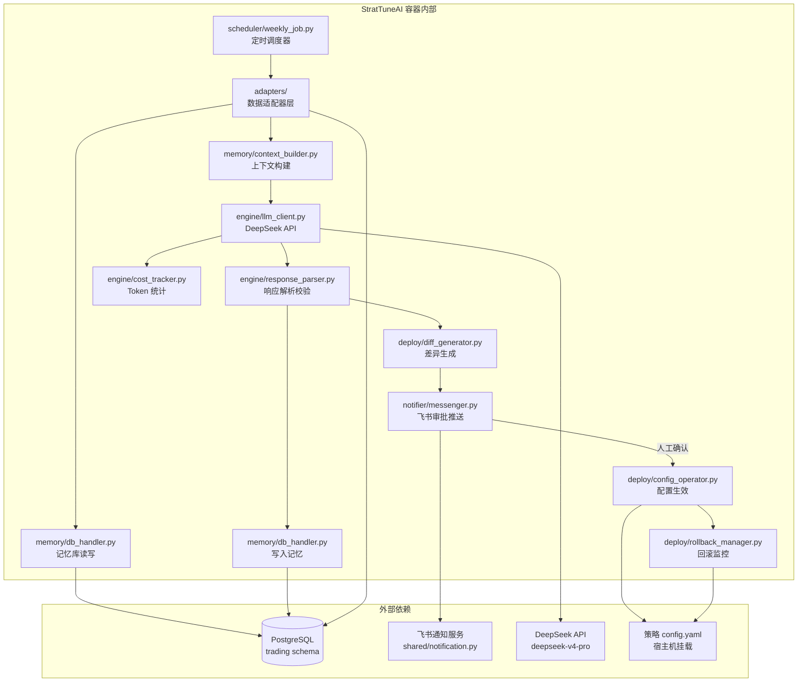
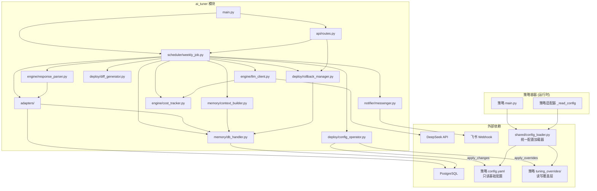

# StratTuneAI 多策略AI调优系统 -- 架构设计文档

**文档版本**: v2.0
**创建日期**: 2026-06-21
**作者**: 后端架构师
**关联文档**: [PRD-多策略AI调优系统](../requirements/StratTuneAI/PRD-多策略AI调优系统.md) | [多策略AI调优系统技术路线](../requirements/StratTuneAI/多策略AI调优系统技术路线.md)

---

## 文档修订历史

| 版本 | 日期 | 修改人 | 修改内容 |
|------|------|--------|----------|
| v1.0 | 2026-06-21 | 后端架构师 | 初始版本，完整架构设计 |
| v2.0 | 2026-08-11 | 代码图书馆长 | 引入 AI 调优覆盖层（tuning_overrides）机制，新增 shared/config_loader.py，更新 ConfigOperator 和回滚流程 |

---

## 1. 总体架构概述

### 1.1 架构定位

StratTuneAI 是现有量化交易系统的一个**独立子系统**，以独立 Docker 容器运行，不侵入现有策略容器的运行逻辑。它通过共享 PostgreSQL 数据库和飞书通知服务与主系统交互，实现"采集-分析-建议-审批-生效"的完整闭环。

### 1.2 五层闭环架构

```
┌──────────────────────────────────────────────────────────────────────────┐
│                         StratTuneAI 容器                                   │
│                                                                            │
│  ┌────────────┐    ┌────────────┐    ┌────────────┐    ┌────────────┐    │
│  │  scheduler  │───>│  adapters  │───>│   memory   │───>│   engine   │    │
│  │  定时调度    │    │  数据适配   │    │  记忆管理   │    │  AI 引擎   │    │
│  │  APScheduler│    │ BaseAdapter│    │ DB+Context │    │ DeepSeek   │    │
│  └────────────┘    └────────────┘    └────────────┘    └─────┬──────┘    │
│                                                               │           │
│                                          ┌────────────────────┘           │
│                                          ▼                                │
│  ┌────────────┐    ┌────────────┐    ┌────────────┐                      │
│  │  scheduler  │<───│   deploy   │<───│  notifier   │                      │
│  │  效果追踪    │    │  配置生效   │    │  飞书审批    │                      │
│  │  (下周验证) │    │ + 回滚管理  │    │  交互卡片    │                      │
│  └────────────┘    └────────────┘    └────────────┘                      │
│                                                                            │
└──────────────────────────────────────────────────────────────────────────┘
         │                  │                  │
         ▼                  ▼                  ▼
┌─────────────┐   ┌──────────────┐   ┌──────────────┐
│  PostgreSQL  │   │ 策略 config   │   │  飞书 Webhook │
│  trading     │   │ .yaml 文件    │   │  通知服务     │
│  schema      │   │ (宿主机挂载)  │   │               │
└─────────────┘   └──────────────┘   └──────────────┘
```

### 1.3 模块关系图



### 1.4 与现有系统的关系

| 维度 | 关系 | 说明 |
|------|------|------|
| 代码层面 | 独立模块 | `ai_tuner/` 在项目根目录，通过 `sys.path` 引用 `shared/` |
| 数据库 | 共享 Schema | 使用 `trading` schema，新建 `strategy_memory` 表 |
| 通知 | 复用服务 | 复用 `shared/notification.py`，新增调优专用 Webhook 环境变量 |
| 配置 | 覆盖层机制 | 策略 `config.yaml` 只读（基础设计参数），AI 调优参数写入 `tuning_overrides/` 覆盖层目录，通过 `shared/config_loader.py` 自动合并 |
| 部署 | 独立容器 | 在 `docker-compose.yml` 中新增 `ai-tuner` 服务 |
| 运行时 | 完全解耦 | 策略容器无需感知 ai_tuner 的存在 |

---

## 2. 数据库设计

### 2.1 新增表：strategy_memory

在现有 `trading` schema 下新增一张表，用于存储每次 AI 调优的完整记录。

#### 2.1.1 完整 DDL

```sql
-- ============================================
-- StratTuneAI 策略调优记忆表
-- 所属 Schema: trading
-- ============================================

CREATE TABLE IF NOT EXISTS trading.strategy_memory (
    -- 主键
    id              SERIAL PRIMARY KEY,

    -- 策略标识（与适配器 strategy_id 一致）
    strategy_id     VARCHAR(32) NOT NULL,

    -- 当时的策略版本号
    version         VARCHAR(20),

    -- AI 生成的 50 字核心摘要（用于滑动窗口上下文，最大 200 字符）
    summary         VARCHAR(200),

    -- 完整的 StrategyReport JSON（备查）
    full_report     JSONB,

    -- AI 原始输出的 JSON 建议
    -- 结构: {"reasons": "...", "summary": "...", "adjustments": {...}, "expected_impact": "...", "confidence": 0.75}
    ai_suggestions  JSONB,

    -- 审批与生效状态
    is_applied      BOOLEAN NOT NULL DEFAULT FALSE,
    approved_by     VARCHAR(64),
    approved_at     TIMESTAMP,
    rejected_at     TIMESTAMP,
    expired_at      TIMESTAMP,

    -- 审批状态枚举: pending / confirmed / rejected / expired / applied / rolled_back
    approval_status VARCHAR(20) NOT NULL DEFAULT 'pending',

    -- 回滚相关
    backup_path     VARCHAR(512),
    is_rolled_back  BOOLEAN NOT NULL DEFAULT FALSE,
    rolled_back_at  TIMESTAMP,

    -- 效果追踪（下周周报时回填）
    post_win_rate   DECIMAL(5,2),
    post_total_pnl  DECIMAL(20,8),
    effect_notes    TEXT,

    -- 时间戳
    created_at      TIMESTAMP NOT NULL DEFAULT NOW(),
    updated_at      TIMESTAMP NOT NULL DEFAULT NOW()
);

-- ============================================
-- 注释
-- ============================================
COMMENT ON TABLE trading.strategy_memory IS 'StratTuneAI 策略调优记忆表，记录每次 AI 调优的完整生命周期';
COMMENT ON COLUMN trading.strategy_memory.strategy_id IS '策略标识，如 btc_eth、new_coin';
COMMENT ON COLUMN trading.strategy_memory.version IS '当时的策略版本号';
COMMENT ON COLUMN trading.strategy_memory.summary IS 'AI 生成的 50 字核心摘要，用于滑动窗口上下文';
COMMENT ON COLUMN trading.strategy_memory.full_report IS '完整的 StrategyReport JSON，备查';
COMMENT ON COLUMN trading.strategy_memory.ai_suggestions IS 'AI 原始输出的 JSON 建议';
COMMENT ON COLUMN trading.strategy_memory.is_applied IS '是否已确认并生效';
COMMENT ON COLUMN trading.strategy_memory.approval_status IS '审批状态: pending/confirmed/rejected/expired/applied/rolled_back';
COMMENT ON COLUMN trading.strategy_memory.post_win_rate IS '调优后一周胜率（回填）';
COMMENT ON COLUMN trading.strategy_memory.effect_notes IS '效果追踪备注';
```

#### 2.1.2 索引设计

```sql
-- 核心查询索引：按策略ID + 创建时间倒序（滑动窗口查询）
CREATE INDEX IF NOT EXISTS idx_memory_strategy_time
    ON trading.strategy_memory(strategy_id, created_at DESC);

-- 已生效记录查询（上下文构建仅取 is_applied=true 的记录）
CREATE INDEX IF NOT EXISTS idx_memory_strategy_applied
    ON trading.strategy_memory(strategy_id, is_applied, created_at DESC)
    WHERE is_applied = TRUE;

-- 待审批记录查询（审批超时检测）
CREATE INDEX IF NOT EXISTS idx_memory_pending
    ON trading.strategy_memory(approval_status, created_at)
    WHERE approval_status = 'pending';

-- 审批人查询（按审批人追溯历史）
CREATE INDEX IF NOT EXISTS idx_memory_approved_by
    ON trading.strategy_memory(approved_by, approved_at DESC)
    WHERE approved_by IS NOT NULL;

-- 创建时间范围查询（归档/清理）
CREATE INDEX IF NOT EXISTS idx_memory_created_at
    ON trading.strategy_memory(created_at DESC);
```

#### 2.1.3 审批状态机

```
                        ┌──────────┐
                        │ pending   │  ← AI 建议生成后，初始状态
                        └────┬─────┘
                             │
              ┌──────────────┼──────────────┐
              ▼              ▼              ▼
        ┌──────────┐  ┌──────────┐  ┌──────────┐
        │confirmed │  │ rejected │  │ expired  │
        └────┬─────┘  └──────────┘  └──────────┘
             │
             ▼
        ┌──────────┐
        │ applied  │  ← 配置已生效
        └────┬─────┘
             │
             ▼
        ┌──────────────┐
        │ rolled_back  │  ← 自动回滚触发
        └──────────────┘
```

**状态转换规则**:

| 当前状态 | 触发事件 | 目标状态 | 条件 |
|----------|----------|----------|------|
| pending | 管理员确认 | confirmed | 48h 内 |
| pending | 管理员拒绝 | rejected | 48h 内 |
| pending | 超时 48h | expired | 自动 |
| confirmed | 配置写入成功 | applied | 自动 |
| applied | 自动回滚触发 | rolled_back | 自动 |
| confirmed | 配置写入失败 | pending | 回退（需人工介入） |

#### 2.1.4 数据生命周期

```
活跃期 (0-3个月)
  │  is_applied=true 的记录参与滑动窗口上下文构建
  │  approval_status 用于审批流程
  │
  ▼
归档期 (3-12个月)
  │  不参与滑动窗口（仅保留统计聚合值）
  │  数据保留在表中，按 created_at 过滤
  │
  ▼
清理期 (>12个月)
  │  按策略定期归档到冷存储（可选）
  │  保留近 12 个月数据在热表中
```

---

## 3. 各模块接口定义

### 3.1 数据模型（Pydantic Schemas）

#### 3.1.1 核心数据模型

```python
from pydantic import BaseModel, Field, validator
from datetime import datetime
from decimal import Decimal
from typing import Optional, Dict, List


# ============================================
# 策略报告数据模型
# ============================================

class StrategyMeta(BaseModel):
    """策略元信息"""
    strategy_id: str = Field(..., description="策略标识，如 btc_eth")
    strategy_name: str = Field(..., description="策略显示名称")
    version: str = Field(..., description="策略版本号")
    running_days: int = Field(..., ge=0, description="累计运行天数")
    week_start: str = Field(..., description="周报起始日期 YYYY-MM-DD")
    week_end: str = Field(..., description="周报结束日期 YYYY-MM-DD")


class PerformanceMetrics(BaseModel):
    """绩效指标"""
    order_count: int = Field(0, ge=0, description="本周委托笔数")
    fill_count: int = Field(0, ge=0, description="本周成交笔数")
    wins: int = Field(0, ge=0, description="盈利笔数")
    losses: int = Field(0, ge=0, description="亏损笔数")
    win_rate: float = Field(0.0, ge=0.0, le=100.0, description="胜率（百分比）")
    total_pnl: float = Field(0.0, description="总盈亏（USDT）")
    avg_win: float = Field(0.0, description="平均盈利（USDT）")
    avg_loss: float = Field(0.0, description="平均亏损（USDT）")
    profit_factor: float = Field(0.0, ge=0.0, description="盈亏比")
    sharpe_approx: Optional[float] = Field(None, description="夏普近似值")


class RiskMetrics(BaseModel):
    """风险指标"""
    max_consecutive_losses: int = Field(0, ge=0, description="本周最大连续亏损")
    current_drawdown_pct: float = Field(0.0, ge=0.0, description="当前回撤百分比")
    is_paused: bool = Field(False, description="是否处于熔断/暂停状态")
    pause_reason: str = Field("", description="暂停原因")
    daily_loss_limit_hit: bool = Field(False, description="是否触发日亏损限额")


class DistributionMetrics(BaseModel):
    """分布指标"""
    signal_grade_dist: Dict[str, int] = Field(default_factory=dict, description="信号等级分布")
    holding_hours_avg: float = Field(0.0, description="平均持仓时长（小时）")
    holding_hours_max: float = Field(0.0, description="最大持仓时长（小时）")
    symbol_trade_dist: Dict[str, int] = Field(default_factory=dict, description="各币种交易笔数分布")


class StrategyReport(BaseModel):
    """标准化策略报告（所有适配器统一输出）"""
    meta: StrategyMeta
    performance: PerformanceMetrics
    risk: RiskMetrics
    distribution: DistributionMetrics
    anomalies: List[str] = Field(default_factory=list, description="异常事件列表")
    error: Optional[str] = Field(None, description="采集错误信息（如有）")


# ============================================
# AI 调优建议数据模型
# ============================================

class ParamAdjustment(BaseModel):
    """单个参数调整"""
    param_path: str = Field(..., description="参数路径，如 risk.stop_loss_atr_multiplier")
    from_value: float = Field(..., description="当前值")
    to_value: float = Field(..., description="建议值")
    reason: str = Field("", description="调整理由")


class AITuningSuggestion(BaseModel):
    """AI 调优建议（AI 输出的 JSON 解析结果）"""
    reasons: str = Field(..., description="详细分析本周策略表现的原因")
    summary: str = Field(..., max_length=200, description="一句话总结（50字以内）")
    adjustments: Dict[str, Dict[str, float]] = Field(
        default_factory=dict,
        description="调整映射 {param_path: {from: 旧值, to: 新值}}"
    )
    expected_impact: str = Field(..., description="预期调优后的效果")
    confidence: float = Field(..., ge=0.0, le=1.0, description="置信度")

    @validator('adjustments')
    def validate_adjustments(cls, v):
        """最多调整 3 个参数"""
        if len(v) > 3:
            raise ValueError(f"单次调整参数数量不能超过 3 个，当前: {len(v)}")
        return v


# ============================================
# 记忆记录数据模型
# ============================================

class MemoryRecord(BaseModel):
    """记忆库记录"""
    id: Optional[int] = None
    strategy_id: str
    version: Optional[str] = None
    summary: Optional[str] = None
    full_report: Optional[Dict] = None
    ai_suggestions: Optional[Dict] = None
    is_applied: bool = False
    approved_by: Optional[str] = None
    approved_at: Optional[datetime] = None
    approval_status: str = "pending"
    backup_path: Optional[str] = None
    is_rolled_back: bool = False
    post_win_rate: Optional[float] = None
    effect_notes: Optional[str] = None
    created_at: Optional[datetime] = None


# ============================================
# 参数白名单定义
# ============================================

class ParamWhitelistItem(BaseModel):
    """白名单参数项"""
    param_path: str = Field(..., description="参数路径")
    min_value: float = Field(..., description="最小值")
    max_value: float = Field(..., description="最大值")
    step: float = Field(..., description="步长")
    description: str = Field("", description="参数说明")
    current_value: Optional[float] = Field(None, description="当前值（运行时填充）")
```

#### 3.1.2 配置模型

```python
from pydantic import BaseModel, Field
from typing import List, Dict, Optional


class StrategyConfig(BaseModel):
    """单个策略注册配置"""
    strategy_id: str = Field(..., description="策略标识")
    adapter_class: str = Field(..., description="适配器类路径，如 adapters.mtpcs_adapter.MTPCSAdapter")
    config_path: str = Field(..., description="策略 config.yaml 路径，如 strategies/btc_eth/config.yaml")
    enabled: bool = Field(True, description="是否启用")


class DeepSeekConfig(BaseModel):
    """DeepSeek API 配置"""
    api_base: str = Field("https://api.deepseek.com", description="API 地址")
    api_key_env: str = Field("DEEPSEEK_API_KEY", description="API Key 环境变量名")
    model: str = Field("deepseek-v4-pro", description="模型名称")
    temperature: float = Field(0.3, ge=0.0, le=2.0, description="温度参数")
    max_tokens: int = Field(2048, ge=1, le=8192, description="最大输出 Token")
    timeout: int = Field(60, ge=10, le=300, description="请求超时（秒）")
    max_retries: int = Field(3, ge=0, le=5, description="失败重试次数")
    thinking_mode: bool = Field(True, description="是否启用思考模式")
    reasoning_effort: str = Field("high", description="推理强度: low/medium/high")


class SchedulerConfig(BaseModel):
    """调度器配置"""
    cron_expression: str = Field("55 23 * * 0", description="Cron 表达式（周日 23:55）")
    timezone: str = Field("Asia/Shanghai", description="时区")
    strategy_execution_order: str = Field("serial", description="执行方式: serial（串行）")


class MemoryConfig(BaseModel):
    """记忆管理配置"""
    sliding_window_size: int = Field(3, ge=1, le=10, description="滑动窗口大小（条）")
    archive_months: int = Field(3, ge=1, le=12, description="超过 N 个月归档")
    summary_max_chars: int = Field(200, ge=50, le=500, description="摘要最大字符数")


class ApprovalConfig(BaseModel):
    """审批配置"""
    timeout_hours: int = Field(48, ge=1, le=168, description="审批超时时间（小时）")
    remind_hours: int = Field(24, ge=1, le=72, description="提醒时间（小时）")
    webhook_env: str = Field("FEISHU_WEBHOOK_TUNER", description="飞书 Webhook 环境变量名")


class RollbackConfig(BaseModel):
    """自动回滚配置"""
    enabled: bool = Field(True, description="是否启用自动回滚")
    monitor_hours: int = Field(24, ge=1, le=72, description="监控时长（小时）")
    max_consecutive_losses: int = Field(3, ge=2, le=10, description="连续亏损触发阈值")
    max_loss_percent: float = Field(2.0, ge=0.5, le=10.0, description="累计亏损触发阈值（%）")
    max_backups: int = Field(10, ge=3, le=30, description="最多保留备份数")


class AppConfig(BaseModel):
    """StratTuneAI 应用总配置"""
    strategies: List[StrategyConfig] = Field(..., description="策略注册列表")
    deepseek: DeepSeekConfig = Field(default_factory=DeepSeekConfig)
    scheduler: SchedulerConfig = Field(default_factory=SchedulerConfig)
    memory: MemoryConfig = Field(default_factory=MemoryConfig)
    approval: ApprovalConfig = Field(default_factory=ApprovalConfig)
    rollback: RollbackConfig = Field(default_factory=RollbackConfig)
    log_level: str = Field("INFO", description="日志级别")
```

### 3.2 适配器层接口

#### 3.2.1 BaseAdapter 抽象基类

```python
# ai_tuner/adapters/base_adapter.py

from abc import ABC, abstractmethod
from typing import Dict, List
from dataclasses import dataclass
from .schemas import StrategyReport, ParamWhitelistItem


@dataclass
class AdapterContext:
    """适配器上下文（注入依赖）"""
    db_manager: object          # DatabaseManager 实例
    binance_client: object      # BinanceClient 实例（可选，用于盈亏查询）
    strategy_id: str
    config_path: str


class BaseAdapter(ABC):
    """
    策略数据适配器基类

    所有策略适配器必须实现此接口。
    新策略接入只需：继承此类 → 实现 3 个抽象方法 → 编写 Prompt 模板 → 注册到 config.yaml
    """

    def __init__(self, context: AdapterContext):
        """
        初始化适配器

        Args:
            context: 适配器上下文，包含数据库连接、策略标识等依赖
        """
        self._context = context

    @property
    def strategy_id(self) -> str:
        """策略唯一标识"""
        return self._context.strategy_id

    @property
    def config_path(self) -> str:
        """策略 config.yaml 路径"""
        return self._context.config_path

    # ============================================
    # 抽象方法（子类必须实现）
    # ============================================

    @abstractmethod
    async def collect(self) -> StrategyReport:
        """
        采集过去一周的策略数据，输出标准化报告

        Returns:
            StrategyReport: 标准化策略报告。
                           如果采集失败，返回携带 error 字段的报告，不抛出异常。

        Raises:
            不应抛出异常，所有错误通过 report.error 字段传递。
        """
        ...

    @abstractmethod
    def get_param_whitelist(self) -> Dict[str, ParamWhitelistItem]:
        """
        返回该策略的参数白名单定义

        Returns:
            Dict[str, ParamWhitelistItem]: 参数路径 -> 白名单项映射
            示例:
            {
                "risk.stop_loss_atr_multiplier": ParamWhitelistItem(
                    param_path="risk.stop_loss_atr_multiplier",
                    min_value=1.5, max_value=3.0, step=0.1,
                    description="止损 ATR 倍数"
                ),
                ...
            }
        """
        ...

    @abstractmethod
    def get_redline_params(self) -> List[str]:
        """
        返回该策略的红线参数列表（AI 绝对不可触碰）

        Returns:
            List[str]: 红线参数路径列表
            示例: ["strategy.symbols", "risk.max_position_size", "notification.*"]
        """
        ...

    # ============================================
    # 可选覆盖方法
    # ============================================

    async def get_current_config(self) -> Dict:
        """
        读取当前策略的合并配置（基础配置 + AI 调优覆盖层）

        使用 shared/config_loader.py 的 load_strategy_config() 加载，
        自动合并 config.yaml 基础配置和 tuning_overrides 覆盖层。

        子类可以覆盖以支持不同的配置格式或读取方式。

        Returns:
            Dict: 当前配置的嵌套字典（合并后的完整配置）
        """
        from shared.config_loader import load_strategy_config
        strategy_dir = os.path.dirname(self.config_path)
        return load_strategy_config(strategy_dir)

    def get_prompt_templates(self) -> Dict[str, str]:
        """
        返回该策略的 Prompt 模板路径映射

        Returns:
            Dict[str, str]: {"system": "path/to/system.txt", "user": "path/to/user.txt"}
        """
        return {
            "system": f"prompts/{self.strategy_id}_system.txt",
            "user": f"prompts/{self.strategy_id}_user.txt",
        }
```

#### 3.2.2 MTPCS 适配器设计

```python
# ai_tuner/adapters/mtpcs_adapter.py

class MTPCSAdapter(BaseAdapter):
    """
    MTPCS（主流币种趋势回调确认策略）适配器

    数据采集来源:
    - 订单/成交数据: trading.trade_records (strategy='MTPCS策略')
    - 盈亏数据: Binance income API (REALIZED_PNL)
    - 当前配置: strategies/btc_eth/config.yaml
    - 信号分布: 策略内部状态表
    """

    async def collect(self) -> StrategyReport:
        """
        采集流程:
        1. 确定时间范围（上周一 00:00 至上周日 23:59 北京时间）
        2. 从 trade_records 查询订单/成交数据
        3. 从 Binance API 获取已实现盈亏
        4. 读取当前 config.yaml
        5. 从策略状态表获取暂停/熔断状态
        6. 组装为 StrategyReport
        """
        ...

    def get_param_whitelist(self) -> Dict[str, ParamWhitelistItem]:
        """
        MTPCS 白名单（详见 PRD 4.1.1 节）:
        - scoring.min_score: [60, 90]
        - scoring.weights.*: 各维度权重
        - risk.stop_loss_atr_multiplier: [1.5, 3.0]
        - risk.partial_take_profit.*: TP1/TP2 参数
        - risk.chandelier_stop.*: 吊灯止损参数
        - risk.time_stop.max_holding_hours: [24, 120]
        - risk.frequency_control.*: 频率控制参数
        - binance.leverage.*: 各等级杠杆
        - binance.position_ratio.*: 各等级仓位比例
        """
        ...

    def get_redline_params(self) -> List[str]:
        """
        MTPCS 红线参数（详见 PRD 4.1.2 节）:
        - strategy.* (symbols, timeframes, schedule)
        - risk.max_position_size
        - risk.position_sizing.*
        - risk.close_limit_order.*
        - scoring.grade_thresholds.*
        - binance.order_optimization.*
        - notification.*
        """
        ...
```

#### 3.2.3 新币做空适配器设计

```python
# ai_tuner/adapters/new_coin_adapter.py

class NewCoinAdapter(BaseAdapter):
    """
    新币做空策略适配器

    数据采集来源:
    - 订单/成交数据: trading.trade_records (strategy='新币做空策略')
    - 盈亏数据: Binance income API
    - 当前配置: strategies/new_coin/config.yaml
    - 持仓分布: 策略内部状态
    """

    async def collect(self) -> StrategyReport:
        """采集逻辑类似 MTPCS，但查询策略名不同，币种列表动态获取"""
        ...

    def get_param_whitelist(self) -> Dict[str, ParamWhitelistItem]:
        """
        新币做空白名单（详见 PRD 4.2.1 节）:
        - scoring.entry_threshold: [3.0, 8.0]
        - scoring.weights.*: 各维度权重
        - scoring.oi_volume_ratio.thresholds.*: OI/交易量阈值
        - scoring.technical.*: 技术面评分
        - trading.leverage: [1, 3]
        - trading.max_positions: [2, 5]
        - trading.single_position_margin: [25, 100]
        - trading.stop_loss_percent: [0.03, 0.08]
        - trading.take_profit_percent: [0.05, 0.15]
        - trading.batch_take_profit.*: 分批止盈参数
        - trading.consecutive_loss.*: 连续亏损控制
        - trading.max_drawdown.*: 最大回撤控制
        - trading.emergency_stop.trigger_percent: [0.01, 0.03]
        - trading.risk_control.max_loss_percent: [0.01, 0.05]
        - pattern.three_tops.max_deviation: [0.01, 0.05]
        """
        ...

    def get_redline_params(self) -> List[str]:
        """
        新币做空红线参数（详见 PRD 4.2.2 节）:
        - strategy.*
        - scoring.veto_thresholds.*
        - scoring.oi_volume_ratio.scores.*
        - scoring.sentiment.*
        - trading.batch_take_profit.*_close_percent
        - trading.batch_take_profit.trailing_stop_atr_multiplier
        - trading.time_stop.*
        - trading.blacklist.*
        - trading.emergency_stop.check_minutes
        - pattern.* (形态识别参数)
        - detector.*
        - kline.*
        - notification.*
        - database.*
        - logging.*
        """
        ...
```

### 3.3 记忆管理层接口

#### 3.3.1 DBHandler

```python
# ai_tuner/memory/db_handler.py

class MemoryDBHandler:
    """
    记忆库数据库处理器

    负责 strategy_memory 表的 CRUD 操作。
    复用 shared/database.py 的 DatabaseManager，自带 SQL 注入防护。
    """

    def __init__(self, db_manager: DatabaseManager):
        """
        初始化记忆库处理器

        Args:
            db_manager: 数据库管理器实例（需已建立连接）
        """
        ...

    async def ensure_table(self) -> None:
        """
        确保 strategy_memory 表存在（自动建表）

        使用 execute_ddl 绕过安全校验，仅用于初始化阶段。
        可多次安全调用（IF NOT EXISTS）。
        """
        ...

    async def insert(self, record: MemoryRecord) -> int:
        """
        插入一条调优记忆记录

        Args:
            record: 记忆记录（id 字段忽略，由数据库自动生成）

        Returns:
            int: 新插入记录的 ID
        """
        ...

    async def get_recent(
        self,
        strategy_id: str,
        limit: int = 3,
        applied_only: bool = True,
        max_age_months: int = 3
    ) -> List[MemoryRecord]:
        """
        获取最近 N 条调优记忆（滑动窗口查询）

        Args:
            strategy_id: 策略标识
            limit: 返回条数（默认 3）
            applied_only: 是否仅返回已生效的记录
            max_age_months: 最大年龄（月），超过的不返回

        Returns:
            List[MemoryRecord]: 记忆记录列表，按 created_at 倒序
        """
        ...

    async def update_approval_status(
        self,
        record_id: int,
        status: str,
        approved_by: Optional[str] = None
    ) -> bool:
        """
        更新审批状态

        Args:
            record_id: 记录 ID
            status: 新状态 (confirmed/rejected/applied/rolled_back)
            approved_by: 审批人标识

        Returns:
            bool: 是否更新成功

        Raises:
            ValueError: 非法状态转换（如从 rejected 转到 confirmed）
        """
        ...

    async def get_pending_approvals(
        self,
        strategy_id: Optional[str] = None,
        max_age_hours: int = 48
    ) -> List[MemoryRecord]:
        """
        获取待审批记录

        Args:
            strategy_id: 策略标识（可选，不传则查所有）
            max_age_hours: 最大等待时间（小时）

        Returns:
            List[MemoryRecord]: 待审批记录列表
        """
        ...

    async def expire_stale_approvals(self, timeout_hours: int = 48) -> int:
        """
        将超时未审批的记录标记为过期

        Args:
            timeout_hours: 超时时间（小时）

        Returns:
            int: 过期记录数
        """
        ...

    async def update_effect_tracking(
        self,
        record_id: int,
        post_win_rate: float,
        post_total_pnl: float,
        effect_notes: str
    ) -> bool:
        """
        回填调优效果追踪数据

        Args:
            record_id: 记录 ID
            post_win_rate: 调优后一周胜率
            post_total_pnl: 调优后一周总盈亏
            effect_notes: 效果说明

        Returns:
            bool: 是否更新成功
        """
        ...
```

#### 3.3.2 ContextBuilder

```python
# ai_tuner/memory/context_builder.py

class ContextBuilder:
    """
    滑动窗口上下文构建器

    将历史调优记录压缩为适合 AI 上下文窗口的文本格式。
    """

    def __init__(self, db_handler: MemoryDBHandler, window_size: int = 3):
        """
        初始化上下文构建器

        Args:
            db_handler: 记忆库处理器
            window_size: 滑动窗口大小
        """
        ...

    async def build(
        self,
        strategy_id: str,
        current_report: StrategyReport,
        current_config: Dict
    ) -> str:
        """
        构建完整的 AI 调用上下文

        Args:
            strategy_id: 策略标识
            current_report: 本周策略报告
            current_config: 当前策略配置

        Returns:
            str: 格式化的上下文文本，包含:
                 - 当前策略配置
                 - 本周体检报告
                 - 历史调优记忆（最近 N 条摘要）
        """
        ...

    async def _build_memory_context(self, strategy_id: str) -> str:
        """
        构建历史调优记忆文本

        Returns:
            str: 格式如:
                【历史调优记录】
                2026-06-14: 降低入场阈值从6.5→7.0，胜率从38%回升至45%
                2026-06-07: 调整止损ATR倍数从2.5→2.0，减少过早止损
                2026-05-31: 维持不变，策略表现稳定
        """
        ...
```

### 3.4 AI 引擎层接口

#### 3.4.1 LLMClient

```python
# ai_tuner/engine/llm_client.py

from openai import AsyncOpenAI


class LLMClient:
    """
    DeepSeek API 封装客户端

    使用 OpenAI Python SDK（兼容 DeepSeek API 协议）。
    """

    def __init__(self, config: DeepSeekConfig):
        """
        初始化 LLM 客户端

        Args:
            config: DeepSeek 配置
        """
        self._config = config
        self._client = AsyncOpenAI(
            api_key=os.getenv(config.api_key_env),
            base_url=config.api_base
        )

    async def chat(
        self,
        system_prompt: str,
        user_prompt: str,
        strategy_id: str = "unknown"
    ) -> Dict[str, any]:
        """
        调用 DeepSeek API 进行对话

        Args:
            system_prompt: System Prompt 内容
            user_prompt: User Prompt 内容
            strategy_id: 策略标识（用于日志和成本追踪）

        Returns:
            Dict: API 原始响应

        Raises:
            LLMTimeoutError: 请求超时
            LLMAPIError: API 返回错误
            LLMRetryExhaustedError: 重试耗尽
        """
        ...

    async def get_tuning_suggestion(
        self,
        strategy_id: str,
        context: str,
        prompt_templates: Dict[str, str]
    ) -> str:
        """
        获取调优建议（高层封装）

        Args:
            strategy_id: 策略标识
            context: 上下文文本（含报告、配置、历史记忆）
            prompt_templates: Prompt 模板路径映射

        Returns:
            str: AI 原始输出文本（待解析）
        """
        ...

    def _load_prompt(self, template_path: str) -> str:
        """
        加载 Prompt 模板文件

        Args:
            template_path: 模板文件路径

        Returns:
            str: 模板内容
        """
        ...
```

#### 3.4.2 ResponseParser

```python
# ai_tuner/engine/response_parser.py

class ResponseParser:
    """
    AI 响应解析器

    负责: JSON 提取 → Pydantic 校验 → 白名单校验 → 范围校验 → 截断/拒绝
    """

    def __init__(
        self,
        whitelist: Dict[str, ParamWhitelistItem],
        redline: List[str]
    ):
        """
        初始化解析器

        Args:
            whitelist: 参数白名单
            redline: 红线参数列表
        """
        ...

    def parse(self, raw_response: str) -> ParseResult:
        """
        解析 AI 原始响应

        处理流程:
        1. 正则提取 JSON（兼容 AI 在 JSON 前后加说明文字）
        2. Pydantic 校验（AITuningSuggestion 模型）
        3. 白名单校验（每个 adjustment 的 param_path 必须在白名单中）
        4. 范围校验（新值必须在 [min, max] 范围内）
        5. 步长对齐（新值对齐到 step 的整数倍）
        6. 红线拦截（adjustment 中的 param_path 绝对不能匹配红线）
        7. 权重归一化（如果调整的是权重参数，确保和=1.0）
        8. 返回 ParseResult

        Args:
            raw_response: AI 原始输出文本

        Returns:
            ParseResult: 解析结果（成功/失败 + 校验后的建议 or 错误信息）
        """
        ...

    def _extract_json(self, text: str) -> str:
        """
        从文本中提取 JSON 字符串

        使用正则匹配第一个完整 JSON 对象。
        """
        ...

    def _validate_whitelist(self, adjustments: Dict) -> List[str]:
        """
        白名单校验

        Returns:
            List[str]: 违规参数列表（空列表表示全部通过）
        """
        ...

    def _validate_ranges(self, adjustments: Dict) -> Dict[str, float]:
        """
        范围校验并截断

        Returns:
            Dict[str, float]: 截断后的 adjustments（越界值被截断到边界）
        """
        ...

    def _check_redline(self, adjustments: Dict) -> List[str]:
        """
        红线拦截检查

        Returns:
            List[str]: 触线的参数列表
        """
        ...


@dataclass
class ParseResult:
    """解析结果"""
    success: bool
    suggestion: Optional[AITuningSuggestion] = None
    errors: List[str] = field(default_factory=list)
    warnings: List[str] = field(default_factory=list)
    truncated_params: Dict[str, Dict] = field(default_factory=dict)
```

#### 3.4.3 CostTracker

```python
# ai_tuner/engine/cost_tracker.py

@dataclass
class TokenUsage:
    """单次 API 调用的 Token 用量"""
    strategy_id: str
    prompt_tokens: int
    completion_tokens: int
    total_tokens: int
    estimated_cost_usd: float
    timestamp: datetime


class CostTracker:
    """
    Token 用量与成本追踪器

    功能:
    - 每次 API 调用记录 Token 用量
    - 根据 DeepSeek 定价估算费用
    - 月度汇总报告
    - 超限告警
    """

    # DeepSeek v4-pro 定价（2026年6月）
    PRICING = {
        "prompt_cache_miss": 1.74,    # $1.74 / 1M tokens（缓存未命中）
        "prompt_cache_hit": 0.174,    # $0.174 / 1M tokens（缓存命中，自动缓存）
        "completion": 3.48,           # $3.48 / 1M tokens
    }

    def __init__(self, alert_threshold_tokens: int = 10000):
        """
        Args:
            alert_threshold_tokens: 单次调用 Token 超限告警阈值
        """
        ...

    def record(self, strategy_id: str, response: Dict) -> TokenUsage:
        """
        记录一次 API 调用的 Token 用量

        Args:
            strategy_id: 策略标识
            response: API 响应（含 usage 字段）

        Returns:
            TokenUsage: 本次用量统计
        """
        ...

    def get_monthly_summary(self, year: int, month: int) -> Dict:
        """
        获取月度汇总

        Returns:
            Dict: {
                "total_calls": 8,
                "total_tokens": 32000,
                "total_cost_usd": 0.012,
                "by_strategy": {
                    "btc_eth": {"calls": 4, "tokens": 16000, "cost": 0.006},
                    ...
                }
            }
        """
        ...

    def is_over_threshold(self, usage: TokenUsage) -> bool:
        """检查是否超限"""
        ...
```

### 3.5 配置管理层接口

#### 3.5.1 ConfigOperator

```python
# ai_tuner/deploy/config_operator.py

class ConfigOperator:
    """
    配置操作器

    提供两种写入模式:
    1. apply_changes() — 直接写入 config.yaml（用于资金分配等非 AI 调优写入）
    2. apply_overrides() — 写入 tuning_overrides 覆盖层（用于 AI 调优参数变更）

    核心原则: 覆盖层写入原子性 + 写入前备份 + 写入后验证
    """

    def __init__(self, rollback_manager=None):
        """
        Args:
            rollback_manager: RollbackManager 实例，用于备份管理
        """
        ...

    def read_config(self, config_path: str) -> Dict:
        """
        读取配置（YAML → 嵌套字典）

        Args:
            config_path: config.yaml 路径

        Returns:
            Dict: 配置字典
        """
        ...

    def apply_changes(
        self,
        config_path: str,
        adjustments: Dict[str, Any],
    ) -> bool:
        """
        应用参数变更到配置文件（直接写入 config.yaml）

        用于非 AI 调优写入（如资金分配 capital_limits 更新）。
        AI 调优参数变更请使用 apply_overrides()。

        流程:
        1. 备份当前配置（通过 rollback_manager）
        2. 读取当前配置
        3. 应用变更
        4. 原子写入（临时文件 → rename）

        Args:
            config_path: 配置文件路径
            adjustments: 参数调整，格式为 {param_path: new_value}
                        或 {param_path: {"to": new_value}}

        Returns:
            bool: 是否成功
        """
        ...

    def apply_overrides(
        self,
        config_path: str,
        adjustments: Dict[str, Any],
    ) -> bool:
        """
        应用 AI 调优参数到 tuning_overrides 覆盖层

        不修改 config.yaml 基础配置，而是写入独立的覆盖层文件。
        策略运行时通过 shared/config_loader.py 自动合并基础配置 + 覆盖层。

        流程:
        1. 生成版本号 V{YYYYMMDD}（同一天多次调用追加后缀）
        2. 从 config_path 推导策略目录和覆盖层目录
        3. 将扁平参数路径转为嵌套字典结构
        4. 原子写入 tuning_overrides/V{version}.yaml
        5. 原子写入 .active 指向新版本

        回滚机制:
        - 写入覆盖层文件失败 → 不修改 .active，状态不变
        - 写入 .active 失败 → 删除已创建的覆盖层文件，回滚到前状态
        - 回滚通过修改 .active 指向旧版本即可，无需删除覆盖层文件

        Args:
            config_path: 策略 config.yaml 路径（用于推导目录）
            adjustments: 参数调整，格式为 {param_path: new_value}

        Returns:
            bool: 是否成功
        """
        ...

    def set_nested_value(self, config: Dict, param_path: str, value: float) -> bool:
        """
        设置嵌套字典中的值

        支持点号分隔的路径: "risk.stop_loss_atr_multiplier" → config["risk"]["stop_loss_atr_multiplier"]

        Args:
            config: 配置字典
            param_path: 参数路径
            value: 新值

        Returns:
            bool: 是否设置成功
        """
        ...

    def _atomic_write(self, config_path: str, config: Dict) -> None:
        """
        原子性写入 YAML 文件

        先写入临时文件，再用 os.rename 原子替换，防止写入中断损坏配置。
        """
        ...

    def _generate_version(self, override_dir: str) -> str:
        """
        生成覆盖层版本号

        格式: V{YYYYMMDD}
        同一天多次调用自动追加后缀: V{YYYYMMDD}_02, V{YYYYMMDD}_03, ...
        """
        ...

    def _flat_to_nested(self, adjustments: Dict[str, Any]) -> Dict:
        """
        将扁平参数路径转为嵌套字典结构

        例如: {"scoring.min_score": 75}
        转为: {"scoring": {"min_score": 75}}
        """
        ...


@dataclass
class ApplyResult:
    """配置应用结果"""
    success: bool
    backup_path: Optional[str] = None
    error: Optional[str] = None
    verified: bool = False
```

#### 3.5.2 DiffGenerator

```python
# ai_tuner/deploy/diff_generator.py

class DiffGenerator:
    """
    差异生成器

    将 AI 建议的 adjustments 与当前配置对比，生成人类可读的变更清单。
    """

    async def generate(
        self,
        strategy_id: str,
        strategy_name: str,
        adjustments: Dict[str, Dict[str, float]],
        reasons: str,
        expected_impact: str,
        confidence: float
    ) -> str:
        """
        生成变更清单文本

        Args:
            strategy_id: 策略标识
            strategy_name: 策略显示名称
            adjustments: 调整映射
            reasons: AI 分析原因
            expected_impact: 预期影响
            confidence: 置信度

        Returns:
            str: 格式化的变更清单，如:

            【配置变更清单】MTPCS趋势策略 (btc_eth)

            参数路径                              当前值    新值     变化
            ─────────────────────────────────────────────────────────────
            risk.stop_loss_atr_multiplier         2.0      2.3      +15%
            risk.chandelier_stop.activation_atr   1.8      2.0      +11.1%
            ─────────────────────────────────────────────────────────────
            变更数量：2 项
            生成时间：2026-06-21 23:58
        """
        ...

    def _calculate_change_pct(self, old: float, new: float) -> str:
        """计算变化百分比"""
        if old == 0:
            return "N/A"
        pct = (new - old) / old * 100
        return f"{'+' if pct > 0 else ''}{pct:.1f}%"
```

#### 3.5.3 RollbackManager

```python
# ai_tuner/deploy/rollback_manager.py

class RollbackManager:
    """
    回滚管理器

    配置文件的备份、恢复和清理。
    每次应用变更前自动创建备份（用于 apply_changes 直接写入 config.yaml 的场景）。
    AI 调优覆盖层（tuning_overrides）的回滚通过修改 .active 指向旧版本实现，
    无需恢复备份文件。
    """

    def __init__(self, max_backups: int = 10):
        """
        Args:
            max_backups: 每个配置文件保留的最大备份数
        """
        ...

    def create_backup(self, config_path: str) -> str:
        """
        创建配置文件备份

        备份文件命名格式: config.yaml.backup.{timestamp}

        Args:
            config_path: 配置文件路径

        Returns:
            str: 备份文件路径，备份失败返回空字符串
        """
        ...

    def rollback(self, config_path: str, backup_path: str) -> bool:
        """
        从备份恢复配置

        Args:
            config_path: 目标配置文件路径
            backup_path: 备份文件路径

        Returns:
            bool: 是否成功
        """
        ...

    def list_backups(self, config_path: str) -> List[str]:
        """
        列出所有备份文件

        Returns:
            List[str]: 备份文件路径列表（按时间倒序）
        """
        ...

    def cleanup_old_backups(self, config_path: str, keep_count: int = None) -> int:
        """
        清理旧备份文件

        Args:
            config_path: 配置文件路径
            keep_count: 保留数量，默认使用实例配置

        Returns:
            int: 删除的备份文件数量
        """
        ...
```

#### 3.5.4 统一配置加载器（shared/config_loader.py）

```python
# shared/config_loader.py

def load_strategy_config(strategy_dir: str) -> Dict[str, Any]:
    """
    加载策略的合并配置（基础配置 + AI 调优覆盖层）

    流程:
    1. 读取 config.yaml 作为基础配置
    2. 读取 tuning_overrides/.active 获取当前生效版本
    3. 读取对应的覆盖层 YAML 文件
    4. deep_merge 合并（覆盖层参数优先）

    降级策略（任一条件满足，只加载基础配置，不报错，仅记录 warning）:
    - tuning_overrides/ 目录不存在
    - .active 文件不存在
    - .active 内容为空
    - .active 指向的版本文件不存在
    - 覆盖层 YAML 解析失败

    Args:
        strategy_dir: 策略目录路径（绝对路径或相对于项目根目录）
                      例如 "strategies/btc_eth" 或 "/app/strategies/btc_eth"

    Returns:
        合并后的配置字典。基础配置也不存在时返回空字典。
    """
    ...


def deep_merge(base: Dict[str, Any], override: Dict[str, Any]) -> Dict[str, Any]:
    """
    深度合并两个配置字典

    规则:
    1. 递归合并嵌套字典
    2. 覆盖层参数优先于基础配置
    3. 覆盖层不存在的参数，保留基础配置值
    4. 覆盖层值为 None 的参数，保留基础配置值（不删除）
    5. 列表类型直接替换（不合并）
    6. 标量类型直接覆盖
    7. 不修改原始字典（返回新字典）

    Args:
        base: 基础配置字典
        override: 覆盖层配置字典

    Returns:
        合并后的新字典
    """
    ...
```

**目录结构**:

```
strategies/{strategy_id}/
├── config.yaml                    # 基础设计参数（AI 永不修改）
└── tuning_overrides/              # AI 调优覆盖层目录
    ├── .active                    # 内容: "V20260811"（指向当前生效版本）
    ├── V20260811.yaml             # 本周调优后生成
    ├── V20260804.yaml             # 上周
    └── V20260728.yaml             # 上上周
```

**使用方式**:

所有策略的 `main.py` 和适配器的 `_read_config()` 方法改为调用 `load_strategy_config()`:

```python
from shared.config_loader import load_strategy_config

# 策略配置加载
strategy_dir = os.path.dirname(config_path)
config = load_strategy_config(strategy_dir)
# config 已经是合并后的配置（基础配置 + AI 调优覆盖层）
```

**回滚机制**:

回滚通过修改 `.active` 文件指向旧版本即可，无需恢复备份文件:

```bash
# 回滚到 V20260804 版本
echo "V20260804" > strategies/btc_eth/tuning_overrides/.active
```

### 3.6 通知模块接口

```python
# ai_tuner/notifier/messenger.py

class TunerMessenger:
    """
    StratTuneAI 通知模块

    复用 shared/notification.py 的 NotificationClient，
    封装调优专用的通知格式（飞书卡片/文本消息）。
    """

    def __init__(self, webhook_url: str):
        """
        Args:
            webhook_url: 调优专用飞书 Webhook URL
        """
        ...

    async def send_tuning_card(
        self,
        strategy_id: str,
        strategy_name: str,
        week_label: str,
        performance: PerformanceMetrics,
        ai_analysis: str,
        diff_text: str,
        expected_impact: str,
        confidence: float,
        record_id: int
    ) -> bool:
        """
        推送飞书调优建议卡片

        卡片格式（详见 PRD 3.6.2 节）:
        - 策略名称、时间
        - 本周表现（胜率、盈亏、交易数、最大连亏）
        - AI 分析原因
        - 建议调整清单（diff_text）
        - 预期影响、置信度
        - 审批关键词: /confirm {strategy_id} {date} / /reject {strategy_id} {date}

        Args:
            strategy_id: 策略标识
            strategy_name: 策略显示名称
            week_label: 周标签（如 "2026-06-21 (第25周)"）
            performance: 绩效指标
            ai_analysis: AI 分析原因
            diff_text: 变更清单文本
            expected_impact: 预期影响
            confidence: 置信度
            record_id: 记忆记录 ID

        Returns:
            bool: 是否发送成功
        """
        ...

    async def send_reminder(
        self,
        strategy_id: str,
        strategy_name: str,
        pending_count: int
    ) -> bool:
        """
        发送审批提醒

        Args:
            strategy_id: 策略标识
            strategy_name: 策略显示名称
            pending_count: 待审批记录数

        Returns:
            bool: 是否发送成功
        """
        ...

    async def send_applied_notification(
        self,
        strategy_id: str,
        strategy_name: str,
        diff_text: str
    ) -> bool:
        """
        发送配置已生效通知

        Returns:
            bool: 是否发送成功
        """
        ...

    async def send_rollback_alert(
        self,
        strategy_id: str,
        strategy_name: str,
        reason: str
    ) -> bool:
        """
        发送紧急回滚告警

        Returns:
            bool: 是否发送成功
        """
        ...

    async def send_error_alert(
        self,
        strategy_id: str,
        error_message: str
    ) -> bool:
        """
        发送错误告警

        Returns:
            bool: 是否发送成功
        """
        ...

    async def send_weekly_summary(
        self,
        results: List[Dict]
    ) -> bool:
        """
        发送周度调优执行摘要

        Args:
            results: [{"strategy_id": "btc_eth", "status": "success", ...}, ...]

        Returns:
            bool: 是否发送成功
        """
        ...
```

### 3.7 调度器接口

```python
# ai_tuner/scheduler/weekly_job.py

class WeeklyTuningJob:
    """
    周度调优主流程

    协调所有模块完成一次完整的调优周期。
    """

    def __init__(
        self,
        adapters: Dict[str, BaseAdapter],
        context_builder: ContextBuilder,
        llm_client: LLMClient,
        parser_factory: Callable[[str], ResponseParser],
        db_handler: MemoryDBHandler,
        config_operator: ConfigOperator,
        diff_generator: DiffGenerator,
        messenger: TunerMessenger,
        rollback_manager: RollbackManager,
        cost_tracker: CostTracker,
        config: AppConfig
    ):
        ...

    async def execute_all(self) -> List[Dict]:
        """
        执行所有已注册策略的调优流程

        串行执行，一个策略失败不影响后续策略。

        Returns:
            List[Dict]: 每个策略的执行结果摘要
        """
        ...

    async def execute_single(self, strategy_id: str) -> Dict:
        """
        执行单个策略的调优流程

        完整流程:
        1. adapter.collect() → StrategyReport
        2. [反馈闭环] effect_tracker.track_and_fill() → 效果追踪与回填
        3. [反馈闭环] context_enhancer.build_feedback_context() → 构建反馈上下文
        4. [反馈闭环] learning_signal_generator.build_learning_instructions() → 构建学习指令
        5. context_builder.build_context() → 构建历史上下文
        6. llm_client.get_tuning_suggestion() → AI 原始响应
        7. parser.parse() → AITuningSuggestion（含白名单校验）
        8. db_handler.insert() → 写入记忆库（pending）
        9. [跳过推送] AI 建议"维持不变"时跳过后续步骤
        10. diff_generator.generate() → 变更清单
        11. messenger.send_tuning_card() → 推送飞书通知卡片
        12. [auto-apply] 若 approval.auto_apply.enabled=true，自动写入覆盖层并标记已应用

        Args:
            strategy_id: 策略标识

        Returns:
            Dict: {"strategy_id": "...", "status": "success/failed", "record_id": ..., "error": "..."}
        """
        ...

    async def handle_approval(
        self,
        strategy_id: str,
        record_id: int,
        action: str,
        approved_by: str
    ) -> Dict:
        """
        处理审批回调

        确认流程:
        1. 幂等检查（是否已处理）
        2. 更新状态为 confirmed
        3. config_operator.apply() → 应用配置
        4. 更新状态为 applied
        5. rollback_manager.start_monitoring() → 启动回滚监控
        6. messenger.send_applied_notification() → 发送生效通知

        拒绝流程:
        1. 更新状态为 rejected
        2. 记录日志

        Args:
            strategy_id: 策略标识
            record_id: 记录 ID
            action: 操作 (confirm/reject)
            approved_by: 审批人

        Returns:
            Dict: {"status": "ok/error", "message": "..."}
        """
        ...

    async def check_expired_approvals(self) -> int:
        """
        检查并处理过期审批

        Returns:
            int: 过期记录数
        """
        ...

    async def run_effect_tracking(self) -> List[Dict]:
        """
        运行效果追踪

        对比上周调优前后的策略表现差异，回填到 memory 表。

        Returns:
            List[Dict]: 追踪结果
        """
        ...
```

---

## 4. 数据流详细设计

### 4.1 正常流程时序

```
周日 23:55 (北京时间)
    │
    ▼
┌──────────────────────────────────────────────────────────────────┐
│ 1. APScheduler 触发 WeeklyTuningJob.execute_all()                 │
└──────────────────────────────┬───────────────────────────────────┘
                               │
                               ▼
┌──────────────────────────────────────────────────────────────────┐
│ 2. 遍历已注册策略 [btc_eth, new_coin]，串行执行                     │
└──────────────────────────────┬───────────────────────────────────┘
                               │
              ┌────────────────┴────────────────┐
              ▼                                 ▼
┌──────────────────────────┐     ┌──────────────────────────┐
│ 3a. MTPCSAdapter         │     │ 3b. NewCoinAdapter       │
│ .collect()               │     │ .collect()               │
│   ├─ 查询 trade_records  │     │   ├─ 查询 trade_records  │
│   ├─ 查询 Binance income │     │   ├─ 查询 Binance income │
│   ├─ 读取 config.yaml    │     │   ├─ 读取 config.yaml    │
│   └─ 返回 StrategyReport │     │   └─ 返回 StrategyReport │
└──────────┬───────────────┘     └──────────┬───────────────┘
           │                                 │
           ▼                                 ▼
┌──────────────────────────────────────────────────────────────────┐
│ 4. 反馈闭环流程（效果追踪 → 反馈上下文 → 学习信号）                │
│                                                                    │
│ 4a. EffectTracker.track_and_fill()                                 │
│     → 回填上周调优效果 post_* 字段                                 │
│ 4b. ContextEnhancer.build_feedback_context()                       │
│     → 生成效果对比 Markdown 表格                                   │
│ 4c. LearningSignalGenerator.build_learning_instructions()          │
│     → L1~L4 规则引擎判断，生成学习指令                             │
└──────────────────────────┬────────────────────────────────────────┘
           │                                 │
           ▼                                 ▼
┌──────────────────────────┐     ┌──────────────────────────┐
│ 5a. ContextBuilder       │     │ 5b. ContextBuilder       │
│ .build_context()         │     │ .build_context()         │
│   ├─ 查询记忆库(最近3条) │     │   ├─ 查询记忆库(最近3条) │
│   ├─ 拼接当前配置        │     │   ├─ 拼接当前配置        │
│   ├─ 拼接本周报告        │     │   ├─ 拼接本周报告        │
│   ├─ 拼接反馈上下文      │     │   ├─ 拼接反馈上下文      │
│   └─ 拼接学习指令        │     │   └─ 拼接学习指令        │
│   └─ 返回上下文文本      │     │   └─ 返回上下文文本      │
└──────────┬───────────────┘     └──────────┬───────────────┘
           │                                 │
           ▼                                 ▼
┌──────────────────────────┐     ┌──────────────────────────┐
│ 6a. LLMClient            │     │ 6b. LLMClient            │
│ .get_tuning_suggestion() │     │ .get_tuning_suggestion() │
│   ├─ 加载 mtpcs_system   │     │   ├─ 加载 new_coin_system│
│   ├─ 加载 mtpcs_user     │     │   ├─ 加载 new_coin_user  │
│   ├─ 调用 DeepSeek API   │     │   ├─ 调用 DeepSeek API   │
│   └─ 返回 AI 原始响应    │     │   └─ 返回 AI 原始响应    │
└──────────┬───────────────┘     └──────────┬───────────────┘
           │                                 │
           ▼                                 ▼
┌──────────────────────────┐     ┌──────────────────────────┐
│ 7a. ResponseParser       │     │ 7b. ResponseParser       │
│ .parse()                 │     │ .parse()                 │
│   ├─ 提取 JSON           │     │   ├─ 提取 JSON           │
│   ├─ Pydantic 校验       │     │   ├─ Pydantic 校验       │
│   ├─ 白名单校验          │     │   ├─ 白名单校验          │
│   ├─ 范围校验+截断       │     │   ├─ 范围校验+截断       │
│   ├─ 红线拦截            │     │   ├─ 红线拦截            │
│   └─ 返回 ParseResult    │     │   └─ 返回 ParseResult    │
└──────────┬───────────────┘     └──────────┬───────────────┘
           │                                 │
           ▼                                 ▼
┌──────────────────────────┐     ┌──────────────────────────┐
│ 8a. MemoryDBHandler      │     │ 8b. MemoryDBHandler      │
│ .insert()                │     │ .insert()                │
│   └─ 写入 strategy_memory│     │   └─ 写入 strategy_memory│
│      (is_applied=false)  │     │      (is_applied=false)  │
└──────────┬───────────────┘     └──────────┬───────────────┘
           │                                 │
           ▼                                 ▼
┌──────────────────────────┐     ┌──────────────────────────┐
│ 9a. DiffGenerator +      │     │ 9b. DiffGenerator +      │
│     Messenger            │     │     Messenger            │
│ .generate() → .send()    │     │ .generate() → .send()    │
│   └─ 推送飞书调优卡片    │     │   └─ 推送飞书调优卡片    │
└──────────┬───────────────┘     └──────────┬───────────────┘
           │                                 │
           └────────────────┬────────────────┘
                            │
                   ┌────────┴────────┐
                   ▼                 ▼
           ┌──────────────┐  ┌──────────────┐
           │ auto-apply   │  │ auto-apply   │
           │ enabled=true │  │ enabled=false │
           │              │  │ (默认)        │
           └──────┬───────┘  └──────┬───────┘
                  │                 │
                  ▼                 ▼
          ┌─────────────────┐  ┌────────────┐  ┌────────────┐
          │ 10a. 自动应用    │  │ /confirm    │  │ /reject /  │
          │ ConfigOperator  │  │ 人工确认    │  │ 超时过期    │
          │ .apply_overrides│  └──────┬─────┘  └────────────┘
          │                 │         │
          │  ├─ 写入覆盖层  │         │
          │  ├─ mark_applied│         ▼
          │  │  (approved_by│ ┌────────────────────────────────────┐
          │  │   ="auto_    │ │ 10b. WeeklyTuningJob.handle_      │
          │  │    apply")   │ │      approval()                    │
          │  └─ 发送自动    │ │    ├─ 幂等检查                     │
          │      应用通知   │ │    ├─ 更新状态 confirmed           │
          └────────┬───────┘ │    ├─ ConfigOperator.apply_        │
                   │         │    │  overrides() → 写入            │
                   │         │    │  tuning_overrides/             │
                   │         │    │  + 生成版本号 V{YYYYMMDD}.yaml │
                   │         │    │  + 更新 .active 指向新版本     │
                   │         │    ├─ 更新状态 applied              │
                   │         │    ├─ RollbackManager               │
                   │         │    └─ Messenger.send_applied_       │
                   │         │       notification() → 生效通知     │
                   │         └──────────┬─────────────────────────┘
                   │                    │
                   └────────┬───────────┘
                            │
                            ▼
                   ┌────────────────────┐
                   │ 11. 调优完成        │
                   │ 日志记录完成状态    │
                   └────────────────────┘
```

### 4.2 异常处理分支

#### 4.2.1 数据采集失败

```
adapter.collect() 失败
    │
    ├─ 捕获异常 → 生成带 error 字段的 StrategyReport
    │
    ├─ error 为空？→ 继续正常流程
    │
    └─ error 非空？
        ├─ 部分数据可用？→ AI 仍可分析（基于部分数据 + 标注数据不完整）
        └─ 完全不可用？→ 跳过该策略，记录错误日志，发送告警
```

#### 4.2.2 API 调用失败

```
llm_client.get_tuning_suggestion() 失败
    │
    ├─ 第1次失败 → 等待 5s → 重试
    ├─ 第2次失败 → 等待 10s → 重试
    ├─ 第3次失败 → 等待 20s → 重试
    │
    └─ 3次均失败
        ├─ 记录错误日志
        ├─ 发送告警通知
        └─ 跳过该策略（不写入 memory 表，不影响后续策略）
```

#### 4.2.3 JSON 解析失败

```
response_parser.parse() 失败
    │
    ├─ 正则提取 JSON 失败 → 无法提取合法 JSON
    │   └─ 丢弃该建议，记录原始响应到日志，发送告警
    │
    ├─ Pydantic 校验失败 → 缺少必填字段或类型错误
    │   └─ 丢弃该建议，发送告警
    │
    ├─ 白名单校验失败 → 部分参数不在白名单中
    │   └─ 拒绝违规参数，仅保留合法参数；如全部违规则丢弃
    │
    └─ 红线拦截 → 触碰到红线参数
        └─ 立即丢弃该建议，发送严重告警
```

#### 4.2.4 配置写入失败

```
config_operator.apply() 失败
    │
    ├─ 写入临时文件失败 → 磁盘空间不足 / 权限问题
    │   └─ 从备份恢复，发送告警
    │
    ├─ 原子重命名失败 → .tmp 文件无法 rename
    │   └─ 删除 .tmp 文件，保持原配置，发送告警
    │
    └─ 验证失败 → 写入后读取值与预期不符
        └─ 从备份恢复，发送告警
```

#### 4.2.5 通知发送失败

```
messenger.send_tuning_card() 失败
    │
    ├─ 第1次失败 → 等待 5s → 重试
    ├─ 第2次失败 → 等待 5s → 重试
    ├─ 第3次失败 → 等待 5s → 重试
    │
    └─ 3次均失败
        └─ 记录错误日志（调优建议已写入 memory，可后续手动查看）
```

### 4.3 审批回调流程

```
飞书消息 → 管理员回复关键词
    │
    ▼
POST /api/v1/approval
    │
    ├─ 参数校验（strategy_id, date, action 必填）
    │
    ├─ 查询 memory 记录
    │   ├─ 记录不存在 → 返回 404
    │   ├─ 状态不是 pending → 返回 409（冲突）
    │   └─ 已超时 48h → 返回 410（已过期）
    │
    ├─ action = "confirm"
    │   ├─ 幂等检查 → 已确认则返回 200
    │   ├─ 更新状态 → confirmed
    │   ├─ 备份 config.yaml
    │   ├─ 应用 adjustments
    │   ├─ 验证写入
    │   ├─ 更新状态 → applied
    │   ├─ 启动回滚监控
    │   └─ 发送生效通知 → 返回 200
    │
    └─ action = "reject"
        ├─ 幂等检查 → 已拒绝则返回 200
        ├─ 更新状态 → rejected
        └─ 返回 200
```

---

## 5. 配置管理方案

### 5.1 ai_tuner/config.yaml 完整结构

```yaml
# ============================================
# StratTuneAI 多策略 AI 调优系统配置
# ============================================

# ---------- 策略注册列表 ----------
strategies:
  - strategy_id: "btc_eth"
    adapter_class: "adapters.mtpcs_adapter.MTPCSAdapter"
    config_path: "strategies/btc_eth/config.yaml"
    enabled: true
    display_name: "MTPCS趋势策略"

  - strategy_id: "new_coin"
    adapter_class: "adapters.new_coin_adapter.NewCoinAdapter"
    config_path: "strategies/new_coin/config.yaml"
    enabled: true
    display_name: "新币做空策略"

  # 后续扩展示例:
  # - strategy_id: "hrs"
  #   adapter_class: "adapters.hrs_adapter.HRSAdapter"
  #   config_path: "strategies/hrs/config.yaml"
  #   enabled: false
  #   display_name: "混合反转策略(HRS)"

  # - strategy_id: "grid"
  #   adapter_class: "adapters.grid_adapter.GridAdapter"
  #   config_path: "strategies/grid/config.yaml"
  #   enabled: false
  #   display_name: "网格交易策略"

# ---------- DeepSeek API 配置 ----------
deepseek:
  api_base: "https://api.deepseek.com"
  api_key_env: "DEEPSEEK_API_KEY"      # 从环境变量读取
  model: "deepseek-v4-pro"
  temperature: 0.3                     # 低温度保证输出稳定
  max_tokens: 2048
  timeout: 60                          # 请求超时（秒）
  max_retries: 3                       # 失败重试次数
  thinking_mode: true                  # 启用思考模式（deepseek-v4-pro 支持）
  reasoning_effort: "high"            # 推理强度: low/medium/high

# ---------- 调度器配置 ----------
scheduler:
  cron_expression: "55 23 * * 0"       # 每周日 23:55
  timezone: "Asia/Shanghai"
  strategy_execution_order: "serial"   # 串行执行（避免 API 限流）

# ---------- 记忆管理配置 ----------
memory:
  sliding_window_size: 3               # 滑动窗口大小（条）
  archive_months: 3                    # 超过 N 个月归档
  summary_max_chars: 200               # 摘要最大字符数

# ---------- 审批配置 ----------
approval:
  timeout_hours: 48                    # 审批超时时间
  remind_hours: 24                     # 提醒时间
  webhook_env: "FEISHU_WEBHOOK_TUNER"  # 飞书 Webhook 环境变量名

# ---------- 自动回滚配置 ----------
rollback:
  enabled: true                        # 是否启用自动回滚
  monitor_hours: 24                    # 监控时长（小时）
  max_consecutive_losses: 3            # 连续亏损触发阈值
  max_loss_percent: 2.0                # 累计亏损触发阈值（%）
  max_backups: 10                      # 最多保留备份数

# ---------- 日志配置 ----------
log_level: "INFO"
```

### 5.2 环境变量清单

| 变量名 | 必填 | 说明 | 示例值 |
|--------|------|------|--------|
| `DEEPSEEK_API_KEY` | 是 | DeepSeek API 密钥 | `sk-xxxx` |
| `DEEPSEEK_API_BASE` | 否 | API 地址（覆盖 config.yaml） | `https://api.deepseek.com` |
| `DB_HOST` | 是 | PostgreSQL 主机地址 | `postgres`（容器内） |
| `DB_PORT` | 否 | PostgreSQL 端口 | `5432` |
| `DB_NAME` | 是 | 数据库名 | `trading_platform` |
| `DB_USER` | 是 | 数据库用户 | `trading_user` |
| `DB_PASSWORD` | 是 | 数据库密码 | `trading_password_2024` |
| `FEISHU_WEBHOOK_TUNER` | 是 | 调优专用飞书 Webhook URL | `https://open.feishu.cn/...` |
| `STRATEGIES_CONFIG_DIR` | 否 | 策略配置目录（宿主机挂载路径） | `/app/strategies` |
| `MANUAL_TRIGGER` | 否 | 设为 `true` 时立即执行一次调优 | `false` |
| `LOG_LEVEL` | 否 | 日志级别 | `INFO` |
| `TZ` | 否 | 时区 | `Asia/Shanghai` |

---

## 6. Docker 容器化方案

### 6.1 Dockerfile

```dockerfile
# ai_tuner/Dockerfile
# StratTuneAI 多策略 AI 调优系统

FROM python:3.10-slim

# 设置时区
ENV TZ=Asia/Shanghai
RUN ln -snf /usr/share/zoneinfo/$TZ /etc/localtime && echo $TZ > /etc/timezone

# 设置工作目录
WORKDIR /app

# 安装系统依赖
RUN apt-get update && apt-get install -y --no-install-recommends \
    gcc \
    && rm -rf /var/lib/apt/lists/*

# 复制依赖文件
COPY ai_tuner/requirements.txt /app/ai_tuner/requirements.txt

# 安装 Python 依赖
RUN pip install --no-cache-dir -r /app/ai_tuner/requirements.txt

# 复制应用代码
COPY ai_tuner/ /app/ai_tuner/

# 复制共享模块
COPY shared/ /app/shared/

# 复制策略配置目录（宿主机挂载，构建时仅创建目录结构）
RUN mkdir -p /app/strategies

# 创建日志目录
RUN mkdir -p /app/logs

# 设置 Python 路径
ENV PYTHONPATH="/app:/app/ai_tuner:$PYTHONPATH"

# 健康检查
HEALTHCHECK --interval=30s --timeout=10s --retries=3 \
    CMD python -c "import sys; sys.exit(0)"

# 启动命令
CMD ["python", "/app/ai_tuner/main.py"]
```

### 6.2 requirements.txt

```
# ai_tuner/requirements.txt

# AI 接口
openai>=1.12.0,<2.0.0

# 定时调度
apscheduler>=3.10.0,<4.0.0

# 数据处理
pydantic>=2.5.0,<3.0.0
pyyaml>=6.0.0,<7.0.0
ruamel.yaml>=0.18.0,<0.19.0   # 保留 YAML 注释

# 数据库
asyncpg>=0.29.0,<1.0.0

# HTTP 服务（审批回调 API）
fastapi>=0.104.0,<1.0.0
uvicorn>=0.24.0,<1.0.0

# 通知
aiohttp>=3.9.0,<4.0.0

# 日志
structlog>=24.1.0,<25.0.0

# 工具
python-dotenv>=1.0.0,<2.0.0
```

### 6.3 docker-compose.yml 集成

在现有 `docker-compose.yml` 中新增 `ai-tuner` 服务：

```yaml
# 在现有 docker-compose.yml 的 services: 部分新增

  # ============================================
  # StratTuneAI 多策略 AI 调优服务
  # ============================================
  ai-tuner:
    build:
      context: .
      dockerfile: ai_tuner/Dockerfile
    container_name: trading_system-ai_tuner
    restart: unless-stopped
    env_file:
      - .env
    environment:
      - STRATEGY_NAME=ai_tuner
      - DB_HOST=postgres
      - DB_PORT=5432
      - DB_NAME=trading_platform
      - DB_USER=trading_user
      - DB_PASSWORD=${DATABASE_PASSWORD:-trading_password_2024}
      - DEEPSEEK_API_KEY=${DEEPSEEK_API_KEY}
      - FEISHU_WEBHOOK_TUNER=${FEISHU_WEBHOOK_TUNER}
      - TZ=Asia/Shanghai
      - LOG_LEVEL=${LOG_LEVEL:-INFO}
    volumes:
      # 挂载策略配置目录（读写，用于配置生效）
      - ./strategies:/app/strategies
      # 挂载日志目录
      - ./logs/ai_tuner:/app/logs
    ports:
      - "8777:8777"  # 审批回调 API 端口
    networks:
      - trading-network
    depends_on:
      postgres:
        condition: service_healthy
    logging:
      driver: "json-file"
      options:
        max-size: "10m"
        max-file: "3"
    healthcheck:
      test: ["CMD", "python", "-c", "import sys; sys.exit(0)"]
      interval: 60s
      timeout: 10s
      retries: 3
      start_period: 30s
```

### 6.4 资源配置

| 资源配置 | 值 | 说明 |
|----------|-----|------|
| CPU | 0.5 核 | 仅在周日 23:55 有负载，空闲时接近 0 |
| 内存 | 256 MB | 运行内存占用低 |
| 磁盘 | 2 GB | 日志 + 备份文件 |

---

## 7. 部署架构

### 7.1 与现有服务的交互方式

```
┌─────────────────────────────────────────────────────────────────────┐
│                         生产服务器                                    │
│                                                                       │
│  ┌───────────────────────────────────────────────────────────────┐  │
│  │                    Docker 容器集群                              │  │
│  │                                                                  │  │
│  │  ┌──────────┐  ┌──────────┐  ┌──────────┐  ┌──────────────┐  │  │
│  │  │ BTC/ETH  │  │   Grid   │  │ New Coin │  │ StratTuneAI  │  │  │
│  │  │  策略    │  │   策略   │  │   策略   │  │  AI 调优     │  │  │
│  │  │ 容器     │  │  容器    │  │  容器    │  │  容器        │  │  │
│  │  └────┬─────┘  └────┬─────┘  └────┬─────┘  └──────┬───────┘  │  │
│  │       │             │             │               │           │  │
│  │       │    ┌────────┴────────┐    │               │           │  │
│  │       │    │  shared/ 模块   │    │               │           │  │
│  │       │    │  (各容器内独立)  │    │               │           │  │
│  │       │    └────────┬────────┘    │               │           │  │
│  │       │             │             │               │           │  │
│  └───────┼─────────────┼─────────────┼───────────────┼───────────┘  │
│          │             │             │               │               │
│          └─────────────┼─────────────┼───────────────┘               │
│                        │             │                               │
│                        ▼             ▼                               │
│  ┌──────────────────────────────────────────────────────────────┐  │
│  │              PostgreSQL 数据库 (trading schema)                │  │
│  │                                                                │  │
│  │  ┌──────────────┐  ┌──────────────┐  ┌──────────────────────┐│  │
│  │  │ trade_records│  │ 其他业务表   │  │ strategy_memory (新) ││  │
│  │  │ (策略写入)   │  │              │  │ (ai_tuner 读写)     ││  │
│  │  └──────────────┘  └──────────────┘  └──────────────────────┘│  │
│  └──────────────────────────────────────────────────────────────┘  │
│                                                                       │
│  ┌──────────────────────────────────────────────────────────────┐  │
│  │              宿主机文件系统                                     │  │
│  │                                                                │  │
│  │  strategies/                                                   │  │
│  │  ├── btc_eth/                                                   │  │
│  │  │   ├── config.yaml          ← 只读（基础设计参数）            │  │
│  │  │   └── tuning_overrides/    ← ai_tuner 读写（覆盖层）        │  │
│  │  │       ├── .active          ← 内容: "V20260811"              │  │
│  │  │       ├── V20260811.yaml   ← 本周调优后生成                 │  │
│  │  │       └── V20260804.yaml   ← 上周                           │  │
│  │  ├── new_coin/                                                   │  │
│  │  │   ├── config.yaml          ← 只读                           │  │
│  │  │   └── tuning_overrides/    ← ai_tuner 读写                  │  │
│  │  │       ├── .active                                            │  │
│  │  │       └── V20260811.yaml                                     │  │
│  │  ├── grid/config.yaml        ← (第二期接入)                     │  │
│  │  └── hrs/config.yaml         ← (第二期接入)                     │  │
│  └──────────────────────────────────────────────────────────────┘  │
└─────────────────────────────────────────────────────────────────────┘

外部服务:
┌──────────────┐    ┌──────────────┐
│ DeepSeek API │    │  飞书通知    │
│ (AI 推理)    │    │  (审批推送)  │
└──────────────┘    └──────────────┘
```

### 7.2 通信方式汇总

| 通信方向 | 方式 | 说明 |
|----------|------|------|
| ai_tuner → PostgreSQL | asyncpg 直连 | 读写 strategy_memory 表，查询 trade_records 表 |
| ai_tuner → 策略 config.yaml | 文件系统只读 | 通过 Docker volume 挂载，只读基础配置（config.yaml） |
| ai_tuner → 策略 tuning_overrides/ | 文件系统读写 | 写入覆盖层文件（V{version}.yaml + .active），不修改 config.yaml |
| ai_tuner → DeepSeek API | HTTPS | OpenAI SDK 调用 |
| ai_tuner → 飞书 | HTTPS Webhook | 复用 shared/notification.py 逻辑 |
| 飞书 → ai_tuner | HTTP POST | 审批回调 API（端口 8777） |
| 策略容器 → ai_tuner | 无直接通信 | 完全解耦，策略容器不感知 ai_tuner |

### 7.3 部署流程

```bash
# 1. 确保 .env 中包含 StratTuneAI 所需的环境变量
# DEEPSEEK_API_KEY=sk-xxxx
# FEISHU_WEBHOOK_TUNER=https://open.feishu.cn/open-apis/bot/...

# 2. 构建并启动
docker-compose up -d --build ai-tuner

# 3. 验证容器状态
docker-compose ps ai-tuner

# 4. 查看启动日志
docker-compose logs -f ai-tuner

# 5. 手动触发一次调优（测试）
docker-compose exec ai-tuner python -c "
from ai_tuner.scheduler.weekly_job import WeeklyTuningJob
# 手动触发逻辑
"

# 6. 健康检查
curl http://localhost:8777/api/v1/health
```

---

## 8. 安全设计

### 8.1 安全架构总览

StratTuneAI 采用**四层安全防护**机制，确保 AI 调优不会引入灾难性参数：

```
第1层: JSON 格式校验    → 确保 AI 输出结构合法
第2层: 白名单校验       → 确保仅调整允许的参数
第3层: 范围校验 + 截断  → 确保参数值在合理范围内
第4层: 人工审批在环     → 最终决策权在人
```

### 8.2 白名单校验流程

```
AI 输出 adjustments: {
    "risk.stop_loss_atr_multiplier": {"from": 2.0, "to": 2.3},
    "strategy.symbols": {"from": [...], "to": [...]}  ← 红线参数
}
    │
    ▼
┌──────────────────────────────────────────────────────────┐
│ 步骤1: 遍历每个 adjustment 的 param_path                  │
│                                                           │
│ 步骤2: 检查 param_path 是否在白名单中                      │
│   ├─ 在白名单 → 继续                                      │
│   └─ 不在白名单 → 检查是否匹配红线列表                     │
│       ├─ 匹配红线 → 拒绝整个 adjustments（严重告警）       │
│       └─ 不匹配也不在白名单 → 拒绝该参数（警告）           │
│                                                           │
│ 步骤3: 检查新值是否在 [min, max] 范围内                    │
│   ├─ 在范围内 → 通过                                      │
│   └─ 超出范围 → 截断到最近边界值（警告）                   │
│                                                           │
│ 步骤4: 对齐步长                                           │
│   例如: step=0.1, to=2.33 → 对齐到 2.3                    │
│                                                           │
│ 步骤5: 特殊校验（权重归一化）                              │
│   如果调整的是权重参数 → 确保所有权重之和 = 1.0            │
│   如果不等于 1.0 → 按比例归一化（警告）                    │
└──────────────────────────────────────────────────────────┘
```

### 8.3 参数范围限制示例

```python
# MTPCS 策略白名单示例（部分）
MTPCS_WHITELIST = {
    "risk.stop_loss_atr_multiplier": {
        "min": 1.5,
        "max": 3.0,
        "step": 0.1,
        "description": "止损 ATR 倍数"
    },
    "risk.frequency_control.max_daily_total_trades": {
        "min": 2,
        "max": 8,
        "step": 1,
        "description": "每日最大总交易数"
    },
    "binance.leverage.S": {
        "min": 3,
        "max": 10,
        "step": 1,
        "description": "S 级杠杆"
    },
}

# 红线参数示例
MTPCS_REDLINE = [
    "strategy.*",
    "risk.max_position_size",
    "risk.position_sizing.*",
    "scoring.grade_thresholds.*",
    "binance.order_optimization.*",
    "notification.*",
]
```

### 8.4 回滚策略

#### 8.4.1 自动回滚触发条件

```
应用新参数后 24 小时内，持续监控：

条件 A: 连续亏损 >= 3 笔
    │
    ├─ 检测方式: 定期查询 trade_records 表
    │   SELECT side, price FROM trading.trade_records
    │   WHERE strategy = 'MTPCS策略'
    │   AND executed_at >= NOW() - INTERVAL '24 hours'
    │   ORDER BY executed_at DESC
    │
    └─ 盈利/亏损判断: 通过配对 BUY/SELL 计算每笔交易的盈亏

条件 B: 累计亏损 > 初始资金的 2%
    │
    └─ 检测方式: 汇总 24h 内所有已平仓交易的盈亏

任一条件触发:
    ├─ 立即执行回滚（恢复备份配置）
    ├─ 更新 memory 表状态为 rolled_back
    ├─ 发送紧急回滚告警到飞书
    └─ 停止后续监控
```

#### 8.4.2 回滚执行流程

**AI 调优覆盖层回滚**（通过修改 `.active` 指向旧版本）:

```
触发回滚
    │
    ▼
┌──────────────────────────────────────────────────────┐
│ 1. 读取当前 .active 获取版本号                         │
│    cat tuning_overrides/.active → "V20260811"         │
│                                                        │
│ 2. 从历史版本文件中选择目标版本                        │
│    ls tuning_overrides/V*.yaml                        │
│    ├─ V20260811.yaml (当前)                            │
│    ├─ V20260804.yaml (目标)                            │
│    └─ V20260728.yaml                                  │
│                                                        │
│ 3. 修改 .active 指向旧版本（原子写入）                  │
│    echo "V20260804" > tuning_overrides/.active.tmp     │
│    mv .active.tmp .active                              │
│                                                        │
│ 4. 更新 memory 表                                     │
│    is_rolled_back = true, rolled_back_at = NOW()      │
│                                                        │
│ 5. 发送通知                                           │
│    "紧急回滚: btc_eth 策略参数已恢复到 V20260804 版本" │
│                                                        │
│ 注: 无需恢复备份文件，覆盖层版本文件保留在目录中       │
│     后续可随时通过修改 .active 重新指向任意版本        │
└──────────────────────────────────────────────────────┘
```

**非 AI 调优回滚**（用于 `apply_changes()` 直接写入 config.yaml 的场景）:

```
1. 获取最近一次备份文件路径 config.yaml.backup.{timestamp}
2. 验证备份文件存在且可读
3. 原子性恢复: cp config.yaml.backup.{ts} config.yaml
4. 验证恢复: 重新读取 config.yaml 确认参数已恢复
5. 更新 memory 表
6. 发送通知
```

#### 8.4.3 手动回滚

支持通过 API 手动回滚到任意历史备份：

```bash
# 列出所有备份
curl http://localhost:8777/api/v1/backups/btc_eth

# 回滚到指定备份
curl -X POST http://localhost:8777/api/v1/rollback \
  -H "Content-Type: application/json" \
  -d '{"strategy_id": "btc_eth", "backup_file": "config.yaml.backup.20260621235800"}'

# 回滚到最新备份（默认）
curl -X POST http://localhost:8777/api/v1/rollback \
  -H "Content-Type: application/json" \
  -d '{"strategy_id": "btc_eth"}'
```

### 8.5 SQL 注入防护

复用 `shared/database.py` 的 `DatabaseManager`，其内置了完善的 SQL 注入防护：

- 所有 SQL 执行前经过 `_validate_sql()` 安全检查
- 检测危险操作（DROP、TRUNCATE、ALTER、CREATE 等）
- 检测注释注入（`--`、`/* */`）
- 检测 UNION 注入
- 禁止多语句执行
- 使用参数化查询（`$1, $2, ...`），从根本上防止 SQL 注入

### 8.6 密钥管理

| 密钥 | 存储方式 | 访问方式 |
|------|----------|----------|
| `DEEPSEEK_API_KEY` | 环境变量（`.env` 文件） | `os.getenv("DEEPSEEK_API_KEY")` |
| `DB_PASSWORD` | 环境变量（`.env` 文件） | `os.getenv("DATABASE_PASSWORD")` |
| `FEISHU_WEBHOOK_TUNER` | 环境变量（`.env` 文件） | `os.getenv("FEISHU_WEBHOOK_TUNER")` |
| 配置文件 | 宿主机文件系统挂载 | Docker volume |

**安全规则**:
- 所有密钥通过环境变量传入，禁止硬编码
- `.env` 文件不提交到 Git（已在 `.gitignore` 中）
- API 调用日志不包含 API Key 明文
- 容器内不存储任何敏感信息的明文文件
- 配置备份文件不包含敏感信息（仅备份策略参数）

---

## 9. 扩展设计（新策略接入规范）

### 9.1 接入流程

新增一个策略到 StratTuneAI 调优系统，只需以下 4 步：

```
步骤1: 编写适配器 → 步骤2: 编写 Prompt 模板 → 步骤3: 注册配置 → 步骤4: 验证
```

### 9.2 步骤1：编写适配器

```python
# ai_tuner/adapters/my_strategy_adapter.py

from .base_adapter import BaseAdapter, AdapterContext
from .schemas import StrategyReport, StrategyMeta, PerformanceMetrics, \
    RiskMetrics, DistributionMetrics, ParamWhitelistItem
from typing import Dict, List
from datetime import datetime, timedelta, timezone

BEIJING_TZ = timezone(timedelta(hours=8))


class MyStrategyAdapter(BaseAdapter):
    """
    XXX策略适配器

    必须实现 3 个抽象方法: collect(), get_param_whitelist(), get_redline_params()
    """

    def __init__(self, context: AdapterContext):
        super().__init__(context)
        # 策略专用的 trade_records 中的 strategy 名称
        self._trade_record_strategy_name = "XXX策略"

    async def collect(self) -> StrategyReport:
        """
        采集过去一周的策略数据

        实现要点:
        1. 计算时间范围: 上周一 00:00 至上周日 23:59（北京时间）
        2. 从 trade_records 查询数据
        3. 从 Binance API 获取盈亏数据（可选）
        4. 从策略状态表获取风险指标
        5. 组装 StrategyReport 返回
        6. 异常时返回带 error 字段的报告，不抛出异常
        """
        try:
            # 1. 计算时间范围
            now = datetime.now(BEIJING_TZ)
            days_since_monday = now.weekday()
            last_monday = (now - timedelta(days=days_since_monday + 7)).replace(
                hour=0, minute=0, second=0, microsecond=0
            )
            last_sunday = last_monday + timedelta(days=6)
            last_sunday = last_sunday.replace(hour=23, minute=59, second=59)

            # 2. 查询 trade_records
            rows = await self._context.db_manager.fetch_all(
                "SELECT * FROM trading.trade_records "
                "WHERE strategy = $1 AND executed_at BETWEEN $2 AND $3 "
                "ORDER BY executed_at",
                self._trade_record_strategy_name,
                last_monday.replace(tzinfo=None),
                last_sunday.replace(tzinfo=None)
            )

            # 3. 统计绩效指标
            wins, losses, total_pnl = 0, 0, 0.0
            # ... 具体统计逻辑 ...

            # 4. 组装报告
            return StrategyReport(
                meta=StrategyMeta(
                    strategy_id=self.strategy_id,
                    strategy_name="XXX策略",
                    version="1.0.0",
                    running_days=100,
                    week_start=last_monday.strftime("%Y-%m-%d"),
                    week_end=last_sunday.strftime("%Y-%m-%d")
                ),
                performance=PerformanceMetrics(
                    order_count=len(rows),
                    fill_count=len(rows),
                    wins=wins,
                    losses=losses,
                    win_rate=round(wins / (wins + losses) * 100, 1) if (wins + losses) > 0 else 0.0,
                    total_pnl=total_pnl,
                    # ... 其他字段
                ),
                risk=RiskMetrics(),
                distribution=DistributionMetrics(),
                anomalies=[]
            )

        except Exception as e:
            # 采集失败时返回带 error 的报告
            return StrategyReport(
                meta=StrategyMeta(
                    strategy_id=self.strategy_id,
                    strategy_name="XXX策略",
                    version="unknown",
                    running_days=0,
                    week_start="",
                    week_end=""
                ),
                performance=PerformanceMetrics(),
                risk=RiskMetrics(),
                distribution=DistributionMetrics(),
                anomalies=[],
                error=f"数据采集失败: {str(e)}"
            )

    def get_param_whitelist(self) -> Dict[str, ParamWhitelistItem]:
        """
        返回参数白名单

        定义 AI 可以调整的参数及其范围。
        """
        return {
            # 示例: 入场阈值
            "scoring.entry_threshold": ParamWhitelistItem(
                param_path="scoring.entry_threshold",
                min_value=3.0,
                max_value=8.0,
                step=0.5,
                description="入场评分阈值"
            ),
            # 添加该策略的其他可调参数...
        }

    def get_redline_params(self) -> List[str]:
        """
        返回红线参数列表

        支持通配符: "strategy.*" 匹配 strategy 下的所有参数。
        """
        return [
            "strategy.*",
            "notification.*",
            "database.*",
            "logging.*",
            # 添加该策略的其他红线参数...
        ]
```

### 9.3 步骤2：编写 Prompt 模板

创建两个 Prompt 模板文件：

#### prompts/my_strategy_system.txt

```
你是 XXX策略的参数调优专家。

该策略的核心逻辑：
- [简要描述策略逻辑]
- [关键交易规则]

白名单参数（你可以调整）：
- [参数路径]: [说明]（当前范围 [min]-[max]）
- ...

红线参数（严禁调整）：
- [参数路径]: [原因]
- ...

请根据当前策略表现，返回 JSON 格式的调优建议。
```

#### prompts/my_strategy_user.txt

```
## 当前策略配置
{{ current_config }}

## 本周体检报告
{{ report_json }}

## 历史调优记忆
{{ memory_context }}

请分析以上数据，给出参数调整建议。严格按以下 JSON 格式输出：

{
  "reasons": "详细分析本周策略表现的原因...",
  "summary": "一句话总结调优建议（50字以内）",
  "adjustments": {
    "参数路径": {"from": 旧值, "to": 新值}
  },
  "expected_impact": "预期调优后的效果",
  "confidence": 0.75
}

注意：
- adjustments 为空对象 {} 表示建议维持不变
- confidence 范围 0.0-1.0，表示你对建议的确信度
- 如果本周胜率≥50%且无明显异常，强烈建议 adjustments 为 {}
```

### 9.4 步骤3：注册配置

在 `ai_tuner/config.yaml` 的 `strategies` 列表中添加：

```yaml
strategies:
  # ... 已有策略 ...

  - strategy_id: "my_strategy"
    adapter_class: "adapters.my_strategy_adapter.MyStrategyAdapter"
    config_path: "strategies/my_strategy/config.yaml"
    enabled: true
    display_name: "XXX策略"
```

### 9.5 步骤4：验证

```bash
# 1. 重启 ai_tuner 容器
docker-compose restart ai-tuner

# 2. 手动触发该策略的调优
curl -X POST http://localhost:8777/api/v1/trigger \
  -H "Content-Type: application/json" \
  -d '{"strategy_ids": ["my_strategy"]}'

# 3. 查看日志
docker-compose logs -f ai-tuner | grep my_strategy

# 4. 验证飞书卡片推送
# 检查飞书群是否收到调优建议卡片
```

### 9.6 接入检查清单

| 检查项 | 说明 |
|--------|------|
| 适配器实现 `collect()` | 正确采集数据，异常时返回带 error 字段的报告 |
| 适配器实现 `get_param_whitelist()` | 白名单完整，范围合理，步长正确 |
| 适配器实现 `get_redline_params()` | 红线参数完整，覆盖所有不可调参数 |
| System Prompt 模板 | 包含策略逻辑说明、白名单、红线参数 |
| User Prompt 模板 | 包含 `{{ current_config }}`、`{{ report_json }}`、`{{ memory_context }}` 占位符 |
| config.yaml 注册 | strategy_id 唯一，config_path 正确 |
| 数据库表中有该策略的 trade_records | 确保数据采集有数据源 |
| 已测试手动触发 | 通过 API 手动触发一次，验证全流程 |

---

## 10. API 接口定义

### 10.1 手动触发调优

```
POST /api/v1/trigger
Content-Type: application/json

{
  "strategy_ids": ["btc_eth", "new_coin"],  // 可选，默认全部
  "force": false                             // 是否强制执行（忽略时间检查）
}

Response 202:
{
  "status": "accepted",
  "task_id": "550e8400-e29b-41d4-a716-446655440000",
  "strategies": ["btc_eth", "new_coin"]
}
```

### 10.2 审批回调

```
POST /api/v1/approval
Content-Type: application/json

{
  "strategy_id": "btc_eth",
  "date": "2026-06-21",
  "action": "confirm",       // confirm | reject
  "approved_by": "admin"
}

Response 200:
{
  "status": "ok",
  "message": "已确认应用 btc_eth 的调优建议"
}

Response 409:
{
  "status": "conflict",
  "message": "该建议已被处理，当前状态: confirmed"
}

Response 410:
{
  "status": "expired",
  "message": "该建议已过期（超过48小时），请等待下周调优"
}
```

### 10.3 手动回滚

```
POST /api/v1/rollback
Content-Type: application/json

{
  "strategy_id": "btc_eth",
  "backup_file": "config.yaml.backup.20260621235800"  // 可选，默认最新
}

Response 200:
{
  "status": "ok",
  "message": "已回滚 btc_eth 配置到备份 config.yaml.backup.20260621235800"
}
```

### 10.4 列出备份

```
GET /api/v1/backups/{strategy_id}

Response 200:
{
  "strategy_id": "btc_eth",
  "backups": [
    "config.yaml.backup.20260621235800",
    "config.yaml.backup.20260614235500",
    "config.yaml.backup.20260607235500"
  ]
}
```

### 10.5 健康检查

```
GET /api/v1/health

Response 200:
{
  "status": "healthy",
  "scheduler": "running",
  "next_run": "2026-06-28T23:55:00+08:00",
  "strategies": [
    {"id": "btc_eth", "enabled": true, "last_run": "2026-06-21T23:58:30+08:00", "last_status": "success"},
    {"id": "new_coin", "enabled": true, "last_run": "2026-06-21T23:59:45+08:00", "last_status": "success"}
  ],
  "db_connected": true,
  "uptime_seconds": 604800
}
```

### 10.6 成本查询

```
GET /api/v1/costs?year=2026&month=6

Response 200:
{
  "year": 2026,
  "month": 6,
  "total_calls": 8,
  "total_tokens": 32000,
  "total_cost_usd": 0.012,
  "by_strategy": {
    "btc_eth": {"calls": 4, "tokens": 16000, "cost_usd": 0.006},
    "new_coin": {"calls": 4, "tokens": 16000, "cost_usd": 0.006}
  }
}
```

---

## 11. 日志与监控

### 11.1 日志规范

使用 `structlog` 结构化日志，所有日志输出为 JSON 格式：

```python
import structlog
logger = structlog.get_logger()

# 日志示例
logger.info(
    "调优流程开始",
    strategy_id="btc_eth",
    week_start="2026-06-15",
    week_end="2026-06-21"
)

logger.info(
    "AI 调优建议已生成",
    strategy_id="btc_eth",
    has_adjustments=True,
    adjustments_count=2,
    confidence=0.75,
    tokens_used=3200
)

logger.error(
    "API 调用失败",
    strategy_id="new_coin",
    attempt=3,
    error="timeout",
    retry_exhausted=True
)
```

### 11.2 关键监控指标

| 指标 | 采集方式 | 告警阈值 |
|------|----------|----------|
| 定时任务执行状态 | 日志 | 连续 2 次失败 |
| API 调用成功率 | 日志 | < 95% |
| API 调用延迟 P95 | 日志 | > 10s |
| 单次 Token 用量 | cost_tracker | > 10000 tokens |
| 审批超时率 | strategy_memory 表 | > 50% |
| 自动回滚次数 | strategy_memory 表 | > 1 次/月 |
| 容器运行状态 | Docker healthcheck | 异常 |

---

## 12. 目录结构总览

```
/ai_tuner/
├── Dockerfile                        # 容器构建文件
├── requirements.txt                  # Python 依赖
├── main.py                           # 入口：启动调度器 + FastAPI 服务
├── config.yaml                       # AI 调优系统自身配置
│
├── adapters/                         # 数据适配器层
│   ├── __init__.py
│   ├── schemas.py                    # Pydantic 数据模型定义
│   ├── base_adapter.py               # 抽象基类 BaseAdapter
│   ├── mtpcs_adapter.py              # MTPCS 策略适配器
│   └── new_coin_adapter.py           # 新币做空策略适配器
│
├── memory/                           # 记忆管理层
│   ├── __init__.py
│   ├── db_handler.py                 # strategy_memory 表 CRUD
│   └── context_builder.py            # 滑动窗口上下文构建
│
├── prompts/                          # Prompt 模板（策略隔离）
│   ├── common_rules.txt              # 通用规则（所有策略共享）
│   ├── mtpcs_system.txt              # MTPCS 策略 System Prompt
│   ├── mtpcs_user.txt                # MTPCS 策略 User Prompt 模板
│   ├── new_coin_system.txt           # 新币做空策略 System Prompt
│   └── new_coin_user.txt             # 新币做空策略 User Prompt 模板
│
├── engine/                           # AI 调用核心
│   ├── __init__.py
│   ├── llm_client.py                 # DeepSeek API 封装
│   ├── response_parser.py            # JSON 解析与边界校验
│   └── cost_tracker.py               # Token 用量统计
│
├── deploy/                           # 配置生效与回滚
│   ├── __init__.py
│   ├── config_operator.py            # 两种写入模式: apply_changes() 直接写 config.yaml, apply_overrides() 写 tuning_overrides/
│   ├── diff_generator.py             # 生成人类可读变更清单
│   └── rollback_manager.py           # 备份管理与回滚（覆盖层回滚通过修改 .active 指向旧版本）
│
├── notifier/                         # 通知模块
│   ├── __init__.py
│   └── messenger.py                  # 飞书交互卡片推送与确认监听
│
├── allocation/                        # 月度资金分配模块
│   ├── __init__.py
│   ├── allocation_calculator.py       # 分配比例计算引擎
│   ├── monthly_job.py                 # 月度分配调度器
│   ├── pnl_collector.py               # 各策略收益数据采集
│   ├── config_updater.py              # 写入数据库和配置
│   └── tests/
│       └── test_allocation.py         # 单元测试
│
├── scheduler/                        # 定时调度
│   ├── __init__.py
│   └── weekly_job.py                 # 周度调优主流程
│
└── api/                              # HTTP API 层
    ├── __init__.py
    └── routes.py                     # FastAPI 路由定义
```

---

## 13. 依赖关系图



---

## 14. 附录

### 14.1 术语表

| 术语 | 英文 | 说明 |
|------|------|------|
| 调优 | Tuning | AI 驱动的策略参数调整 |
| 白名单 | Whitelist | AI 可以调整的参数列表 |
| 红线 | Redline | AI 绝对不可触碰的参数 |
| 滑动窗口 | Sliding Window | 仅取最近 N 条历史记忆构建上下文 |
| 回滚 | Rollback | 自动恢复到上一个配置版本 |
| 熔断 | Circuit Breaker | 策略因连续亏损/回撤过大而暂停交易 |
| 适配器 | Adapter | 屏蔽不同策略数据差异的中间层 |
| 记忆库 | Memory | 存储每次调优记录的数据库表 |

### 14.2 参考文档

- [PRD-多策略AI调优系统](../requirements/StratTuneAI/PRD-多策略AI调优系统.md)
- [多策略AI调优系统技术路线](../requirements/StratTuneAI/多策略AI调优系统技术路线.md)
- [系统架构设计文档](./系统架构设计.md)
- [数据库设计文档](./数据库设计.md)
- [DeepSeek API 文档](https://platform.deepseek.com/api-docs/)
- [飞书开放平台 - 消息卡片](https://open.feishu.cn/document/uAjLw4CM/ukzMukzMukzM/feishu-cards/card-components)

---

**文档结束**