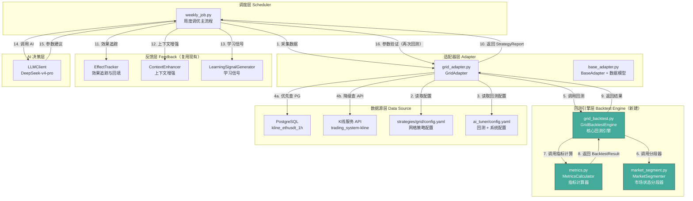
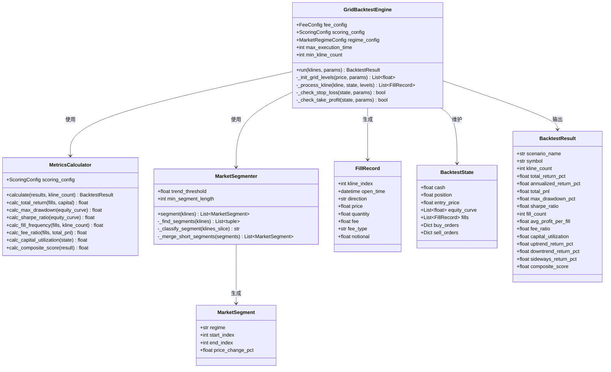
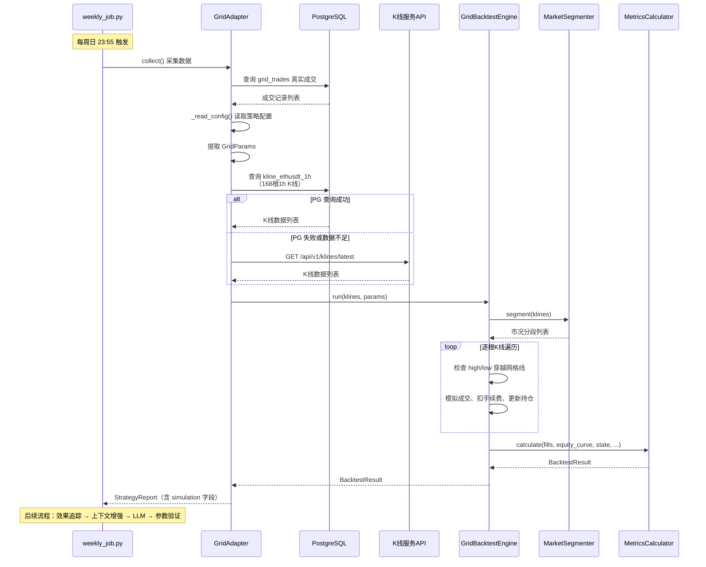
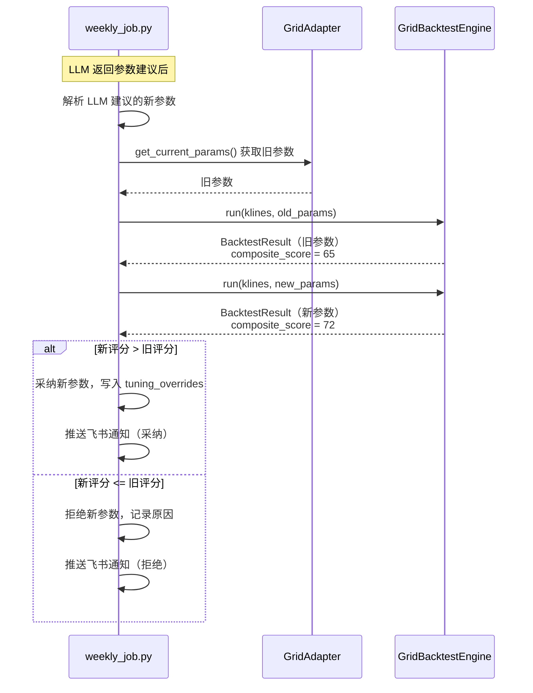
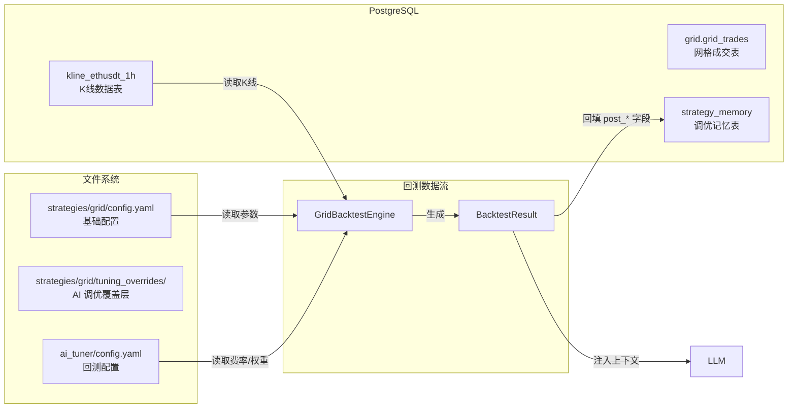

# 网格策略回测引擎 架构设计文档

## 文档信息

| 项目 | 内容 |
|:---|:---|
| 文档版本 | V1.0 |
| 创建日期 | 2026-08-19 |
| 作者 | 后端架构师 |
| 状态 | 待评审 |
| 关联 PRD | [网格策略回测AI调优系统-PRD](../requirements/网格策略回测AI调优系统-PRD.md) |
| 关联架构 | [StratTuneAI架构设计](StratTuneAI架构设计.md) |

---

## 1. 概述

### 1.1 背景

当前网格策略AI调优系统（方案C / 混合模式）中，`GridAdapter._simulate()` 使用**简单估算模型**替代真实回测。该模型存在填充效率因子固定、不计算手续费滑点、不区分市况、不生成逐笔交易记录等问题。

本方案（方案D）将简单估算替换为**逐根K线回测引擎**，实现精确的网格策略模拟。

### 1.2 设计目标

1. **逐笔模拟**：基于 ETHUSDT 1h K线，按网格逻辑逐小时模拟挂单、成交、止盈止损
2. **精确成本**：计入 maker 手续费(0.04%)、taker 手续费(0.06%)、滑点(0.01%)
3. **全面评估**：计算收益率、最大回撤、夏普比率、成交频率、手续费占比、资金利用率
4. **市况细分**：按上涨/下跌/横盘分段统计表现
5. **参数验证**：LLM 建议的新参数必须经过回测验证，综合评分优于旧参数才采纳
6. **无交易也调优**：即使本周网格策略无真实成交，也基于回测数据执行 AI 调优

### 1.3 与现有系统的关系

```
StratTuneAI 调优系统（现有）
  │
  ├── weekly_job.py          ← 修改：网格策略无交易时也调优
  │     │
  │     ├── grid_adapter.py  ← 修改：_simulate() 重写为调用回测引擎
  │     │     │
  │     │     └── backtest/  ← 新建：回测引擎模块
  │     │           ├── grid_backtest.py
  │     │           ├── metrics.py
  │     │           └── market_segment.py
  │     │
  │     ├── base_adapter.py  ← 修改：新增 BacktestResult 数据模型
  │     │
  │     └── config.yaml      ← 修改：新增 backtest 配置段
  │
  └── feedback/              ← 不改：复用现有 EffectTracker / ContextEnhancer
```

---

## 2. 系统架构

### 2.1 整体架构图



### 2.2 架构分层说明

| 层级 | 职责 | 变更类型 |
|:---|:---|:---|
| **调度层** | 周度调优主流程：遍历策略、编排流水线 | 修改 `_tune_single_strategy()` |
| **适配器层** | 策略数据采集、参数管理、与回测引擎的桥接 | 重写 `_simulate()`、新增数据模型 |
| **回测引擎层** | 逐根K线回放、指标计算、市况分段（纯计算，无外部依赖） | 新建模块 |
| **数据源层** | K线数据获取（PG 优先，API 降级）、配置读取 | 新增 PG 直查逻辑 |
| **反馈层** | 效果追踪、上下文增强、学习信号（复用现有，不改） | 无变更 |
| **AI 决策层** | DeepSeek API 调用、Prompt 渲染 | 更新 Prompt 模板 |

### 2.3 关键设计原则

| 原则 | 实现方式 |
|:---|:---|
| **纯计算模块** | 回测引擎不依赖数据库、不依赖网络、不依赖 pandas，只做纯 Python 数值计算 |
| **确定性** | 相同输入保证相同输出，无随机性，便于验证和调试 |
| **可配置** | 所有阈值、权重、费率从 `ai_tuner/config.yaml` 读取，禁止硬编码 |
| **向后兼容** | `SimulationMetrics` 保持不变，新增 `BacktestResult` 为独立模型 |
| **不影响其他策略** | btc_eth、hrs、new_coin 的调优流程完全不变 |
| **异常不阻断** | 回测异常时记录日志、发送告警、跳过本次调优，不崩溃 |

---

## 3. 模块设计

### 3.1 模块总览

```
ai_tuner/backtest/              ← 新建包
├── __init__.py                 # 公开 API 导出
├── grid_backtest.py            # 核心回测引擎（约 200 行）
├── metrics.py                  # 指标计算器（约 100 行）
└── market_segment.py           # 市场状态分段器（约 80 行）
```

### 3.2 类图



### 3.3 核心模块接口定义

#### 3.3.1 GridBacktestEngine（回测引擎）

```python
class GridBacktestEngine:
    """网格策略逐笔回测引擎"""

    def __init__(self, config: Dict[str, Any]):
        """
        从 ai_tuner/config.yaml 的 backtest 段初始化配置

        读取配置项：
        - backtest.fee.maker / taker / slippage
        - backtest.scoring.*
        - backtest.max_execution_time
        - backtest.min_kline_count
        - backtest.market_regime.*
        """

    def run(
        self,
        klines: List[Dict[str, Any]],
        params: GridParams,
    ) -> BacktestResult:
        """
        执行回测

        Args:
            klines: K线数据列表，每项包含 open_time/open/high/low/close/volume
            params: 网格参数（从 strategies/grid/config.yaml 读取）

        Returns:
            BacktestResult: 包含所有回测指标

        Raises:
            BacktestTimeoutError: 回测超时
            BacktestDataError: K线数据不足
        """
```

#### 3.3.2 MetricsCalculator（指标计算器）

```python
class MetricsCalculator:
    """网格策略专属指标计算器"""

    def __init__(self, scoring_config: ScoringConfig):
        """从回测配置初始化评分权重"""

    def calculate(
        self,
        fills: List[FillRecord],
        equity_curve: List[float],
        state: BacktestState,
        kline_count: int,
        segmented_results: Dict[str, List[FillRecord]],
    ) -> BacktestResult:
        """
        计算所有回测指标

        Args:
            fills: 所有成交记录
            equity_curve: 权益曲线（每根K线后的权益值）
            state: 最终持仓状态
            kline_count: K线总数
            segmented_results: 按市况分组的成交记录

        Returns:
            BacktestResult: 包含所有指标
        """
```

#### 3.3.3 MarketSegmenter（市场状态分段器）

```python
class MarketSegmenter:
    """市场状态分段器：将K线序列按价格走势分为上涨/下跌/横盘段"""

    def __init__(self, trend_threshold: float, min_segment_length: int):
        """
        Args:
            trend_threshold: 趋势判定阈值（如 0.02 表示 2%）
            min_segment_length: 每段最少K线数（如 8）
        """

    def segment(
        self, klines: List[Dict[str, Any]]
    ) -> List[MarketSegment]:
        """
        将K线序列分段

        算法：
        1. 扫描K线序列，找到价格走势的转折点
        2. 将相邻转折点之间的K线归为一个段
        3. 计算每段的价格变化率，判定为上涨/下跌/横盘
        4. 合并长度不足 min_segment_length 的短段到相邻段

        Returns:
            MarketSegment 列表，覆盖所有K线，无重叠无遗漏
        """
```

### 3.4 数据模型定义

#### 3.4.1 FillRecord（成交记录）

```python
@dataclass
class FillRecord:
    """单笔成交记录"""
    kline_index: int          # 触发成交的K线序号
    open_time: datetime       # K线开盘时间
    direction: str            # "buy" 或 "sell"
    price: float              # 成交价格（网格挂单价）
    quantity: float           # 成交数量（币本位）
    fee: float                # 手续费（USDT）
    fee_type: str             # "maker" 或 "taker"
    notional: float           # 名义价值（USDT）
```

#### 3.4.2 BacktestState（回测状态）

```python
@dataclass
class BacktestState:
    """回测过程中的持仓状态"""
    cash: float                       # 可用资金（USDT）
    position: float                   # 当前持仓（币本位，正=多，负=空）
    entry_price: float                # 开仓均价
    last_price: float                 # 最新价格（用于计算浮动盈亏）
    equity_curve: List[float]         # 权益曲线（每根K线后记录一次）
    fills: List[FillRecord]           # 所有成交记录
    buy_orders: Dict[float, float]    # 买单挂单 {价格: 数量}
    sell_orders: Dict[float, float]   # 卖单挂单 {价格: 数量}
    total_fee: float                  # 累计手续费
    peak_equity: float                # 权益峰值（用于计算最大回撤）
```

#### 3.4.3 BacktestResult（回测结果，base_adapter.py 新增）

```python
class BacktestResult(BaseModel):
    """网格回测结果（方案D新增数据模型）"""

    # === 基础信息 ===
    scenario_name: str = Field(default="", description="场景名称")
    symbol: str = Field(default="ETHUSDT", description="交易对")
    kline_count: int = Field(default=0, description="回测使用的K线数量")

    # === 收益类 ===
    total_return_pct: float = Field(default=0.0, description="总收益率（%）")
    annualized_return_pct: float = Field(default=0.0, description="年化收益率（%）")
    total_pnl: float = Field(default=0.0, description="总盈亏（USDT）")

    # === 风险类 ===
    max_drawdown_pct: float = Field(default=0.0, description="最大回撤（%）")
    sharpe_ratio: float = Field(default=0.0, description="夏普比率（周度）")

    # === 网格专属 ===
    fill_count: int = Field(default=0, description="成交次数")
    avg_profit_per_fill: float = Field(default=0.0, description="单次成交平均利润（USDT）")
    fee_ratio: float = Field(default=0.0, description="手续费占利润比（%）")
    capital_utilization: float = Field(default=0.0, description="资金利用率（%）")

    # === 市况细分 ===
    uptrend_return_pct: float = Field(default=0.0, description="上涨市况收益率（%）")
    downtrend_return_pct: float = Field(default=0.0, description="下跌市况收益率（%）")
    sideways_return_pct: float = Field(default=0.0, description="横盘市况收益率（%）")

    # === 综合评分 ===
    composite_score: float = Field(default=0.0, description="综合评分（0-100）")
```

#### 3.4.4 GridParams（网格参数，回测引擎内部使用）

```python
@dataclass
class GridParams:
    """回测用的网格参数（从 strategies/grid/config.yaml 提取）"""
    base_grid_count: int           # grid.base_grid_count
    grid_spacing_atr_multiplier: float  # grid.grid_spacing_atr_multiplier
    stop_loss_buffer: int          # grid.stop_loss_buffer
    leverage: int                  # trading.leverage
    margin: float                  # trading.margin
    single_position_margin: float  # trading.single_position_margin
    stop_loss_percent: float       # risk.stop_loss_percent
    hard_stop_loss: float          # risk.hard_stop_loss
    atr: float                     # 当前ATR值（从外部计算后传入）
    current_price: float           # 当前价格（从外部传入）
```

---

## 4. 数据流设计

### 4.1 主流程数据流



### 4.2 参数验证数据流



### 4.3 数据持久化



---

## 5. 关键算法设计

### 5.1 核心算法：逐根K线回放

```
算法：逐根K线网格回测

输入：
  klines: List[Kline]           # 168根1h K线
  params: GridParams            # 网格参数
  fee_config: FeeConfig         # 费率配置

输出：
  result: BacktestResult        # 回测结果

过程：

1. 初始化：
   state = BacktestState(
       cash = params.margin * params.leverage,    # 总可用资金 = 保证金 × 杠杆
       position = 0,
       equity_curve = [cash],
       fills = [],
       buy_orders = {},
       sell_orders = {},
       total_fee = 0,
       peak_equity = cash,
   )

2. 计算网格层级：
   grid_spacing = params.atr * params.grid_spacing_atr_multiplier
   half_range = grid_spacing * params.base_grid_count / 2
   price_low = params.current_price - half_range
   price_high = params.current_price + half_range

   网格档位 = [price_low + i * grid_spacing for i in range(params.base_grid_count + 1)]

   对于每个网格档位：
     - 如果档位 < 当前价格：挂买单（等待价格下跌到该档位时买入）
     - 如果档位 > 当前价格：挂卖单（等待价格上涨到该档位时卖出）

3. 遍历每根K线（i = 0..len(klines)-1）：
   kline = klines[i]
   high = kline.high
   low = kline.low
   close = kline.close

   3.1 检查买单成交：
       FOR 每个买单挂单价格 p IN state.buy_orders:
           IF low <= p <= high:    # 价格穿越了该买单档位
               qty = state.buy_orders[p]
               fill_price = p
               fee = fill_price * qty * fee_config.maker
               记录成交：FillRecord(direction="buy", price=fill_price, qty=qty, fee=fee, fee_type="maker")
               state.cash -= fill_price * qty + fee
               state.position += qty
               state.total_fee += fee
               删除该买单挂单
               在 p + grid_spacing 处挂等量卖单（止盈挂单）

   3.2 检查卖单成交：
       FOR 每个卖单挂单价格 p IN state.sell_orders:
           IF low <= p <= high:    # 价格穿越了该卖单档位
               qty = state.sell_orders[p]
               fill_price = p
               fee = fill_price * qty * fee_config.maker
               记录成交：FillRecord(direction="sell", price=fill_price, qty=qty, fee=fee, fee_type="maker")
               state.cash += fill_price * qty - fee
               state.position -= qty
               state.total_fee += fee
               删除该卖单挂单
               在 p - grid_spacing 处挂等量买单（重新挂单）

   3.3 更新状态：
       state.last_price = close
       equity = state.cash + state.position * close
       state.equity_curve.append(equity)
       state.peak_equity = max(state.peak_equity, equity)

   3.4 检查止盈止损（如果持仓不为0）：
       盈亏比例 = (close - state.entry_price) / state.entry_price * (position的方向)
       IF 盈亏比例 <= -params.stop_loss_percent:
           触发止损：市价平仓，扣 taker 手续费
           fee = close * abs(state.position) * fee_config.taker
           记录 FillRecord(direction="平仓", fee_type="taker")
           state.cash += close * position - fee（方向修正）
           state.position = 0
       IF 盈亏比例 <= params.hard_stop_loss:
           触发硬止损：同上，但扣除更高手续费

4. 回测结束后计算指标：
   调用 MetricsCalculator.calculate() 计算所有指标
   调用 MarketSegmenter.segment() 计算市况细分指标
```

### 5.2 市场状态分段算法

```
算法：市场状态分段

输入：
  klines: List[Kline]       # 168根K线
  threshold: float          # 趋势判定阈值（如 0.02）
  min_segment_length: int   # 每段最少K线数（如 8）

输出：
  segments: List[MarketSegment]

过程：

1. 计算价格变化率序列：
   对每根K线 i（从第1根开始）：
     price_change[i] = (klines[i].close - klines[i-1].close) / klines[i-1].close

2. 初始分段（基于累计价格变化率）：
   current_segment_start = 0
   cumulative_change = 0

   FOR i = 1..len(klines)-1:
       cumulative_change += price_change[i]

       # 检查是否到达转折点
       IF abs(cumulative_change) >= threshold:
           # 从当前段首到当前位置，判定为一段
           segment = MarketSegment(
               start_index = current_segment_start,
               end_index = i,
               price_change_pct = cumulative_change,
               regime = "上涨" if cumulative_change > 0 else "下跌"
           )
           记录该段
           current_segment_start = i + 1
           cumulative_change = 0

   # 处理剩余部分
   IF current_segment_start < len(klines):
       segment = MarketSegment(
           start_index = current_segment_start,
           end_index = len(klines) - 1,
           price_change_pct = cumulative_change,
           regime = "横盘"  # 末段未达到阈值，视为横盘
       )
       记录该段

3. 合并短段：
   遍历所有段：
     IF 段长度 < min_segment_length:
       将该段合并到相邻较长的段中
       重新计算合并后的价格变化率和 regime

4. 重新判定 regime：
   对每个段：
     IF abs(price_change_pct) >= threshold:
         regime = "上涨" if price_change_pct > 0 else "下跌"
     ELSE:
         regime = "横盘"

5. 返回分段列表
```

### 5.3 综合评分算法

```
算法：综合评分计算

输入：
  result: BacktestResult（已填充收益、回撤、夏普）

输出：
  composite_score: float（0-100）

过程：

1. 收益率得分：
   return_score = min(100, max(0, result.total_return_pct * return_score_scale))
   # return_score_scale 从配置读取，默认 10
   # 即：收益率 10% = 100 分，负收益 = 0 分

2. 回撤得分：
   drawdown_score = min(100, max(0, (1 - result.max_drawdown_pct / drawdown_cap) * 100))
   # drawdown_cap 从配置读取，默认 0.20
   # 即：回撤 0% = 100 分，回撤 20% = 0 分

3. 夏普得分：
   sharpe_score = min(100, max(0, result.sharpe_ratio * sharpe_score_scale))
   # sharpe_score_scale 从配置读取，默认 50
   # 即：夏普 2.0 = 100 分，负夏普 = 0 分

4. 综合评分：
   composite_score = return_weight * return_score
                   + drawdown_weight * drawdown_score
                   + sharpe_weight * sharpe_score
   # 权重从配置读取，默认 0.40 / 0.30 / 0.30
```

### 5.4 夏普比率计算（周度）

```
算法：周度夏普比率

1. 计算每根K线后的权益收益率：
   对 equity_curve 的每对相邻值 (prev, curr)：
     period_return[i] = (curr - prev) / prev

2. 计算平均收益率：
   avg_return = mean(period_return)

3. 计算收益率标准差：
   std_return = stdev(period_return)

4. 年化夏普比率：
   如果 std_return == 0:
       sharpe = 0
   否则：
       sharpe = avg_return / std_return * sqrt(168)  # 168根1h K线 = 1周

   注：这是简化版，不使用无风险利率（加密市场环境下无风险利率近似为0）
```

---

## 6. 错误处理策略

### 6.1 异常分类与处理

| 异常类别 | 场景 | 处理方式 | 是否阻断 |
|:---|:---|:---|:---|
| **数据源异常** | PostgreSQL 连接超时/失败 | 降级到 K线服务 API | 否（有降级） |
| **数据源异常** | K线服务 API 也失败 | 记录错误日志，发送飞书告警，跳过本次调优 | 是 |
| **数据不足** | K线数量 < 24 根 | 记录警告日志，跳过本次调优 | 是 |
| **数据不完整** | K线数量在 24-167 之间 | 使用可用数据继续回测，在报告中标注"数据不完整" | 否 |
| **回测超时** | 单次回测超过 10 秒 | 终止回测，记录错误日志，跳过本次调优 | 是 |
| **参数异常** | 网格参数为 0 或负数 | 使用默认值兜底，记录警告 | 否 |
| **计算异常** | 除零、NaN 等 | 对应指标设为 0，记录警告 | 否 |
| **内存不足** | 内存占用接近 512MB | 预计增量 < 128MB，在限制内；如超限则 OOM Kill | 是 |

### 6.2 超时保护机制

```python
import signal
import asyncio

class BacktestTimeoutError(Exception):
    """回测超时异常"""
    pass

async def run_with_timeout(engine, klines, params, timeout_seconds=10):
    """
    带超时保护的回测执行

    使用 asyncio.wait_for 实现超时控制。
    注意：回测引擎是纯同步代码，需要在 ThreadPoolExecutor 中运行。
    """
    loop = asyncio.get_running_loop()
    try:
        result = await asyncio.wait_for(
            loop.run_in_executor(None, engine.run, klines, params),
            timeout=timeout_seconds,
        )
        return result
    except asyncio.TimeoutError:
        logger.error("回测超时", timeout_seconds=timeout_seconds)
        raise BacktestTimeoutError(f"回测超过 {timeout_seconds} 秒")
```

### 6.3 降级链路

```
K线数据获取降级链路：

第一优先级：PostgreSQL 直查 kline_ethusdt_1h
    │
    ├── 成功 + 数据 >= 168根 → 正常使用
    ├── 成功 + 数据 24-167根 → 使用但标注"数据不完整"
    ├── 成功 + 数据 < 24根 → 跳过本次调优
    └── 失败（超时/连接错误/异常）
            │
            ▼
第二优先级：K线服务 HTTP API
    │
    ├── 成功 + 数据 >= 168根 → 正常使用
    ├── 成功 + 数据 24-167根 → 使用但标注"数据不完整"
    ├── 成功 + 数据 < 24根 → 跳过本次调优
    └── 失败
            │
            ▼
        发送飞书告警 → 跳过本次调优
```

### 6.4 异常回填策略

EffectTracker 回填时，如果回测数据异常：

| 场景 | 处理方式 |
|:---|:---|
| 有真实成交数据 | `post_*` 字段写入真实成交数据（保持原有逻辑） |
| 无真实成交，回测正常 | `post_*` 字段写入回测数据 |
| 无真实成交，回测异常 | `post_*` 字段保留默认值（0），不阻断后续流程 |

---

## 7. 配置结构设计

### 7.1 ai_tuner/config.yaml 新增配置段

```yaml
# ============================================================
# 网格回测配置（方案D 新增）
# ============================================================
backtest:
  # 费率配置
  fee:
    maker: 0.0004               # Maker手续费 0.04%
    taker: 0.0006               # Taker手续费 0.06%
    slippage: 0.0001            # 滑点 0.01%

  # 综合评分权重
  scoring:
    return_weight: 0.40         # 收益率权重
    drawdown_weight: 0.30       # 最大回撤权重
    sharpe_weight: 0.30         # 夏普比率权重

  # 性能限制
  max_execution_time: 10        # 单次回测最大执行时间（秒）
  min_kline_count: 24           # 最少K线数量，低于此值跳过回测

  # 市况分段参数
  market_regime:
    trend_threshold: 0.02       # 趋势判定阈值：累计涨跌幅 >= 2% 视为趋势段
    min_segment_length: 8       # 每段最少K线数（不足则合并到相邻段）

  # 评分计算参数
  return_score_scale: 10        # 收益率 × 10 = 得分（10%收益率 = 100分）
  drawdown_cap: 0.20            # 回撤上限：20%回撤 = 0分
  sharpe_score_scale: 50        # 夏普 × 50 = 得分（2.0夏普 = 100分）
```

### 7.2 ai_tuner/config.yaml 参数路径修复

当前 `param_whitelist` 中网格策略的以下路径需要与 `strategies/grid/config.yaml` 对齐：

```yaml
# 修复前（错误路径）：
- "atr_multipliers.oscillation"       # 策略配置中实际为 market.atr_multipliers.oscillation
- "atr_multipliers.weak_trend"        # 策略配置中实际为 market.atr_multipliers.weak_trend

# 修复后（正确路径）：
- "market.atr_multipliers.oscillation"
- "market.atr_multipliers.weak_trend"
```

同时从 `param_whitelist` 中移除以下已在 `redline_params` 中的项（红线参数不应出现在白名单中）：

```yaml
# 移除以下行（已在 redline_params 中）：
- "trading.leverage"
- "trading.margin"
- "trading.single_position_margin"
- "risk.stop_loss_percent"
- "risk.hard_stop_loss"
```

### 7.3 配置读取流程

```
GridBacktestEngine.__init__(config)
    │
    ├── config["backtest"]["fee"] → FeeConfig
    ├── config["backtest"]["scoring"] → ScoringConfig
    ├── config["backtest"]["market_regime"] → MarketRegimeConfig
    ├── config["backtest"]["max_execution_time"] → self.max_execution_time
    └── config["backtest"]["min_kline_count"] → self.min_kline_count

GridAdapter._simulate()
    │
    ├── self._read_config() → 策略配置（已合并 tuning_overrides）
    │     ├── grid.base_grid_count
    │     ├── grid.grid_spacing_atr_multiplier
    │     ├── grid.stop_loss_buffer
    │     ├── trading.leverage
    │     ├── trading.margin
    │     ├── trading.single_position_margin
    │     ├── risk.stop_loss_percent
    │     └── risk.hard_stop_loss
    │
    └── self._system_config → 系统配置
          └── backtest.* → 传给 GridBacktestEngine
```

---

## 8. 与现有系统集成

### 8.1 grid_adapter.py 修改点

#### 8.1.1 _simulate() 方法重写

```python
# 修改前（方案C）：简单公式估算
async def _simulate(self, week_start, week_end, symbols):
    # 获取K线 → 计算市场统计 → 构建3个场景 → 公式估算
    ...

# 修改后（方案D）：调用回测引擎，多场景对比
async def _simulate(self, week_start, week_end, symbols):
    """使用回测引擎模拟网格策略表现（方案D）"""
    # 1. 获取K线数据（PG 优先 + API 降级）
    klines = await self._fetch_klines_for_backtest(week_start, week_end, symbols)

    # 2. 计算市场统计（ATR、当前价格、市场状态）
    market_stats = self._calc_market_stats(klines)

    # 3. 提取当前网格参数
    current_params = self._extract_grid_params(market_stats)

    # 4. 构建多场景参数组合（当前/更密集/更稀疏）
    scenarios = self._build_scenarios(current_params)

    # 5. 初始化回测引擎
    engine = GridBacktestEngine(self._system_config)

    # 6. 对每个场景执行回测
    results = []
    for scenario in scenarios:
        result = engine.run(klines, scenario["params"])
        sim = self._backtest_result_to_simulation(
            result, scenario["name"], market_stats, scenario["params"]
        )
        results.append(sim)

    return results
```

#### 8.1.2 新增辅助方法

```python
def _extract_grid_params(self, market_stats: Dict) -> GridParams:
    """从策略配置中提取回测所需的网格参数"""
    config = self._read_config()
    grid_cfg = config.get("grid", {})
    trading_cfg = config.get("trading", {})
    risk_cfg = config.get("risk", {})

    return GridParams(
        base_grid_count=int(grid_cfg.get("base_grid_count", 6)),
        grid_spacing_atr_multiplier=float(grid_cfg.get("grid_spacing_atr_multiplier", 2.5)),
        stop_loss_buffer=int(grid_cfg.get("stop_loss_buffer", 2)),
        leverage=int(trading_cfg.get("leverage", 10)),
        margin=float(trading_cfg.get("margin", 500)),
        single_position_margin=float(trading_cfg.get("single_position_margin", 100)),
        stop_loss_percent=float(risk_cfg.get("stop_loss_percent", 0.10)),
        hard_stop_loss=float(risk_cfg.get("hard_stop_loss", -0.15)),
        atr=market_stats["atr"],
        current_price=market_stats["current_price"],
    )

def _build_scenarios(self, current_params: GridParams) -> List[Dict]:
    """构建多场景参数组合（当前/更密集/更稀疏）"""
    # 场景1：当前配置 — 使用现有参数
    # 场景2：更密集网格 — base_grid_count + 2，spacing × 0.85
    # 场景3：更稀疏网格 — base_grid_count - 2，spacing × 1.15
    ...

def _backtest_result_to_simulation(
    self,
    result: Dict[str, Any],
    scenario_name: str,
    market_stats: Dict[str, Any],
    scenario_params: GridParams,
) -> SimulationMetrics:
    """将回测结果转换为 SimulationMetrics

    重要：grid_count/grid_spacing/price_range/profit_rate 必须取自
    scenario_params（各场景不同），不得回读配置文件，否则三个场景
    会显示相同参数值，导致 AI 无法判断参数调整效果。
    """
    base_grid_count = scenario_params.base_grid_count
    spacing_multiplier = scenario_params.grid_spacing_atr_multiplier
    atr = market_stats.get("atr", 0.0)
    current_price = market_stats.get("current_price", 0.0)

    grid_spacing = atr * spacing_multiplier
    half_range = grid_spacing * base_grid_count / 2
    profit_rate = grid_spacing / current_price if current_price > 0 else 0

    # 置信度从配置读取（ai_tuner/config.yaml -> backtest.confidence）
    backtest_cfg = self._system_config.get("backtest", {})
    confidence = float(backtest_cfg.get("confidence", 0.85))

    return SimulationMetrics(
        scenario_name=scenario_name,
        symbol=result.get("symbol", "ETHUSDT"),
        market_state=market_stats.get("market_state", ""),
        grid_count=base_grid_count,
        grid_spacing=round(grid_spacing, 4),
        price_range_low=round(current_price - half_range, 2),
        price_range_high=round(current_price + half_range, 2),
        profit_rate_per_fill=round(profit_rate * 100, 2),
        estimated_fills_weekly=result.get("fill_count", 0),
        estimated_profit_weekly=round(result.get("total_pnl", 0.0), 2),
        confidence=confidence,
    )
```

#### 8.1.3 新增 K线数据获取方法

```python
async def _fetch_klines_for_backtest(
    self, week_start: datetime, week_end: datetime, symbols: List[str]
) -> List[Dict[str, Any]]:
    """
    获取回测所需的K线数据（PG优先 + API降级）

    优先级：
    1. PostgreSQL 直查 kline_ethusdt_1h 表
    2. K线服务 HTTP API 降级
    3. 都失败则抛出异常

    Returns:
        K线数据列表，长度应在 24-168 之间
    """
    # 尝试从 PostgreSQL 读取
    klines = await self._fetch_klines_from_pg(week_start, week_end)
    if klines and len(klines) >= self._system_config.get("backtest", {}).get("min_kline_count", 24):
        return klines

    # 降级到 K线服务 API
    logger.warning("PostgreSQL K线数据不足，降级到K线服务API")
    kline_url = self._get_kline_service_url()
    if not kline_url:
        raise BacktestDataError("K线数据源不可用：PostgreSQL 和 K线服务均不可用")

    for symbol in symbols:
        klines = await self._fetch_klines(kline_url, symbol, week_start, week_end)
        if klines:
            return klines

    raise BacktestDataError("K线数据不足：所有数据源均无法获取足够的K线数据")

async def _fetch_klines_from_pg(
    self, week_start: datetime, week_end: datetime
) -> List[Dict[str, Any]]:
    """
    从 PostgreSQL 直接查询 K线数据

    使用已有的 db_manager 连接，不从零创建连接。
    """
    query = """
        SELECT open_time, open_price, high_price, low_price, close_price, volume
        FROM kline_ethusdt_1h
        WHERE open_time >= $1
          AND open_time < $2
        ORDER BY open_time ASC
    """
    try:
        rows = await self.db_manager.fetch_all(query, week_start, week_end)
        return [
            {
                "open_time": row["open_time"],
                "open": float(row["open_price"]),
                "high": float(row["high_price"]),
                "low": float(row["low_price"]),
                "close": float(row["close_price"]),
                "volume": float(row["volume"]),
            }
            for row in rows
        ]
    except Exception as e:
        logger.warning("PostgreSQL K线查询失败", error=str(e))
        return []
```

### 8.2 weekly_job.py 修改点

```python
# _tune_single_strategy() 方法第 192-194 行修改

# 修改前：
if report.performance.total_trades == 0:
    logger.info("策略本周无交易，跳过调优", strategy_id=strategy_id)
    return "skip"

# 修改后：
if report.performance.total_trades == 0:
    if strategy_id == "grid":
        # 网格策略：无交易也继续调优（基于回测数据）
        logger.info("网格策略本周无真实成交，使用回测数据继续调优",
                    strategy_id=strategy_id)
    else:
        # 其他策略：保持原有逻辑
        logger.info("策略本周无交易，跳过调优", strategy_id=strategy_id)
        return "skip"
```

### 8.3 base_adapter.py 修改点

在数据模型区域新增 `BacktestResult`（见 3.4.3 节），不修改现有的 `SimulationMetrics`。

### 8.4 参数验证（Step 6）集成

在 `weekly_job.py` 的 `_tune_single_strategy()` 中，LLM 返回参数建议后，新增参数验证步骤：

```python
# 步骤6：参数验证（仅网格策略）
if strategy_id == "grid":
    from ai_tuner.backtest.grid_backtest import GridBacktestEngine

    # 构建新参数
    new_params = adapter._build_params_from_adjustments(adjustments, market_stats)

    # 回测验证
    engine = GridBacktestEngine(self.config)
    old_result = engine.run(klines, old_params)  # 复用 Step 2 的 K线
    new_result = engine.run(klines, new_params)

    if new_result.composite_score <= old_result.composite_score:
        logger.warning(
            "LLM建议参数回测验证未通过，拒绝采纳",
            old_score=old_result.composite_score,
            new_score=new_result.composite_score,
        )
        # 记录到 memory 表
        # 发送飞书通知（拒绝）
        return "skip"
```

---

## 9. 性能分析

### 9.1 复杂度分析

| 操作 | 时间复杂度 | 说明 |
|:---|:---|:---|
| K线数据获取 | O(n) | n = 168根K线，单次 SQL 查询 |
| 网格层级初始化 | O(g) | g = 网格数（约 6-12） |
| 逐根K线遍历 | O(n * g) | 每根K线检查所有挂单档位 |
| 市况分段 | O(n) | 单次扫描 |
| 指标计算 | O(n) | 遍历成交记录和权益曲线 |
| **总复杂度** | **O(n * g)** | n=168, g<=12, 即约 2000 次循环 |

### 9.2 资源预估

| 指标 | 预估值 | 限制 | 是否满足 |
|:---|:---|:---|:---|
| 单次回测耗时 | < 2 秒 | < 5 秒 | 满足 |
| 两次回测（验证）耗时 | < 4 秒 | < 10 秒 | 满足 |
| 内存占用增量 | < 50 MB | < 128 MB | 满足 |
| 完整调优流程 | < 25 秒 | < 30 秒 | 满足 |

**性能优化措施**：
- 纯 Python 循环，无 pandas 依赖（避免 pandas 的内存开销）
- 使用 `@dataclass` 而非 Pydantic 做内部数据交换（减少序列化开销）
- 权益曲线只记录每根K线后的值（168 个 float），不记录中间状态
- 市况分段结果缓存，避免重复计算

---

## 10. 测试策略

### 10.1 单元测试

| 测试模块 | 测试内容 | 预期用例数 |
|:---|:---|:---|
| `test_grid_backtest.py` | 回测引擎核心逻辑：成交判断、手续费计算、止盈止损 | 8 |
| `test_metrics.py` | 指标计算：收益率、回撤、夏普、综合评分 | 6 |
| `test_market_segment.py` | 市况分段：上涨/下跌/横盘识别、短段合并 | 5 |

### 10.2 集成测试

| 测试场景 | 验证内容 |
|:---|:---|
| 完整回测流程 | 从 K线数据 → 回测引擎 → 指标计算 → BacktestResult |
| 参数验证流程 | 旧参数 vs 新参数回测对比，评分比较 |
| 无交易时调优 | 无真实成交时，回测数据正常传递给 LLM |
| 降级链路 | PG 不可用 → API 降级；API 也不可用 → 跳过 |

### 10.3 边界测试

| 场景 | 预期行为 |
|:---|:---|
| 空 K线列表 | 返回 BacktestResult 全为默认值 |
| K线数量 = min_kline_count（24） | 正常回测，标注"数据不完整" |
| 网格参数极端值（间距=0） | 使用兜底值，记录警告 |
| 价格全程在网格区间外 | 无成交，返回 0 收益 |
| 价格全程在网格区间内震荡 | 高频成交，手续费占比高 |
| 单边上涨/下跌 | 网格被击穿，触发止损 |

---

## 11. 文件变更清单

| 文件 | 变更类型 | 行数估计 | 说明 |
|:---|:---|:---|:---|
| `ai_tuner/backtest/__init__.py` | 新建 | ~20 | 公开 API 导出 |
| `ai_tuner/backtest/grid_backtest.py` | 新建 | ~200 | 核心回测引擎 |
| `ai_tuner/backtest/metrics.py` | 新建 | ~100 | 指标计算器 |
| `ai_tuner/backtest/market_segment.py` | 新建 | ~80 | 市场状态分段器 |
| `ai_tuner/adapters/base_adapter.py` | 修改 | +35 | 新增 BacktestResult 数据模型 |
| `ai_tuner/adapters/grid_adapter.py` | 重写 `_simulate()` + 新增方法 | +150 / -80 | 替换为调用回测引擎 |
| `ai_tuner/scheduler/weekly_job.py` | 修改 | +10 | 网格策略无交易时也调优 |
| `ai_tuner/config.yaml` | 修改 | +25 | 新增 backtest 配置段 + 参数路径修复 |
| `ai_tuner/prompts/grid_system.txt` | 修改 | ~50 | 更新提示词适配新指标体系 |
| `ai_tuner/prompts/grid_user.txt` | 修改 | ~30 | 更新模板适配回测数据 |

---

## 12. 附录

### 12.1 术语表

| 术语 | 说明 |
|:---|:---|
| 方案C | 当前混合模式：真实成交数据 + 简单公式估算模拟推演 |
| 方案D | 本设计目标：真实K线逐笔回测引擎 |
| 逐根回放 | 对每根K线，按时间顺序模拟挂单检查、成交、持仓更新 |
| 网格档位 | 等差网格中的价格层级，每个档位挂一个限价单 |
| Maker/Taker | Maker=挂单成交（限价单被吃），Taker=吃单成交（市价单） |
| 市况分段 | 将168根K线按价格走势分为上涨段/下跌段/横盘段 |
| 综合评分 | 收益率×0.40 + 最大回撤×0.30 + 夏普比率×0.30 |
| 资金利用率 | 平均持仓市值 / 总可用资金，反映资金使用效率 |

### 12.2 参考文件

| 文件 | 路径 |
|:---|:---|
| PRD需求文档 | [网格策略回测AI调优系统-PRD.md](../requirements/网格策略回测AI调优系统-PRD.md) |
| 网格适配器 | [grid_adapter.py](file:///Users/yl/vscode/Binance_quantitative_trading/ai_tuner/adapters/grid_adapter.py) |
| 适配器基类 | [base_adapter.py](file:///Users/yl/vscode/Binance_quantitative_trading/ai_tuner/adapters/base_adapter.py) |
| 周度调优 | [weekly_job.py](file:///Users/yl/vscode/Binance_quantitative_trading/ai_tuner/scheduler/weekly_job.py) |
| AI调优配置 | [config.yaml](file:///Users/yl/vscode/Binance_quantitative_trading/ai_tuner/config.yaml) |
| 网格策略配置 | [config.yaml](file:///Users/yl/vscode/Binance_quantitative_trading/strategies/grid/config.yaml) |
| 效果追踪器 | [effect_tracker.py](file:///Users/yl/vscode/Binance_quantitative_trading/ai_tuner/feedback/effect_tracker.py) |
| 上下文增强器 | [context_enhancer.py](file:///Users/yl/vscode/Binance_quantitative_trading/ai_tuner/feedback/context_enhancer.py) |
| 配置加载器 | [config_loader.py](file:///Users/yl/vscode/Binance_quantitative_trading/shared/config_loader.py) |
| StratTuneAI架构 | [StratTuneAI架构设计.md](StratTuneAI架构设计.md) |
| 反馈闭环设计 | [StratTuneAI-反馈闭环设计.md](StratTuneAI-反馈闭环设计.md) |

---

**最后更新：** 2026-08-19