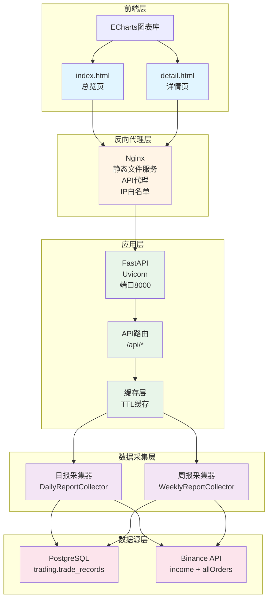
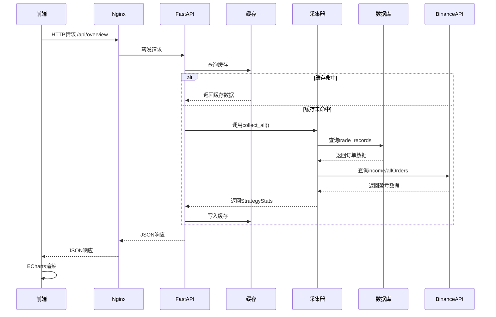
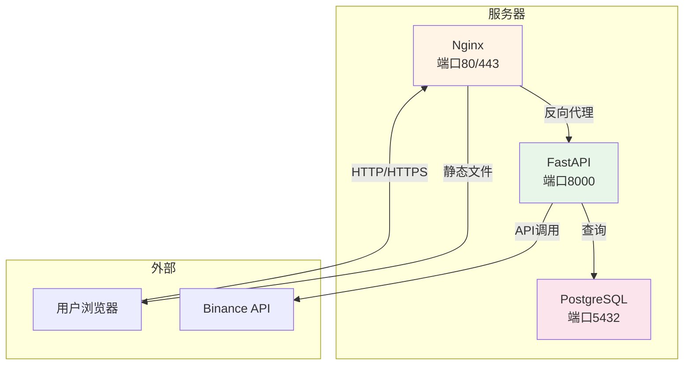

# Dashboard 架构设计文档

> **版本**：v1.1
> **创建日期**：2026-06-02
> **最后更新**：2026-06-03
> **作者**：后端架构师

---

## 目录

1. [系统概述](#1-系统概述)
2. [系统架构](#2-系统架构)
3. [目录结构](#3-目录结构)
4. [API接口设计](#4-api接口设计)
5. [数据流设计](#5-数据流设计)
6. [前端设计](#6-前端设计)
7. [后端设计](#7-后端设计)
8. [安全设计](#8-安全设计)
9. [部署设计](#9-部署设计)
10. [性能优化](#10-性能优化)

---

## 1. 系统概述

### 1.1 设计目标

构建一个轻量级的交易数据可视化Dashboard，用于展示日报、周报和月报数据，帮助用户快速了解各策略的运行状态和盈亏情况。

### 1.2 核心需求

- **数据展示**：总览数据、策略详情、币种明细、趋势图表
- **实时更新**：支持日报/周报/月报数据实时更新
- **可视化**：使用ECharts进行金融级可视化
- **易部署**：轻量级架构，易于部署和维护
- **安全可控**：IP白名单控制，API限流保护

### 1.3 技术选型

| 层次 | 技术选型 | 选型理由 |
|------|---------|---------|
| **前端** | HTML + ECharts + 原生JS | 轻量级，无需打包工具，性能优异 |
| **后端** | FastAPI + Uvicorn | 高性能异步框架，自动API文档 |
| **数据源** | 复用现有采集器 | 避免重复开发，保持数据一致性 |
| **缓存** | 内存缓存（TTL） | 轻量级，无需额外依赖 |
| **部署** | Nginx + systemd / Docker | 支持传统部署和容器化部署 |
| **日志** | structlog | 复用项目现有日志框架 |

---

## 2. 系统架构

### 2.1 架构图



### 2.2 架构层次说明

| 层次 | 职责 | 组件 |
|------|------|------|
| **前端层** | 用户交互、数据可视化 | HTML页面、ECharts图表 |
| **反向代理层** | 静态文件服务、API代理、安全控制 | Nginx |
| **应用层** | 业务逻辑、API服务、缓存管理 | FastAPI |
| **数据采集层** | 数据采集、格式转换 | 复用现有采集器 |
| **数据源层** | 数据存储、外部API | PostgreSQL、Binance API |

### 2.3 核心设计原则

1. **复用优先**：复用现有日报/周报/月报采集器，避免重复开发
2. **轻量级**：无复杂前端框架，纯静态HTML + ECharts
3. **高性能**：FastAPI异步支持，缓存策略优化
4. **易维护**：清晰的目录结构，规范的代码风格
5. **安全可控**：IP白名单、API限流、无认证设计

---

## 3. 目录结构

### 3.1 完整目录结构

```
dashboard/
├── frontend/                    # 前端静态文件
│   ├── index.html              # 首页（总览仪表板）
│   ├── detail.html             # 详情页（单个策略）
│   ├── css/
│   │   └── style.css           # 主样式文件
│   └── js/
│       ├── api.js              # API 调用封装
│       ├── charts.js           # 图表配置（ECharts封装）
│       ├── config.js           # 前端配置（API地址、图表颜色等）
│       ├── main.js             # 主逻辑（首页交互）
│       └── vendor/
│           └── echarts.min.js  # ECharts本地库文件（优先加载）
├── backend/                     # 后端API服务
│   ├── main.py                 # FastAPI主程序（非Docker环境）
│   ├── main_docker.py          # FastAPI主程序（Docker环境入口）
│   ├── Dockerfile              # Docker镜像构建文件
│   ├── docker-compose.yml      # Docker Compose编排文件
│   ├── api/
│   │   ├── __init__.py
│   │   ├── routes.py           # API路由（非Docker环境）
│   │   └── routes_docker.py    # API路由（Docker环境）
│   ├── core/
│   │   ├── __init__.py
│   │   ├── config.py           # 配置管理
│   │   └── cache.py            # 缓存管理
│   ├── models/
│   │   ├── __init__.py
│   │   └── schemas.py          # 数据模型
│   ├── services/
│   │   ├── __init__.py
│   │   ├── data_service.py     # 数据服务（非Docker环境）
│   │   └── data_service_docker.py  # 数据服务（Docker环境）
│   ├── config.yaml             # 配置文件
│   └── requirements.txt        # Python依赖
├── nginx/                       # Nginx配置
│   └── dashboard.conf           # Dashboard站点配置
└── README.md                    # Dashboard使用说明
```

### 3.2 目录职责说明

| 目录 | 职责 | 说明 |
|------|------|------|
| `frontend/` | 前端静态文件 | HTML、CSS、JS文件，由Nginx直接服务 |
| `backend/` | 后端API服务 | FastAPI应用，提供RESTful API，支持本地运行和Docker部署 |
| `nginx/` | Nginx配置 | 反向代理、静态文件服务、安全控制 |

---

## 4. API接口设计

### 4.1 接口列表

| 接口 | 方法 | 说明 | 缓存时间 |
|------|------|------|---------|
| `/api/health` | GET | 健康检查 | 无缓存 |
| `/api/metadata` | GET | 元数据（策略映射、时间范围） | 24小时 |
| `/api/overview` | GET | 总览数据（所有策略汇总） | 60秒 |
| `/api/strategies` | GET | 策略列表 | 60秒 |
| `/api/strategies/{strategy_id}` | GET | 单个策略详情 | 60秒 |
| `/api/strategies/{strategy_id}/symbols` | GET | 币种明细 | 60秒 |
| `/api/trend` | GET | 趋势数据（支持daily/weekly/monthly） | 按类型分流 |

### 4.2 接口详细定义

#### 4.2.1 健康检查

**请求**：
```http
GET /api/health
```

**响应**：
```json
{
  "status": "ok",
  "timestamp": "2026-06-02T15:30:00+08:00",
  "version": "1.0.0",
  "services": {
    "database": "ok",
    "binance_api": "ok"
  }
}
```

#### 4.2.2 元数据

**请求**：
```http
GET /api/metadata
```

**响应**：
```json
{
  "strategies": {
    "btc_eth": {
      "name": "MTPCS策略",
      "emoji": "📈",
      "symbols": ["BTCUSDT", "ETHUSDT", "BNBUSDT", "XRPUSDT", "SOLUSDT", "TRXUSDT"]
    },
    "new_coin": {
      "name": "新币做空策略",
      "emoji": "📉",
      "symbols": []
    },
    "hrs": {
      "name": "HRS策略",
      "emoji": "🔄",
      "symbols": []
    }
  },
  "time_range": {
    "daily": {
      "start": "2026-06-01",
      "end": "2026-06-01"
    },
    "weekly": {
      "start": "2026-05-26",
      "end": "2026-06-01"
    }
  }
}
```

#### 4.2.3 总览数据

**请求**：
```http
GET /api/overview?type=daily
```

**查询参数**：
- `type`：数据类型，可选值 `daily`（日报）、`weekly`（周报）、`monthly`（月报），默认 `daily`

**响应**：
```json
{
  "total_pnl": "1234.56",
  "total_orders": 150,
  "total_fills": 120,
  "total_closed": 100,
  "win_rate": 65.0,
  "strategies": [
    {
      "id": "btc_eth",
      "name": "MTPCS策略",
      "emoji": "📈",
      "order_count": 80,
      "fill_count": 70,
      "closed_count": 60,
      "win_count": 40,
      "loss_count": 20,
      "total_pnl": "800.00",
      "win_rate": 66.7
    },
    {
      "id": "new_coin",
      "name": "新币做空策略",
      "emoji": "📉",
      "order_count": 50,
      "fill_count": 40,
      "closed_count": 30,
      "win_count": 18,
      "loss_count": 12,
      "total_pnl": "334.56",
      "win_rate": 60.0
    },
    {
      "id": "hrs",
      "name": "HRS策略",
      "emoji": "🔄",
      "order_count": 20,
      "fill_count": 10,
      "closed_count": 10,
      "win_count": 7,
      "loss_count": 3,
      "total_pnl": "100.00",
      "win_rate": 70.0
    }
  ],
  "report_date": "2026-06-01",
  "data_source": "binance_api"
}
```

#### 4.2.4 策略列表

**请求**：
```http
GET /api/strategies?type=daily
```

**响应**：
```json
{
  "strategies": [
    {
      "id": "btc_eth",
      "name": "MTPCS策略",
      "emoji": "📈",
      "order_count": 80,
      "fill_count": 70,
      "closed_count": 60,
      "win_count": 40,
      "loss_count": 20,
      "total_pnl": "800.00",
      "win_rate": 66.7,
      "error": null
    }
  ],
  "report_date": "2026-06-01"
}
```

#### 4.2.5 单个策略详情

**请求**：
```http
GET /api/strategies/btc_eth?type=weekly
```

**响应**：
```json
{
  "id": "btc_eth",
  "name": "MTPCS策略",
  "emoji": "📈",
  "order_count": 560,
  "fill_count": 490,
  "closed_count": 420,
  "win_count": 280,
  "loss_count": 140,
  "total_pnl": "5600.00",
  "win_rate": 66.7,
  "avg_daily_orders": 80.0,
  "symbols": [
    {
      "symbol": "BTCUSDT",
      "order_count": 200,
      "fill_count": 180,
      "wins": 120,
      "losses": 60,
      "total_pnl": "2000.00",
      "win_rate": 66.7
    },
    {
      "symbol": "ETHUSDT",
      "order_count": 180,
      "fill_count": 160,
      "wins": 100,
      "losses": 60,
      "total_pnl": "1800.00",
      "win_rate": 62.5
    }
  ],
  "daily_counts": {
    "2026-05-26": 75,
    "2026-05-27": 82,
    "2026-05-28": 78,
    "2026-05-29": 80,
    "2026-05-30": 85,
    "2026-05-31": 76,
    "2026-06-01": 84
  },
  "data_source": "binance_api",
  "validation_warnings": [],
  "error": null
}
```

#### 4.2.6 币种明细

**请求**：
```http
GET /api/strategies/btc_eth/symbols?type=weekly
```

**响应**：
```json
{
  "strategy_id": "btc_eth",
  "strategy_name": "MTPCS策略",
  "symbols": [
    {
      "symbol": "BTCUSDT",
      "order_count": 200,
      "fill_count": 180,
      "wins": 120,
      "losses": 60,
      "total_pnl": "2000.00",
      "win_rate": 66.7,
      "data_quality": "ok",
      "quality_note": ""
    }
  ]
}
```

#### 4.2.7 趋势数据

**请求**：
```http
GET /api/trend?type=daily&days=7
```

**查询参数**：
- `type`：趋势类型，可选值 `daily`（日报）、`weekly`（周报）、`monthly`（月报），默认 `daily`
- `days`：天数，默认 7（日报）或 4（周报）或 3（月报）

**响应**：
```json
{
  "type": "daily",
  "dates": [
    "2026-05-26",
    "2026-05-27",
    "2026-05-28",
    "2026-05-29",
    "2026-05-30",
    "2026-05-31",
    "2026-06-01"
  ],
  "strategies": {
    "btc_eth": [
      {"date": "2026-05-26", "total_pnl": "100.00", "win_rate": 65.0, "order_count": 75},
      {"date": "2026-05-27", "total_pnl": "120.00", "win_rate": 68.0, "order_count": 82}
    ],
    "new_coin": [
      {"date": "2026-05-26", "total_pnl": "50.00", "win_rate": 60.0, "order_count": 30}
    ],
    "hrs": [
      {"date": "2026-05-26", "total_pnl": "20.00", "win_rate": 70.0, "order_count": 10}
    ]
  }
}
```

### 4.3 错误响应格式

所有接口错误时返回统一格式：

```json
{
  "error": {
    "code": "STRATEGY_NOT_FOUND",
    "message": "策略不存在: invalid_strategy",
    "details": {}
  }
}
```

**错误码列表**：

| 错误码 | HTTP状态码 | 说明 |
|--------|-----------|------|
| `INVALID_PARAMETER` | 400 | 参数错误 |
| `STRATEGY_NOT_FOUND` | 404 | 策略不存在 |
| `DATA_NOT_AVAILABLE` | 503 | 数据不可用 |
| `INTERNAL_ERROR` | 500 | 内部错误 |

---

## 5. 数据流设计

### 5.1 数据流向图



### 5.2 数据转换流程

```
原始数据（采集器输出）
    ↓
StrategyStats / WeeklyStrategyStats
    ↓
格式化（format_strategy_stats）
    ↓
响应模型（ResponseModel）
    ↓
JSON序列化
    ↓
HTTP响应
```

### 5.3 缓存策略

| 数据类型 | 缓存时间 | 缓存键 | 更新触发 |
|---------|---------|--------|---------|
| 日报数据 | 5分钟 | `daily` | 实时刷新 |
| 周报数据 | 30分钟 | `weekly` | 实时刷新 |
| 月报数据 | 2小时 | `monthly` | 实时刷新 |
| 元数据 | 24小时 | `metadata` | 策略配置变更 |
| 趋势数据 | 按类型分流 | `trend:{type}:{days}` | 实时刷新 |

**缓存实现**：
```python
from typing import Optional, Any
from datetime import datetime, timedelta

class CacheService:
    """内存缓存服务（TTL）"""

    def __init__(self):
        self._cache: Dict[str, Tuple[Any, datetime]] = {}

    def get(self, key: str) -> Optional[Any]:
        """获取缓存数据"""
        if key not in self._cache:
            return None

        data, expire_time = self._cache[key]
        if datetime.now() > expire_time:
            del self._cache[key]
            return None

        return data

    def set(self, key: str, value: Any, ttl_seconds: int) -> None:
        """设置缓存数据"""
        expire_time = datetime.now() + timedelta(seconds=ttl_seconds)
        self._cache[key] = (value, expire_time)
```

---

## 6. 前端设计

### 6.1 页面结构

#### 6.1.1 首页（index.html）

```
┌─────────────────────────────────────────────────────────┐
│  Dashboard 标题                           更新时间      │
├─────────────────────────────────────────────────────────┤
│  ┌─────────┐  ┌─────────┐  ┌─────────┐  ┌─────────┐   │
│  │ 总盈亏   │  │ 总订单   │  │ 总胜率   │  │ 成交数   │   │
│  │ 1234.56 │  │   150   │  │  65.0%  │  │   120   │   │
│  └─────────┘  └─────────┘  └─────────┘  └─────────┘   │
├─────────────────────────────────────────────────────────┤
│  策略对比（柱状图）                                      │
│  ┌─────────────────────────────────────────────────┐   │
│  │                                                 │   │
│  │  [ECharts柱状图：各策略盈亏、订单数对比]          │   │
│  │                                                 │   │
│  └─────────────────────────────────────────────────┘   │
├─────────────────────────────────────────────────────────┤
│  策略占比（饼图）                                        │
│  ┌──────────────────┐  ┌──────────────────┐          │
│  │ [盈亏分布饼图]    │  │ [订单占比饼图]    │          │
│  └──────────────────┘  └──────────────────┘          │
├─────────────────────────────────────────────────────────┤
│  趋势变化（折线图）                                      │
│  ┌─────────────────────────────────────────────────┐   │
│  │                                                 │   │
│  │  [ECharts折线图：近7天盈亏、胜率趋势]             │   │
│  │                                                 │   │
│  └─────────────────────────────────────────────────┘   │
└─────────────────────────────────────────────────────────┘
```

#### 6.1.2 详情页（detail.html）

```
┌─────────────────────────────────────────────────────────┐
│  策略名称：MTPCS策略 📈                   [返回首页]    │
├─────────────────────────────────────────────────────────┤
│  ┌─────────┐  ┌─────────┐  ┌─────────┐  ┌─────────┐   │
│  │ 总盈亏   │  │ 订单数   │  │ 胜率     │  │ 日均订单  │   │
│  │ 800.00  │  │   560   │  │  66.7%  │  │   80.0  │   │
│  └─────────┘  └─────────┘  └─────────┘  └─────────┘   │
├─────────────────────────────────────────────────────────┤
│  币种明细表格                                            │
│  ┌─────────────────────────────────────────────────┐   │
│  │ 币种    │ 订单 │ 成交 │ 胜率  │ 盈亏    │ 质量  │   │
│  │ BTCUSDT │  200 │  180 │ 66.7% │ 2000.00 │  OK   │   │
│  │ ETHUSDT │  180 │  160 │ 62.5% │ 1800.00 │  OK   │   │
│  └─────────────────────────────────────────────────┘   │
├─────────────────────────────────────────────────────────┤
│  逐日分布（柱状图）                                      │
│  ┌─────────────────────────────────────────────────┐   │
│  │                                                 │   │
│  │  [ECharts柱状图：每日订单数分布]                 │   │
│  │                                                 │   │
│  └─────────────────────────────────────────────────┘   │
└─────────────────────────────────────────────────────────┘
```

### 6.2 技术实现

#### 6.2.1 ECharts配置示例

```javascript
// 深色主题配置
const darkTheme = {
  backgroundColor: '#1a1a2e',
  textStyle: {
    color: '#e0e0e0'
  },
  title: {
    textStyle: {
      color: '#e0e0e0'
    }
  },
  legend: {
    textStyle: {
      color: '#e0e0e0'
    }
  },
  xAxis: {
    axisLine: {
      lineStyle: { color: '#4a4a6a' }
    },
    axisLabel: {
      color: '#e0e0e0'
    }
  },
  yAxis: {
    axisLine: {
      lineStyle: { color: '#4a4a6a' }
    },
    axisLabel: {
      color: '#e0e0e0'
    },
    splitLine: {
      lineStyle: { color: '#2a2a4a' }
    }
  }
};

// 柱状图配置
function createBarChart(containerId, data) {
  const chart = echarts.init(document.getElementById(containerId));
  chart.setOption({
    ...darkTheme,
    tooltip: {
      trigger: 'axis',
      axisPointer: { type: 'shadow' }
    },
    legend: {
      data: ['盈亏', '订单数']
    },
    xAxis: {
      type: 'category',
      data: data.categories
    },
    yAxis: [
      { type: 'value', name: '盈亏(USDT)' },
      { type: 'value', name: '订单数' }
    ],
    series: [
      {
        name: '盈亏',
        type: 'bar',
        data: data.pnl,
        itemStyle: {
          color: new echarts.graphic.LinearGradient(0, 0, 0, 1, [
            { offset: 0, color: '#00d4aa' },
            { offset: 1, color: '#00a080' }
          ])
        }
      },
      {
        name: '订单数',
        type: 'bar',
        yAxisIndex: 1,
        data: data.orders,
        itemStyle: {
          color: new echarts.graphic.LinearGradient(0, 0, 0, 1, [
            { offset: 0, color: '#667eea' },
            { offset: 1, color: '#764ba2' }
          ])
        }
      }
    ]
  });
  return chart;
}
```

#### 6.2.2 API调用封装

```javascript
// API客户端
class DashboardAPI {
  constructor(baseUrl = '/api') {
    this.baseUrl = baseUrl;
  }

  async fetchOverview(type = 'daily') {
    const response = await fetch(`${this.baseUrl}/overview?type=${type}`);
    if (!response.ok) {
      throw new Error(`API错误: ${response.status}`);
    }
    return response.json();
  }

  async fetchStrategy(strategyId, type = 'daily') {
    const response = await fetch(
      `${this.baseUrl}/strategies/${strategyId}?type=${type}`
    );
    if (!response.ok) {
      throw new Error(`API错误: ${response.status}`);
    }
    return response.json();
  }

  async fetchTrend(type = 'daily', days = 7) {
    const response = await fetch(
      `${this.baseUrl}/trend?type=${type}&days=${days}`
    );
    if (!response.ok) {
      throw new Error(`API错误: ${response.status}`);
    }
    return response.json();
  }
}
```

### 6.3 样式设计

#### 6.3.1 深色主题配色

| 元素 | 颜色代码 | 说明 |
|------|---------|------|
| **背景色** | `#1a1a2e` | 主背景 |
| **卡片背景** | `#16213e` | 卡片背景 |
| **文字颜色** | `#e0e0e0` | 主文字 |
| **强调色** | `#00d4aa` | 盈利色 |
| **警告色** | `#ff6b6b` | 亏损色 |
| **图表色1** | `#667eea` | 图表主色 |
| **图表色2** | `#764ba2` | 图表辅色 |

#### 6.3.2 CSS变量定义

```css
/* variables.css */
:root {
  /* 背景色 */
  --bg-primary: #1a1a2e;
  --bg-secondary: #16213e;
  --bg-card: #0f3460;

  /* 文字色 */
  --text-primary: #e0e0e0;
  --text-secondary: #a0a0a0;
  --text-muted: #6a6a8a;

  /* 强调色 */
  --color-profit: #00d4aa;
  --color-loss: #ff6b6b;
  --color-neutral: #ffd93d;

  /* 图表色 */
  --chart-color-1: #667eea;
  --chart-color-2: #764ba2;
  --chart-color-3: #f093fb;

  /* 边框 */
  --border-color: #2a2a4a;
  --border-radius: 8px;

  /* 阴影 */
  --shadow-sm: 0 2px 4px rgba(0, 0, 0, 0.3);
  --shadow-md: 0 4px 8px rgba(0, 0, 0, 0.4);
}
```

---

## 7. 后端设计

### 7.1 FastAPI应用结构

#### 7.1.1 主程序（main.py）

```python
"""
Dashboard API主程序
"""
from fastapi import FastAPI
from fastapi.middleware.cors import CORSMiddleware
from fastapi.responses import JSONResponse
import structlog

from backend.api import overview, strategies, trend
from backend.core.config import settings
from backend.core.dependencies import get_cache_service

logger = structlog.get_logger()

# 创建FastAPI应用
app = FastAPI(
    title="Dashboard API",
    description="交易数据可视化Dashboard API",
    version="1.0.0",
    docs_url="/api/docs",
    redoc_url="/api/redoc"
)

# CORS配置
app.add_middleware(
    CORSMiddleware,
    allow_origins=["*"],
    allow_credentials=True,
    allow_methods=["*"],
    allow_headers=["*"],
)

# 注册路由
app.include_router(overview.router, prefix="/api", tags=["overview"])
app.include_router(strategies.router, prefix="/api", tags=["strategies"])
app.include_router(trend.router, prefix="/api", tags=["trend"])


@app.get("/api/health")
async def health_check():
    """健康检查"""
    return {
        "status": "ok",
        "timestamp": datetime.now().isoformat(),
        "version": "1.0.0"
    }


@app.on_event("startup")
async def startup_event():
    """应用启动事件"""
    logger.info("Dashboard API启动", version="1.0.0")


@app.on_event("shutdown")
async def shutdown_event():
    """应用关闭事件"""
    logger.info("Dashboard API关闭")
```

#### 7.1.2 数据服务（data_service.py）

```python
"""
数据服务
封装采集器调用逻辑
"""
from typing import Dict, Optional
from datetime import datetime

import structlog

from strategies.daily_report.collector import DailyReportCollector, StrategyStats
from strategies.weekly_report.collector import WeeklyReportCollector, WeeklyStrategyStats
from shared.database import DatabaseManager
from shared.binance_api import BinanceClient

logger = structlog.get_logger()


class DataService:
    """数据服务：调用采集器获取数据"""

    def __init__(
        self,
        db_manager: DatabaseManager,
        binance_client: Optional[BinanceClient] = None
    ):
        self.db = db_manager
        self.binance = binance_client

        # 初始化采集器
        self.daily_collector = DailyReportCollector(db_manager, binance_client)
        self.weekly_collector = WeeklyReportCollector(db_manager, binance_client)

    async def get_daily_stats(self) -> Dict[str, StrategyStats]:
        """获取日报数据"""
        logger.info("开始采集日报数据")
        stats = await self.daily_collector.collect_all()
        logger.info("日报数据采集完成", strategy_count=len(stats))
        return stats

    async def get_weekly_stats(self) -> Dict[str, WeeklyStrategyStats]:
        """获取周报数据"""
        logger.info("开始采集周报数据")
        stats = await self.weekly_collector.collect_all()
        logger.info("周报数据采集完成", strategy_count=len(stats))
        return stats
```

#### 7.1.3 API路由示例（overview.py）

```python
"""
总览接口
"""
from fastapi import APIRouter, Depends, Query
from typing import Literal

from backend.core.dependencies import get_data_service, get_cache_service
from backend.models.response import OverviewResponse
from backend.services.data_service import DataService
from backend.services.cache_service import CacheService

router = APIRouter()


@router.get("/overview", response_model=OverviewResponse)
async def get_overview(
    type: Literal["daily", "weekly", "monthly"] = Query(
        default="daily",
        description="数据类型：daily(日报)、weekly(周报) 或 monthly(月报)"
    ),
    data_service: DataService = Depends(get_data_service),
    cache_service: CacheService = Depends(get_cache_service)
):
    """
    获取总览数据（所有策略汇总）

    - **type**: 数据类型，daily为日报，weekly为周报，monthly为月报
    """
    # 尝试从缓存获取
    cache_key = f"overview:{type}"
    cached_data = cache_service.get(cache_key)
    if cached_data:
        return cached_data

    # 调用数据服务
    if type == "daily":
        stats = await data_service.get_daily_stats()
    else:
        stats = await data_service.get_weekly_stats()

    # 格式化响应
    response = format_overview_response(stats, type)

    # 写入缓存（按类型分流）
    _ttl_map = {"daily": 300, "weekly": 1800, "monthly": 7200}
    ttl = _ttl_map.get(type, 300)
    cache_service.set(cache_key, response, ttl_seconds=ttl)

    return response
```

### 7.2 数据模型

#### 7.2.1 响应模型（response.py）

```python
"""
API响应模型
"""
from pydantic import BaseModel, Field
from typing import List, Dict, Optional
from decimal import Decimal


class StrategySummary(BaseModel):
    """策略摘要"""
    id: str = Field(..., description="策略ID")
    name: str = Field(..., description="策略名称")
    emoji: str = Field("", description="策略图标")
    order_count: int = Field(0, description="订单数")
    fill_count: int = Field(0, description="成交数")
    closed_count: int = Field(0, description="平仓数")
    win_count: int = Field(0, description="盈利笔数")
    loss_count: int = Field(0, description="亏损笔数")
    total_pnl: str = Field("0", description="总盈亏")
    win_rate: float = Field(0.0, description="胜率")


class OverviewResponse(BaseModel):
    """总览响应"""
    total_pnl: str = Field(..., description="总盈亏")
    total_orders: int = Field(..., description="总订单数")
    total_fills: int = Field(..., description="总成交数")
    total_closed: int = Field(..., description="总平仓数")
    win_rate: float = Field(..., description="总胜率")
    strategies: List[StrategySummary] = Field(..., description="策略列表")
    report_date: str = Field(..., description="报告日期")
    data_source: str = Field(..., description="数据来源")


class SymbolDetail(BaseModel):
    """币种明细"""
    symbol: str = Field(..., description="交易对")
    order_count: int = Field(0, description="订单数")
    fill_count: int = Field(0, description="成交数")
    wins: int = Field(0, description="盈利笔数")
    losses: int = Field(0, description="亏损笔数")
    total_pnl: str = Field("0", description="总盈亏")
    win_rate: float = Field(0.0, description="胜率")


class StrategyDetailResponse(BaseModel):
    """策略详情响应"""
    id: str = Field(..., description="策略ID")
    name: str = Field(..., description="策略名称")
    emoji: str = Field("", description="策略图标")
    order_count: int = Field(0, description="订单数")
    fill_count: int = Field(0, description="成交数")
    closed_count: int = Field(0, description="平仓数")
    win_count: int = Field(0, description="盈利笔数")
    loss_count: int = Field(0, description="亏损笔数")
    total_pnl: str = Field("0", description="总盈亏")
    win_rate: float = Field(0.0, description="胜率")
    avg_daily_orders: float = Field(0.0, description="日均订单数")
    symbols: List[SymbolDetail] = Field(default_factory=list, description="币种明细")
    daily_counts: Dict[str, int] = Field(
        default_factory=dict,
        description="逐日分布"
    )
    data_source: str = Field(..., description="数据来源")
    validation_warnings: List[str] = Field(
        default_factory=list,
        description="校验警告"
    )
    error: Optional[str] = Field(None, description="错误信息")
```

### 7.3 配置管理

#### 7.3.1 配置文件（config.yaml）

```yaml
# Dashboard配置

# API服务配置
api:
  host: "0.0.0.0"
  port: 8000
  debug: false
  cors_origins:
    - "*"

# 缓存配置
cache:
  enabled: true
  ttl_daily: 60         # 日报缓存 60 秒
  ttl_weekly: 180       # 周报缓存 180 秒
  ttl_monthly: 300      # 月报缓存 300 秒
  ttl_metadata: 86400   # 元数据缓存 24 小时

# income API 缓存配置
income_cache:
  ttl: 30               # income 缓存 30 秒
  max_size: 100         # 最大缓存条目数

# API 并发配置
api_concurrency:
  max_concurrent: 5     # allOrders 并发上限（Semaphore 限流）

# 数据库配置（从环境变量读取）
database:
  host: "${DB_HOST}"
  port: "${DB_PORT}"
  database: "${DB_NAME}"
  user: "${DB_USER}"
  password: "${DB_PASSWORD}"
  min_pool_size: 5
  max_pool_size: 20

# Binance API配置（从环境变量读取）
binance:
  api_key: "${BINANCE_API_KEY}"
  api_secret: "${BINANCE_API_SECRET}"
  testnet: false

# 策略配置
strategies:
  btc_eth:
    name: "MTPCS策略"
    emoji: "📈"
    symbols:
      - "BTCUSDT"
      - "ETHUSDT"
      - "BNBUSDT"
      - "XRPUSDT"
      - "SOLUSDT"
      - "TRXUSDT"

  new_coin:
    name: "新币做空策略"
    emoji: "📉"
    symbols: []

  hrs:
    name: "HRS策略"
    emoji: "🔄"
    symbols: []

# 日志配置
logging:
  level: "INFO"
  format: "json"
  output: "stdout"
```

#### 7.3.2 配置加载（config.py）

```python
"""
配置管理
"""
from pydantic import BaseSettings
from typing import List, Dict
import yaml
import os


class Settings(BaseSettings):
    """应用配置"""

    # API配置
    api_host: str = "0.0.0.0"
    api_port: int = 8000
    api_debug: bool = False

    # 数据库配置
    db_host: str
    db_port: int = 5432
    db_name: str
    db_user: str
    db_password: str

    # Binance配置
    binance_api_key: str
    binance_api_secret: str
    binance_testnet: bool = False

    # 缓存配置
    cache_enabled: bool = True
    cache_ttl_daily: int = 60
    cache_ttl_weekly: int = 180
    cache_ttl_monthly: int = 300

    # income API 缓存配置
    income_cache_ttl: int = 30
    income_cache_max: int = 100

    # API 并发配置
    api_concurrency: int = 5

    class Config:
        env_file = ".env"
        env_file_encoding = "utf-8"


def load_config(config_path: str = "backend/config.yaml") -> Dict:
    """加载YAML配置文件"""
    with open(config_path, "r", encoding="utf-8") as f:
        config = yaml.safe_load(f)

    # 替换环境变量
    def replace_env_vars(obj):
        if isinstance(obj, dict):
            return {k: replace_env_vars(v) for k, v in obj.items()}
        elif isinstance(obj, list):
            return [replace_env_vars(item) for item in obj]
        elif isinstance(obj, str) and obj.startswith("${") and obj.endswith("}"):
            env_var = obj[2:-1]
            return os.getenv(env_var, "")
        else:
            return obj

    return replace_env_vars(config)


# 全局配置实例
settings = Settings()
config = load_config()
```

---

## 8. 安全设计

### 8.1 IP白名单

**Nginx配置实现**：

```nginx
# nginx/dashboard.conf

# 定义允许访问的IP列表
geo $allowed_ip {
    default 0;
    127.0.0.1 1;           # 本地
    192.168.1.0/24 1;      # 内网
    10.0.0.0/8 1;          # 内网
    # 添加更多允许的IP
}

server {
    listen 80;
    server_name dashboard.example.com;

    # IP白名单检查
    if ($allowed_ip = 0) {
        return 403 "访问被拒绝";
    }

    # 静态文件服务
    location / {
        root /path/to/dashboard/frontend;
        index index.html;
        try_files $uri $uri/ /index.html;
    }

    # API代理
    location /api/ {
        proxy_pass http://localhost:8000;
        proxy_set_header Host $host;
        proxy_set_header X-Real-IP $remote_addr;
        proxy_set_header X-Forwarded-For $proxy_add_x_forwarded_for;
    }
}
```

### 8.2 API限流

**Nginx限流配置**：

```nginx
# nginx/dashboard.conf

# 定义限流区域
limit_req_zone $binary_remote_addr zone=api_limit:10m rate=10r/s;

server {
    # ... 其他配置 ...

    # API限流
    location /api/ {
        limit_req zone=api_limit burst=20 nodelay;

        proxy_pass http://localhost:8000;
        # ... 其他代理配置 ...
    }
}
```

**限流参数说明**：
- `rate=10r/s`：每个IP每秒最多10个请求
- `burst=20`：允许突发20个请求
- `nodelay`：超过限制立即返回503

### 8.3 安全措施总结

| 安全措施 | 实现方式 | 说明 |
|---------|---------|------|
| **IP白名单** | Nginx geo模块 | 限制访问IP范围 |
| **API限流** | Nginx limit_req模块 | 防止API滥用 |
| **无认证设计** | 内部系统 | 无需登录认证 |
| **HTTPS支持** | Nginx SSL配置 | 可选，生产环境推荐 |
| **错误处理** | FastAPI异常处理 | 避免敏感信息泄露 |

---

## 9. 部署设计

### 9.1 部署架构



### 9.2 systemd服务配置

**服务文件**（`systemd/dashboard-api.service`）：

```ini
[Unit]
Description=Dashboard API Service
After=network.target postgresql.service

[Service]
Type=simple
User=dashboard
Group=dashboard
WorkingDirectory=/path/to/dashboard/backend
Environment="PATH=/path/to/dashboard/backend/venv/bin"
ExecStart=/path/to/dashboard/backend/venv/bin/uvicorn main:app --host 0.0.0.0 --port 8000
Restart=always
RestartSec=10

# 日志
StandardOutput=journal
StandardError=journal
SyslogIdentifier=dashboard-api

# 资源限制
LimitNOFILE=65536
MemoryMax=512M

[Install]
WantedBy=multi-user.target
```

**服务管理命令**：

```bash
# 安装服务
sudo cp systemd/dashboard-api.service /etc/systemd/system/
sudo systemctl daemon-reload

# 启动服务
sudo systemctl start dashboard-api

# 开机自启
sudo systemctl enable dashboard-api

# 查看状态
sudo systemctl status dashboard-api

# 查看日志
sudo journalctl -u dashboard-api -f
```

### 9.3 Nginx完整配置

**配置文件**（`nginx/dashboard.conf`）：

```nginx
# Dashboard Nginx配置

# IP白名单
geo $allowed_ip {
    default 0;
    127.0.0.1 1;
    192.168.1.0/24 1;
    10.0.0.0/8 1;
}

# 限流区域
limit_req_zone $binary_remote_addr zone=api_limit:10m rate=10r/s;

# HTTP服务器（可选重定向到HTTPS）
server {
    listen 80;
    server_name dashboard.example.com;

    # IP白名单检查
    if ($allowed_ip = 0) {
        return 403 "访问被拒绝";
    }

    # 静态文件服务
    location / {
        root /path/to/dashboard/frontend;
        index index.html;
        try_files $uri $uri/ /index.html;

        # 静态文件缓存
        location ~* \.(css|js|png|jpg|jpeg|gif|ico|svg)$ {
            expires 7d;
            add_header Cache-Control "public, immutable";
        }
    }

    # API代理
    location /api/ {
        # 限流
        limit_req zone=api_limit burst=20 nodelay;

        # 反向代理
        proxy_pass http://localhost:8000;
        proxy_set_header Host $host;
        proxy_set_header X-Real-IP $remote_addr;
        proxy_set_header X-Forwarded-For $proxy_add_x_forwarded_for;
        proxy_set_header X-Forwarded-Proto $scheme;

        # 超时配置
        proxy_connect_timeout 30s;
        proxy_send_timeout 30s;
        proxy_read_timeout 30s;
    }

    # 健康检查（不限流）
    location /api/health {
        proxy_pass http://localhost:8000;
        access_log off;
    }
}

# HTTPS服务器（可选）
# server {
#     listen 443 ssl http2;
#     server_name dashboard.example.com;
#
#     ssl_certificate /path/to/ssl/cert.pem;
#     ssl_certificate_key /path/to/ssl/key.pem;
#
#     # ... 其他配置同上 ...
# }
```

### 9.4 部署步骤

**完整部署流程**：

```bash
# 1. 创建目录结构
mkdir -p /path/to/dashboard/{frontend,backend,nginx,systemd}

# 2. 复制前端文件
cp -r dashboard/frontend/* /path/to/dashboard/frontend/

# 3. 复制后端文件
cp -r dashboard/backend/* /path/to/dashboard/backend/

# 4. 安装Python依赖
cd /path/to/dashboard/backend
python -m venv venv
source venv/bin/activate
pip install -r requirements.txt

# 5. 配置环境变量
cp .env.example .env
# 编辑.env文件，填入数据库和Binance配置

# 6. 安装systemd服务
sudo cp systemd/dashboard-api.service /etc/systemd/system/
sudo systemctl daemon-reload
sudo systemctl enable dashboard-api
sudo systemctl start dashboard-api

# 7. 安装Nginx配置
sudo cp nginx/dashboard.conf /etc/nginx/sites-available/
sudo ln -s /etc/nginx/sites-available/dashboard.conf /etc/nginx/sites-enabled/
sudo nginx -t
sudo systemctl reload nginx

# 8. 验证部署
curl http://localhost/api/health
```

### 9.5 监控与日志

**日志聚合**：

```python
# 使用structlog输出JSON格式日志
import structlog

logger = structlog.get_logger()

# 日志示例
logger.info(
    "API请求",
    method="GET",
    path="/api/overview",
    client_ip="192.168.1.100",
    response_time=0.123
)
```

**systemd日志查看**：

```bash
# 实时查看日志
sudo journalctl -u dashboard-api -f

# 查看最近100行
sudo journalctl -u dashboard-api -n 100

# 查看错误日志
sudo journalctl -u dashboard-api -p err
```

### 9.6 Docker部署

**适用场景**：生产环境容器化部署，与现有Docker基础设施集成。

**Dockerfile**（`dashboard/backend/Dockerfile`）：

```dockerfile
FROM python:3.11-slim

WORKDIR /app

# 安装系统依赖
RUN apt-get update && apt-get install -y \
    gcc \
    libpq-dev \
    curl \
    && rm -rf /var/lib/apt/lists/*

# 复制项目依赖
COPY requirements.txt .
RUN pip install --no-cache-dir -r requirements.txt

# 复制整个项目
COPY . .

# 复制Dashboard专用文件（覆盖）
RUN cp /app/dashboard/backend/main_docker.py /app/dashboard/backend/main.py && \
    cp /app/dashboard/backend/api/routes_docker.py /app/dashboard/backend/api/routes.py && \
    cp /app/dashboard/backend/services/data_service_docker.py /app/dashboard/backend/services/data_service.py

WORKDIR /app/dashboard/backend

EXPOSE 8767

CMD ["python", "-m", "uvicorn", "main:app", "--host", "0.0.0.0", "--port", "8767"]
```

**Docker Compose**（`dashboard/backend/docker-compose.yml`）：

```yaml
version: '3.8'

services:
  dashboard-api:
    build:
      context: ../..
      dockerfile: dashboard/backend/Dockerfile
    container_name: dashboard-api
    restart: unless-stopped
    ports:
      - "8767:8767"
    environment:
      - DB_HOST=trading_system-postgres
      - DB_PORT=5432
      - POSTGRES_USER=${DB_USER}
      - DB_PASSWORD=${DB_PASSWORD}
      - POSTGRES_DB=trading_platform
      - BINANCE_API_KEY=${BINANCE_API_KEY}
      - BINANCE_API_SECRET=${BINANCE_API_SECRET}
      - INCOME_CACHE_TTL=${INCOME_CACHE_TTL:-30}
      - INCOME_CACHE_MAX=${INCOME_CACHE_MAX:-100}
      - API_CONCURRENCY=${API_CONCURRENCY:-5}
    networks:
      - trading-network-v2
    healthcheck:
      test: ["CMD", "curl", "-f", "http://localhost:8767/api/health"]
      interval: 30s
      timeout: 10s
      retries: 3
      start_period: 40s

networks:
  trading-network-v2:
    external: true
```

**关键参数说明**：

| 参数 | 值 | 说明 |
|------|------|------|
| 端口 | 8767 | Dashboard API服务端口 |
| 容器名 | dashboard-api | Docker容器名称 |
| 网络 | trading-network-v2 | 加入现有Docker网络，与数据库通信 |
| 健康检查 | `/api/health` | 30秒间隔，3次重试 |

**重建与重启命令**：

```bash
# 重建镜像并启动（代码变更后使用）
cd dashboard/backend
docker-compose build --no-cache && docker-compose up -d

# 仅重启容器（配置变更后使用）
docker-compose restart

# 查看日志
docker logs -f dashboard-api

# 查看状态
docker ps -f name=dashboard-api
```

**环境区分说明**：

| 文件 | 环境 | 说明 |
|------|------|------|
| `main.py` | 本地开发 | 直接运行，关联本地PostgreSQL |
| `main_docker.py` | Docker生产 | 容器内运行，通过Docker网络连接数据库 |
| `routes.py` | 本地开发 | 通用API路由 |
| `routes_docker.py` | Docker生产 | 适配容器环境的API路由 |
| `data_service.py` | 本地开发 | 通用数据服务 |
| `data_service_docker.py` | Docker生产 | 适配容器环境的数据服务 |

---

## 10. 性能优化

### 10.1 缓存优化

**缓存策略**：

| 数据类型 | 缓存时间 | 更新频率 | 缓存命中率目标 |
|---------|---------|---------|---------------|
| 日报数据 | 60秒 | 实时刷新（今天00:00~现在） | >95% |
| 周报数据 | 180秒 | 实时刷新（本周一00:00~现在） | >99% |
| 月报数据 | 300秒 | 实时刷新（本月1日00:00~现在） | >90% |
| income API | 30秒 | 服务级缓存，带锁防惊群 | >80% |
| 元数据 | 24小时 | 策略变更时 | >99% |
| 趋势数据 | 按类型分流 | 1次 income + 1次 DB + 内存切片 | >90% |

**缓存预热**：

```python
async def warmup_cache():
    """缓存预热：应用启动时预加载常用数据"""
    logger.info("开始缓存预热")

    # 预加载日报数据
    daily_stats = await data_service.get_daily_stats()
    cache_service.set("overview:daily", format_response(daily_stats), 300)

    # 预加载周报数据
    weekly_stats = await data_service.get_weekly_stats()
    cache_service.set("overview:weekly", format_response(weekly_stats), 1800)

    logger.info("缓存预热完成")
```

### 10.2 数据库优化

**查询优化**：

```sql
-- 确保trade_records表有合适的索引
CREATE INDEX IF NOT EXISTS idx_trade_records_strategy_date
ON trading.trade_records(strategy, executed_at);

CREATE INDEX IF NOT EXISTS idx_trade_records_date
ON trading.trade_records(executed_at);
```

**连接池配置**：

```python
# 数据库连接池
db_manager = DatabaseManager(
    host=settings.db_host,
    port=settings.db_port,
    database=settings.db_name,
    user=settings.db_user,
    password=settings.db_password,
    min_pool_size=5,    # 最小连接数
    max_pool_size=20    # 最大连接数
)
```

### 10.3 API性能优化

**异步并发**：

```python
# 并发查询多个策略数据
async def get_all_strategies():
    tasks = [
        get_strategy_data("btc_eth"),
        get_strategy_data("new_coin"),
        get_strategy_data("hrs")
    ]
    results = await asyncio.gather(*tasks)
    return results
```

**响应压缩**：

```python
# FastAPI中间件：Gzip压缩
from fastapi.middleware.gzip import GZipMiddleware

app.add_middleware(GZipMiddleware, minimum_size=1000)
```

### 10.4 前端性能优化

**静态资源缓存**：

```nginx
# Nginx配置：静态文件缓存
location ~* \.(css|js|png|jpg|jpeg|gif|ico|svg)$ {
    expires 7d;
    add_header Cache-Control "public, immutable";
}
```

**ECharts按需加载**：

```javascript
// 只加载需要的图表类型
import { BarChart, LineChart, PieChart } from 'echarts/charts';
import { GridComponent, TooltipComponent } from 'echarts/components';

echarts.use([
    BarChart,
    LineChart,
    PieChart,
    GridComponent,
    TooltipComponent
]);
```

### 10.5 性能监控

**性能指标**：

| 指标 | 目标值 | 监控方式 |
|------|--------|---------|
| API响应时间 | <500ms | FastAPI中间件 |
| 缓存命中率 | >90% | 缓存服务统计 |
| 数据库查询时间 | <100ms | asyncpg查询日志 |
| 内存使用 | <512MB | systemd监控 |
| CPU使用 | <30% | systemd监控 |

**性能监控中间件**：

```python
from fastapi import Request
from time import time

@app.middleware("http")
async def add_process_time_header(request: Request, call_next):
    start_time = time()
    response = await call_next(request)
    process_time = time() - start_time
    response.headers["X-Process-Time"] = str(process_time)

    logger.info(
        "API请求完成",
        path=request.url.path,
        method=request.method,
        process_time=process_time
    )

    return response
```

---

## 附录

### A. 依赖清单

**后端依赖**（`backend/requirements.txt`）：

```txt
fastapi==0.104.1
uvicorn[standard]==0.24.0
pydantic==2.5.0
pydantic-settings==2.1.0
asyncpg==0.29.0
structlog==23.2.0
pyyaml==6.0.1
python-dotenv==1.0.0
```

**前端依赖**：

- ECharts 5.x（本地优先加载 `js/vendor/echarts.min.js`，CDN作为降级方案）
- 无需npm/yarn，纯静态文件

### B. 环境变量

**环境变量清单**（`.env.example`）：

```bash
# 数据库配置
DB_HOST=localhost
DB_PORT=5432
DB_NAME=trading
DB_USER=postgres
DB_PASSWORD=your_password

# Binance API配置
BINANCE_API_KEY=your_api_key
BINANCE_API_SECRET=your_api_secret

# API配置
API_HOST=0.0.0.0
API_PORT=8000
API_DEBUG=false

# 缓存配置
CACHE_ENABLED=true
CACHE_TTL_DAILY=60
CACHE_TTL_WEEKLY=180
CACHE_TTL_MONTHLY=300

# income API 缓存配置
INCOME_CACHE_TTL=30
INCOME_CACHE_MAX=100

# API 并发配置
API_CONCURRENCY=5
```

### C. 开发指南

**本地开发**：

```bash
# 1. 安装依赖
cd backend
python -m venv venv
source venv/bin/activate
pip install -r requirements.txt

# 2. 配置环境变量
cp .env.example .env
# 编辑.env文件

# 3. 启动开发服务器
uvicorn main:app --reload --host 0.0.0.0 --port 8000

# 4. 访问API文档
# http://localhost:8000/api/docs
```

**前端开发**：

```bash
# 1. 启动简单的HTTP服务器
cd frontend
python -m http.server 8080

# 2. 访问页面
# http://localhost:8080
```

---

**文档版本**：v1.1
**最后更新**：2026-06-03
**维护者**：后端架构师
