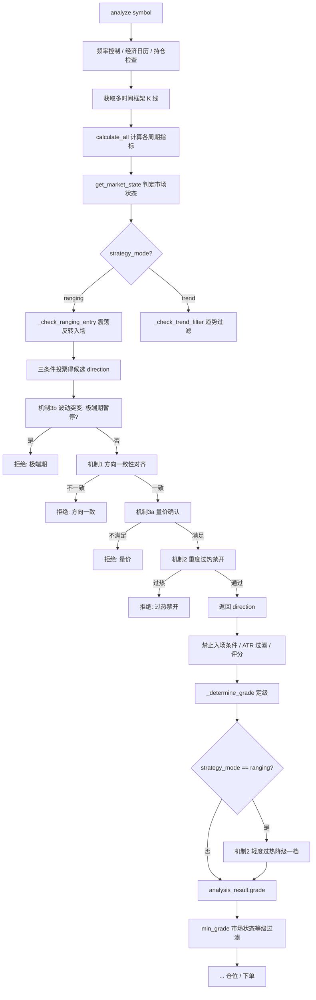

# MTPCS 策略：震荡反转风控三机制 技术方案

## 文档信息

| 项目 | 内容 |
|------|------|
| 方案版本 | v1.0 |
| 对应需求 | `docs/requirements/btc_eth/v6.26_MTPCS震荡反转风控三机制需求文档.md` |
| 代码基线 | v6.26 |
| 涉及文件 | `strategies/btc_eth/strategy.py`、`strategies/btc_eth/market_state.py`、`shared/indicators.py`、`strategies/btc_eth/config.yaml` |
| 编写日期 | 2026-08-28 |
| 文档状态 | 已实现 |

### 评审结论基线（已确认，直接落地）

| 编号 | 结论摘要 | 落地位置 |
|------|---------|---------|
| CP-1 | 新增真正 `EMA21` 字段，方向对齐与乖离率统一用 `EMA21`/`EMA55` | `shared/indicators.py` |
| CP-2 | 均线缺失/NaN/粘合或量价数据缺失 → **保守拒绝**（`fallback_on_missing` 默认 `false`） | 机制①③ |
| CP-3 | 阈值采用推荐初值 | `config.yaml` |
| CP-4 | 新增 `ATR_long`（周期可配，默认 50），与 `ATR`(14) 并列 | `shared/indicators.py` |
| CP-5 | 条件 3/4 去除 `abs()` 方向盲，带符号计算并共用函数；落地方式一：**强度判定仍取绝对值（涨跌皆可识别强趋势），符号仅保留用于日志与机制①协同**，行为与现状等价 | `market_state.py` |
| CP-6 | 仅降级一档，不叠加仓位削减 | 机制② |
| CP-7 | 极端期 per-symbol 暂停 | 机制③ |

---

## 一、总体架构与数据流

### 1.1 三大机制在 `analyze()` 主流程中的介入点

三大机制**仅作用于震荡市（RANGING）入场路径**，趋势市路径（`_check_trend_filter`）不受影响（PRD 2.4）。



**介入点说明（对应真实行号，以当前基线为准）：**

1. **机制③波动 + 机制①方向 + 机制③量价 + 机制②重度过热**：全部内嵌于 [`_check_ranging_entry`](file:///Users/yl/vscode/Binance_quantitative_trading/strategies/btc_eth/strategy.py#L1453-L1581)，在「三条件投票得到候选 `direction` 之后、`return (True, direction)` 之前」依次短路拒绝。调用入口位于 [analyze L781](file:///Users/yl/vscode/Binance_quantitative_trading/strategies/btc_eth/strategy.py#L777-L786)。
2. **机制②轻度过热降级**：位于 [`_determine_grade` 之后（L841）、`min_grade` 过滤（L845-853）之前](file:///Users/yl/vscode/Binance_quantitative_trading/strategies/btc_eth/strategy.py#L841-L853)，仅当 `strategy_mode == 'ranging'` 时执行。

> 顺序约定（PRD 5.4）：先做零成本的**状态判定**（极端期、方向、量价），最后做需附加计算的**过热降级**，保证拒绝路径开销最小、日志可读。本方案与之一致：极端期与量价为纯字段比较，方向对齐为一次字段比较 + 可选粘合判断，过热需额外算乖离率。重度过热放在 `_check_ranging_entry` 内（可提前拒绝、省去后续评分开销），轻度过热降级后置到定级之后（因降级动作依赖 `grade`）。

---

## 二、`shared/indicators.py` 新增字段（CP-1 / CP-4）

### 2.1 新增 `EMA21`（真正 EMA，修复口径不一致）

[`TechnicalIndicators.calculate_all`](file:///Users/yl/vscode/Binance_quantitative_trading/shared/indicators.py#L297-L345) 当前 EMA 循环为：

```python
for period in [12, 26, 55]:
    indicators[f'EMA{period}'] = TechnicalIndicators.calculate_ema(data, period)
```

改为：

```python
# 新增 21 周期 EMA（CP-1）：方向对齐与乖离率统一使用 EMA21/EMA55，
# 修复历史遗留的「MA21(SMA) 与 EMA55 混用」口径不一致问题
for period in [12, 21, 26, 55]:
    indicators[f'EMA{period}'] = TechnicalIndicators.calculate_ema(data, period)
```

- 计算方式复用现有 [`calculate_ema`](file:///Users/yl/vscode/Binance_quantitative_trading/shared/indicators.py#L77-L96)（`ewm(span=21, adjust=False).mean()`）。
- **回测/生产一致性**：回测与生产均通过 `TechnicalIndicators.calculate_all` 产出指标，改一处即可同步；无需回测脚本单独处理。旧的 `MA21`(SMA) 字段保留不动（趋势市路径仍引用 `MA21`，不做破坏性变更）。

### 2.2 新增 `ATR_long`（周期可配，默认 50，CP-4）

`calculate_all` 当前：

```python
indicators['ATR'] = TechnicalIndicators.calculate_atr(data)  # 固定周期 14
```

由于**禁止硬编码**，`ATR_long` 周期需从配置传入。修改 `calculate_all` 签名（增加可选关键字参数，保持向后兼容）：

```python
@staticmethod
def calculate_all(data: pd.DataFrame, atr_long_period: int = 50) -> dict:
    ...
    indicators['ATR'] = TechnicalIndicators.calculate_atr(data)               # 短周期 ATR(14)，复用现有字段
    indicators['ATR_long'] = TechnicalIndicators.calculate_atr(data, atr_long_period)  # 长周期 ATR（新，CP-4）
    ...
```

- 生产调用方 [`analyze L677`](file:///Users/yl/vscode/Binance_quantitative_trading/strategies/btc_eth/strategy.py#L667-L677) 从配置读取周期并传入：

  ```python
  atr_long_period = self.risk_config.get('ranging_strategy', {}).get(
      'volatility_regime', {}).get('atr_long_period', 50)
  indicators[timeframe] = TechnicalIndicators.calculate_all(df, atr_long_period=atr_long_period)
  ```

- **回测一致性**：回测脚本调用 `calculate_all` 时传入与生产相同的 `atr_long_period`（统一从 `config.yaml` 读取），保证 `ATR_long` 口径一致。
- 参数默认值 `50` 仅作为接口兼容缺省；业务上生产与回测均显式传配置值，满足「禁止硬编码」。

---

## 三、五个新增函数的签名、输入、输出与伪代码

> 以下函数均为 [`Strategy`](file:///Users/yl/vscode/Binance_quantitative_trading/strategies/btc_eth/strategy.py#L496) 的实例方法。所有阈值/字段名均来自 `ranging_config`（=`self.risk_config['ranging_strategy']`），无硬编码；每个参数均在函数体内被引用（无幽灵参数）。

### 3.1 前置：安全读取辅助函数（模块级）

为避免重复编写「字段缺失/NaN/空」兜底，新增模块级函数（其余函数复用）：

```python
# strategies/btc_eth/strategy.py 模块级

def _safe_last(indicators: Dict, timeframe: str, field: str) -> Optional[float]:
    """安全读取某时间框架某指标的最新有效值；缺失/NaN/空数据返回 None"""
    series = indicators.get(timeframe, {}).get(field)
    if series is None or len(series) == 0:
        return None
    value = series.iloc[-1]
    if pd.isna(value):
        return None
    return float(value)
```

> 该函数同时被机制①②③ 复用，满足「禁止重复代码」+「异常兜底（禁止裸 `iloc[-1]`）」。

### 3.2 机制① `_check_direction_alignment`

```python
def _check_direction_alignment(
    self,
    direction: str,
    indicators: Dict,
    ranging_config: Dict
) -> Tuple[bool, str]:
    # config = ranging_config.get('direction_alignment', {})
    # if not config.get('enabled', True): return True, ""
    # fast_ma = config.get('fast_ma', 'EMA21')   # CP-1 后统一 EMA21
    # slow_ma = config.get('slow_ma', 'EMA55')
    # fast = _safe_last(indicators, '1d', fast_ma)
    # slow = _safe_last(indicators, '1d', slow_ma)
    #
    # if fast is None or slow is None or slow == 0:
    #     fallback = config.get('fallback_on_missing', False)   # CP-2 默认 false
    #     if fallback:
    #         logger.warning("均线数据缺失，放行方向护栏", ...)
    #         return True, ""
    #     return False, "方向一致性拒绝：日线均线数据缺失"
    #
    # # 均线粘合（CP-2）：EMA21 与 EMA55 相对偏差 ≤ stick_threshold → 保守拒绝
    # stick_threshold = config.get('stick_threshold_pct', 0.3)
    # if abs(fast - slow) / slow * 100 <= stick_threshold:
    #     return False, "方向一致性拒绝：日线均线粘合"
    #
    # if fast > slow:    # 多头排列
    #     if direction == 'SHORT':
    #         return False, "方向一致性拒绝：多头排列禁止做空"
    # elif fast < slow:  # 空头排列
    #     if direction == 'LONG':
    #         return False, "方向一致性拒绝：空头排列禁止做多"
    # return True, ""
```

**输入**：`direction`（候选方向 `LONG`/`SHORT`）、`indicators`（各时间框架指标字典）、`ranging_config`。
**输出**：`(是否通过, 失败原因或空串)`。
**要点**：多头只禁 `SHORT`、空头只禁 `LONG`；一致方向放行；缺失/粘合按 CP-2 保守拒绝。

### 3.3 机制② `_evaluate_overheat`（内部辅助，供 ban/downgrade 复用，避免重复计算）

> 为满足「禁止重复代码」，乖离率与 RSI 的档位评估抽为单一内部函数，`_check_overheat_ban` 与 `_apply_overheat_downgrade` 共用。

```python
def _evaluate_overheat(
    self,
    direction: str,
    indicators: Dict,
    klines: Dict,
    cfg: Dict
) -> str:
    # 返回 'ban'（重度过热） / 'downgrade'（轻度过热） / 'ok'
    # close_1d  = float(pd.DataFrame(klines['1d'])['close'].iloc[-1])
    # fast      = _safe_last(indicators, '1d', 'EMA21')
    # slow      = _safe_last(indicators, '1d', 'EMA55')
    # rsi_4h    = _safe_last(indicators, '4h', 'RSI')
    # if fast is None or slow is None or slow == 0 or rsi_4h is None:
    #     return 'ok'   # 数据不足不触发过热惩罚（不误杀），由量价/方向护栏兜底
    #
    # bias_fast = (close_1d - fast) / fast * 100    # 带符号，无 abs
    # bias_slow = (close_1d - slow) / slow * 100
    # downgrade_enabled = cfg.get('downgrade_enabled', True)
    #
    # 判定（方向敏感）：LONG 只看向上过热(bias>0)，SHORT 只看向下过热(bias<0)
    # if direction == 'LONG':
    #     rsi_ban, rsi_down = cfg['rsi_extreme_long'], cfg['rsi_warn_long']
    #     f_ban, f_down, s_ban, s_down = cfg['bias_fast_ban_pct'], cfg['bias_fast_downgrade_pct'], \
    #                                    cfg['bias_slow_ban_pct'], cfg['bias_slow_downgrade_pct']
    #     over_fast_ban  = bias_fast >= f_ban
    #     over_slow_ban  = bias_slow >= s_ban
    #     over_fast_down = bias_fast >= f_down
    #     over_slow_down = bias_slow >= s_down
    #     rsi_ban_cond   = rsi_4h > rsi_ban
    #     rsi_down_cond  = rsi_down < rsi_4h <= rsi_ban
    # elif direction == 'SHORT':
    #     rsi_ban, rsi_down = cfg['rsi_extreme_short'], cfg['rsi_warn_short']
    #     f_ban, f_down, s_ban, s_down = cfg['bias_fast_ban_pct'], cfg['bias_fast_downgrade_pct'], \
    #                                    cfg['bias_slow_ban_pct'], cfg['bias_slow_downgrade_pct']
    #     over_fast_ban  = bias_fast <= -f_ban    # 向下过热：bias 为负且幅度超阈值
    #     over_slow_ban  = bias_slow <= -s_ban
    #     over_fast_down = bias_fast <= -f_down
    #     over_slow_down = bias_slow <= -s_down
    #     rsi_ban_cond   = rsi_4h < rsi_ban
    #     rsi_down_cond  = rsi_ban <= rsi_4h < rsi_down
    #
    # # 禁开档（重度过热）
    # if over_fast_ban or over_slow_ban or rsi_ban_cond:
    #     return 'ban'
    # # 降级档（轻度过热）；downgrade_enabled=false 时预警区也视为禁开
    # if over_fast_down or over_slow_down or rsi_down_cond:
    #     return 'ban' if not downgrade_enabled else 'downgrade'
    # return 'ok'
```

### 3.4 机制② `_check_overheat_ban`（重度过热禁开）

```python
def _check_overheat_ban(
    self,
    direction: str,
    indicators: Dict,
    klines: Dict,
    ranging_config: Dict
) -> Tuple[bool, str]:
    # cfg = ranging_config.get('overheat_protection', {})
    # if not cfg.get('enabled', True): return True, ""
    # level = self._evaluate_overheat(direction, indicators, klines, cfg)
    # if level == 'ban':
    #     return False, "过热禁开：乖离率或RSI进入极值区"
    # return True, ""
```

### 3.5 机制② `_apply_overheat_downgrade`（轻度过热降级一档）

```python
# 类常量（等级从高到低，与 GRADE_ORDER 一致；C 降档 → 无更高风险档 → None）
_GRADE_LADDER = ['S', 'A', 'B', 'C']

def _apply_overheat_downgrade(
    self,
    grade: str,
    direction: str,
    indicators: Dict,
    klines: Dict,
    ranging_config: Dict
) -> Optional[str]:
    # cfg = ranging_config.get('overheat_protection', {})
    # if not cfg.get('enabled', True): return grade
    # level = self._evaluate_overheat(direction, indicators, klines, cfg)
    # if level != 'downgrade':
    #     return grade
    # idx = self._GRADE_LADDER.index(grade) if grade in self._GRADE_LADDER else None
    # if idx is None or idx + 1 >= len(self._GRADE_LADDER):
    #     return None            # C 已是最低档，再降即「禁开」
    # logger.info("轻度过热，信号降一档", before=grade, after=self._GRADE_LADDER[idx + 1])
    # return self._GRADE_LADDER[idx + 1]
```

**输出**：返回 `str`（S→A→B→C），`'C'` 降档返回 `None`（表示禁开）。

> `None` 的处理见 [7.1 降级插入点](#7-异常兜底与降级策略)，在 `min_grade` 过滤前显式短路拒绝，避免 `GRADE_ORDER.get(None, 3)` 在 `min_grade='C'` 时漏判。

### 3.6 机制③ `_check_volume_confirm`（量价确认）

```python
def _check_volume_confirm(
    self,
    direction: str,
    indicators: Dict,
    klines: Dict,
    ranging_config: Dict
) -> Tuple[bool, str]:
    # cfg = ranging_config.get('volume_confirm', {})
    # if not cfg.get('enabled', True): return True, ""
    # df_4h = pd.DataFrame(klines['4h'])
    # close_4h  = float(df_4h['close'].iloc[-1])
    # volume    = float(df_4h['volume'].iloc[-1]) if pd.notna(df_4h['volume'].iloc[-1]) else None
    # bb_middle = _safe_last(indicators, '4h', 'BB_Middle')
    # vol_ma    = _safe_last(indicators, '4h', 'Volume_MA')
    #
    # # 数据缺失 → 保守拒绝（CP-2）
    # if close_4h is None or volume is None or bb_middle is None or vol_ma is None:
    #     return False, "量价确认拒绝：量价数据缺失"
    #
    # shrink_ratio = cfg.get('shrink_ratio', 1.0)
    # # 价格方向确认（穿越布林中轨）
    # if direction == 'SHORT' and not close_4h < bb_middle:
    #     return False, "量价确认拒绝：收盘价未跌破布林中轨"
    # if direction == 'LONG' and not close_4h > bb_middle:
    #     return False, "量价确认拒绝：收盘价未站上布林中轨"
    # # 缩量确认
    # if not volume < shrink_ratio * vol_ma:
    #     return False, "量价确认拒绝：成交量未缩量"
    # return True, ""
```

### 3.7 机制③ `_check_volatility_regime`（波动突变 / 极端期）

```python
def _check_volatility_regime(
    self,
    symbol: str,
    indicators: Dict,
    ranging_config: Dict
) -> Tuple[bool, str]:
    # cfg = ranging_config.get('volatility_regime', {})
    # if not cfg.get('enabled', True): return True, ""
    #
    # now = datetime.now()
    # # 已处于极端期暂停窗口 → 直接拒绝（跨调度周期保持，见第五部分）
    # pause_until = self.symbol_extreme_pause_until.get(symbol)
    # if pause_until is not None and now < pause_until:
    #     return False, f"极端期：{symbol}震荡反转暂停至{pause_until}"
    #
    # atr_short = _safe_last(indicators, '4h', 'ATR')
    # atr_long  = _safe_last(indicators, '4h', 'ATR_long')
    # if atr_short is None or atr_long is None or atr_long == 0:
    #     # 波动数据缺失：不标记也不拒绝（无法判断），记录告警
    #     logger.warning(f"{symbol} 波动数据缺失，跳过极端期检测")
    #     return True, ""
    #
    # spike_ratio = cfg.get('spike_ratio', 2.0)
    # if atr_short / atr_long > spike_ratio:
    #     pause_bars = cfg.get('pause_bars', 12)
    #     bar_hours  = cfg.get('pause_interval_hours', 4)   # 4h K线
    #     self.symbol_extreme_pause_until[symbol] = now + timedelta(hours=pause_bars * bar_hours)
    #     logger.warning("标记极端期，暂停震荡反转", symbol=symbol,
    #                    atr_short=atr_short, atr_long=atr_long,
    #                    ratio=atr_short / atr_long, pause_until=...)
    #     return False, f"极端期：ATR短长比={atr_short/atr_long:.2f} 超阈值，暂停震荡反转"
    # return True, ""
```

> 波动数据缺失的取舍：极端期是「额外保护」，数据不足时不应误杀正常信号；缺失 → 放行 + `warning`（与 PRD 6.1「禁止裸 `iloc` 中断主循环」一致）。均线/量价缺失去走各自护栏的「保守拒绝」，两类缺失语义不同，已在各自函数内独立处理。

---

## 四、`_check_ranging_entry` 拆分（≤50 行编排函数）

现状 [`_check_ranging_entry`](file:///Users/yl/vscode/Binance_quantitative_trading/strategies/btc_eth/strategy.py#L1453-L1581) 约 128 行（含三条件投票、方向判定、日志）。拆分目标：主函数只做**编排**，≤50 行。

### 4.1 拆分子函数 `_vote_ranging_direction`

将现有「BB 触轨 / RSI 极值 / 反转形态」三条件投票抽为独立函数，返回候选方向：

```python
def _vote_ranging_direction(
    self,
    indicators: Dict,
    klines: Dict,
    entry_conditions: Dict
) -> Tuple[Optional[str], str, list]:
    # 计算 long_votes / short_votes / conditions_met（沿用现有逻辑，仅迁移，不改判定）
    # ...
    # if long_votes == 0 and short_votes == 0: return None, "无震荡入场条件满足(...)", conditions_met
    # if long_votes == short_votes:            return None, f"方向不一致(...)", conditions_met
    # direction = 'LONG' if long_votes > short_votes else 'SHORT'
    # return direction, "", conditions_met
```

> 若该子函数本身仍接近 50 行，再拆为三个更小函数：`_bb_touch_votes`、`_rsi_extreme_votes`、`_reversal_pattern_votes`（每个 ≤30 行），`_vote_ranging_direction` 仅做汇总。具体拆分边界以「单函数 ≤50 行」为硬约束，实现时按需二级拆分。

### 4.2 编排函数（重构后）

```python
def _check_ranging_entry(
    self,
    symbol: str,
    indicators: Dict,
    klines: Dict
) -> Tuple[bool, str]:
    ranging_config = self.risk_config.get('ranging_strategy', {})
    if not ranging_config.get('enabled', True):
        return False, "震荡市策略未启用"
    try:
        if '4h' not in indicators or '4h' not in klines:
            return False, "4h数据缺失"
        entry_conditions = ranging_config.get('entry_conditions', {})

        # (0) 三条件投票 → 候选方向
        direction, vote_reason, conditions_met = self._vote_ranging_direction(
            indicators, klines, entry_conditions
        )
        if direction is None:
            return False, vote_reason

        # (1) 机制③波动突变：极端期暂停
        ok, reason = self._check_volatility_regime(symbol, indicators, ranging_config)
        if not ok:
            return False, reason

        # (2) 机制①方向一致性
        ok, reason = self._check_direction_alignment(direction, indicators, ranging_config)
        if not ok:
            return False, reason

        # (3) 机制③量价确认
        ok, reason = self._check_volume_confirm(direction, indicators, klines, ranging_config)
        if not ok:
            return False, reason

        # (4) 机制②重度过热禁开
        ok, reason = self._check_overheat_ban(direction, indicators, klines, ranging_config)
        if not ok:
            return False, reason

        logger.info(f"{symbol} 震荡入场通过", direction=direction, conditions=conditions_met)
        return True, direction
    except Exception as e:
        logger.error(f"{symbol} 震荡入场检查异常", error=str(e), exc_info=True)
        return False, f"震荡入场检查异常: {str(e)}"
```

编排函数体约 40 行，满足 ≤50 行约束。原有 `dist_to_lower/dist_to_upper/rsi` 等中间变量随投票逻辑迁入子函数，不再出现在主函数中。

---

## 五、极端期状态记忆的数据结构与生命周期

### 5.1 数据结构

在 [`Strategy.__init__`](file:///Users/yl/vscode/Binance_quantitative_trading/strategies/btc_eth/strategy.py#L496-L587) 新增（`self._cycle_count` 附近）：

```python
# 震荡反转极端期暂停截止时间（per-symbol，机制③，CP-7）
# 结构：{symbol: datetime}，跨 analyze 调度周期保持，进程内有效
self.symbol_extreme_pause_until: Dict[str, datetime] = {}
```

**选择放在 `Strategy` 而非 `FrequencyController` 的理由**：

- 极端期是**波动率状态**，非交易频率属性，语义上不属于频率控制。
- `FrequencyController` 带 DB 持久化语义（`frequency_control_state` 表），而极端期暂停窗口很短（默认 48h）、重在「跨调度周期（同进程内）」保持，内存即可，避免新增 DB 列与迁移。
- PRD 5.3.2 表述为「沿 FrequencyController 的 symbol 级状态字段存储（`extreme_pause_until` 或等效）」，本方案采用**等效的 Strategy 内存字典**（per-symbol），满足 CP-7。

### 5.2 生命周期

| 阶段 | 动作 | 说明 |
|------|------|------|
| 初始化 | 空字典 | `Strategy.__init__` |
| 检测命中 | 写入 `self.symbol_extreme_pause_until[symbol] = now + timedelta(hours=pause_bars * pause_interval_hours)` | `_check_volatility_regime`，`warning` 级日志 |
| 暂停消费 | `_check_volatility_regime` 开头判断 `now < pause_until` → 拒绝入场 | 跨调度周期（每小时 cron）保持 |
| 惰性清理 | 过期后再次命中检测，若 `atr_ratio` 仍超阈值则续期，否则自然过期不再拦截 | `get` 语义，过期值为「过去时间」自动失效 |
| 进程重启 | 状态丢失 | 重启后由 `_check_volatility_regime` 重新检测 `atr_ratio` 重新标记；丢失即「宁可重新暂停」，安全性不受影响 |

> 耐力说明：暂停计时按 `datetime`（与现有冷却期一致），4h K 线间隔由配置 `pause_interval_hours=4` 显式给定，避免硬编码「一 K 线 = 4 小时」。

---

## 六、`config.yaml` 新增配置块（完整 schema）

置于 [`ranging_strategy`](file:///Users/yl/vscode/Binance_quantitative_trading/strategies/btc_eth/config.yaml#L433) 之下，与现有 `entry_conditions` / `risk` 并列。全部阈值带中文注释、有默认值、可独立开关，满足「禁止硬编码 + 可维护性」。

```yaml
    # ===== 震荡反转风控三机制（v6.26 新增）=====
    ranging_strategy:
      enabled: true
      # ...（现有 entry_conditions / exit_conditions / risk / allowed_grades / scoring_weights / trend_filter 保持不变）

      # 机制①：方向一致性对齐（CP-1/CP-2）
      direction_alignment:
        enabled: true
        fast_ma: "EMA21"            # 快线字段名（CP-1 新增的真正 EMA21）
        slow_ma: "EMA55"            # 慢线字段名（现有字段）
        fallback_on_missing: false  # 均线缺失/NaN 时是否放行（true=放行+告警，false=保守拒绝）
        stick_threshold_pct: 0.3    # 均线粘合阈值（%）：|EMA21-EMA55|/EMA55 ≤ 该值视为粘合，保守拒绝

      # 机制②：乖离率 / 过热保护（CP-3/CP-6）
      overheat_protection:
        enabled: true
        downgrade_enabled: true     # 是否启用「降级一档」（false 时预警区也直接禁开）
        bias_fast_downgrade_pct: 4.0   # 快线乖离率降级阈值（%，方向敏感）
        bias_fast_ban_pct: 6.0         # 快线乖离率禁开阈值（%）
        bias_slow_downgrade_pct: 6.0   # 慢线乖离率降级阈值（%）
        bias_slow_ban_pct: 9.0         # 慢线乖离率禁开阈值（%）
        rsi_extreme_long: 85           # RSI 极值区上限（禁开做多）
        rsi_extreme_short: 15          # RSI 极值区下限（禁开做空）
        rsi_warn_long: 75              # RSI 预警区上限（降级做多）
        rsi_warn_short: 25             # RSI 预警区下限（降级做空）

      # 机制③a：量价确认
      volume_confirm:
        enabled: true
        shrink_ratio: 1.0            # 缩量判定：当前 4h 成交量 < shrink_ratio × Volume_MA(20)

      # 机制③b：波动突变 / 极端期（CP-4/CP-7）
      volatility_regime:
        enabled: true
        atr_long_period: 50          # 长周期 ATR 周期（CP-4 新增 ATR_long 字段）
        spike_ratio: 2.0             # ATR_short/ATR_long > 该值触发极端期
        pause_bars: 12               # 极端期暂停震荡反转的 4h K 线数
        pause_interval_hours: 4      # 每根 K 线对应小时数（用于暂停时长换算，避免硬编码）
```

**配置一致性约束（PRD 6.2）**：新增 key 均为 snake_case；与 `tuning_overrides/` 若有同名覆盖，部署前需校验合并结果；三个机制均可通过 `enabled: false` 一键关闭，退化为现状行为（满足 AC-5.4）。

---

## 七、异常兜底与降级策略

### 7.1 降级插入点（analyze 主流程修改）

在 [analyze L841-842](file:///Users/yl/vscode/Binance_quantitative_trading/strategies/btc_eth/strategy.py#L841-L853) 之间插入（仅震荡市路径）：

```python
# 8. 确定信号等级
grade = self._determine_grade(score, symbol)

# 8.0 v6.26：机制②轻度过热降级（仅震荡市路径，min_grade 过滤之前）
if strategy_mode == 'ranging':
    grade = self._apply_overheat_downgrade(
        grade, direction, indicators, klines,
        self.risk_config.get('ranging_strategy', {})
    )
    if grade is None:   # 降档后低于最低允许等级（C 再降即禁开）
        analysis_result['reason'] = "过热降级后低于最低允许等级，禁开"
        return analysis_result

analysis_result['grade'] = grade
```

> 显式处理 `grade is None`，避免直接进入 [L846 min_grade 过滤](file:///Users/yl/vscode/Binance_quantitative_trading/strategies/btc_eth/strategy.py#L845-L853) 时 `GRADE_ORDER.get(None, 3)` 在 `min_grade='C'` 配置下漏判（PRD 5.2.4「降级到低于最低允许等级时自然被拒绝」的工程化保障）。`direction` 变量在 [L786](file:///Users/yl/vscode/Binance_quantitative_trading/strategies/btc_eth/strategy.py#L777-L786)（ranging）与 [L795/L797](file:///Users/yl/vscode/Binance_quantitative_trading/strategies/btc_eth/strategy.py#L787-L797)（trend）处赋值，运行至 L841 时必已定义，无未定义风险。

### 7.2 异常兜底矩阵

| 异常场景 | 处理方式 | 落点 |
|---------|---------|------|
| 指标字段缺失 / Series 为空 / 值为 NaN | `_safe_last` 返回 `None`，禁止裸 `iloc[-1]` | 统一辅助函数 |
| 均线（EMA21/EMA55）缺失/NaN/粘合 | `fallback_on_missing=false` → 保守拒绝 | 机制① |
| 量价（volume/Volume_MA/BB_Middle）缺失 | 保守拒绝 | 机制③a |
| 波动（ATR/ATR_long）缺失或 `ATR_long==0` | 放行 + `warning`（不误杀） | 机制③b |
| 乖离率/RSI 数据不足 | 返回 `'ok'`，不触发过热惩罚（由其他护栏兜底） | 机制② |
| `klines['1d']` 缺失 | 机制② `close_1d` 读取前判空，异常由 `_check_ranging_entry` 外层 `try/except` 兜底 | 编排函数 |
| 任一机制 `enabled: false` | 短路放行（`return True` / 返回原 `grade`），退化为现状行为 | 各机制入口 |

### 7.3 整体异常兜底

- `_check_ranging_entry` 保留已有的 `try/except Exception` 外层兜底（[L1579-1581](file:///Users/yl/vscode/Binance_quantitative_trading/strategies/btc_eth/strategy.py#L1579-L1581)），任何未预期异常返回 `(False, "震荡入场检查异常: ...")`，不中断主循环。
- 所有「拒绝」均产出含**机制编号 + 当前值 vs 阈值 + 方向**的结构化日志（满足 PRD 6.4）。

---

## 八、回测 `get_market_state_simple` 方向修复方案（CP-5）

### 8.1 问题

[`get_market_state`](file:///Users/yl/vscode/Binance_quantitative_trading/strategies/btc_eth/market_state.py#L57-L151)（生产）与 [`get_market_state_simple`](file:///Users/yl/vscode/Binance_quantitative_trading/strategies/btc_eth/market_state.py#L211-L266)（回测）的：

- 条件3 价格变化：[L121](file:///Users/yl/vscode/Binance_quantitative_trading/strategies/btc_eth/market_state.py#L115-L123) / [L250](file:///Users/yl/vscode/Binance_quantitative_trading/strategies/btc_eth/market_state.py#L249-L252) 用 `abs()`。
- 条件4 日线斜率：[L133](file:///Users/yl/vscode/Binance_quantitative_trading/strategies/btc_eth/market_state.py#L125-L135) / [L256](file:///Users/yl/vscode/Binance_quantitative_trading/strategies/btc_eth/market_state.py#L254-L260) 用 `abs()`。

方向盲导致：单边暴涨/暴跌时符号被丢弃，日线斜率方向与价格变化方向无法被识别并输出，从而无法为机制①（方向护栏）及复盘提供方向依据。

### 8.2 修复方案：提取带符号公共函数，`get_market_state` 与 `get_market_state_simple` 共用

在 [`market_state.py`](file:///Users/yl/vscode/Binance_quantitative_trading/strategies/btc_eth/market_state.py#L11) 新增两个模块级纯函数（**禁止重复代码**，两处判定共用）：

```python
def _signed_price_change(close_now: float, close_ago: float) -> Optional[float]:
    """带符号价格变化百分比；数据无效返回 None"""
    if close_now is None or close_ago is None or close_ago <= 0:
        return None
    return (close_now / close_ago - 1) * 100


def _signed_daily_slope(ma_now: float, ma_prev: float) -> Optional[float]:
    """带符号日线 EMA21 斜率百分比；数据无效返回 None"""
    if ma_now is None or ma_prev is None or ma_prev <= 0:
        return None
    return (ma_now / ma_prev - 1) * 100
```

生产 `get_market_state` 条件3/4 与回测 `get_market_state_simple` 条件3/4 均改为调用这两个函数。

### 8.3 判定式（兼容 MarketState 二态，衡量「强度」取绝对值，符号用于日志与协同）

`MarketState` 仅二态（PRD 2.4 明确不改枚举），强趋势无论涨跌都应可识别；因此**强度判定仍取绝对值**，但计算过程带符号、日志输出带方向：

```python
# 条件3
price_change = _signed_price_change(close_now, close_10ago)   # 带符号
if price_change is None or abs(price_change) <= price_change_threshold:
    return RANGING, f"价格变化={price_change:+.1f}% ..."       # +号输出方向

# 条件4
daily_slope = _signed_daily_slope(ma21_now, ma21_prev)         # 带符号
if daily_slope is None or abs(daily_slope) <= daily_slope_threshold:
    return RANGING, f"日线EMA21斜率={daily_slope:+.3f}% ..."
```

**修复价值说明：**

1. 计算与日志**保留符号**（`+5.2%` / `-0.30%`），方向不再被 `abs()` 静默抹除，复盘与机制①可感知日线斜率方向。
2. 逻辑不再出现「先 `abs()` 再比较」这一丢失方向后再参与判定的写法，杜绝同类方向盲隐患。
3. 两处（生产/回测）共用同一算符函数，满足 AC-5.2「逻辑一致、共用计算函数」。

> **CP-5 落地方式已确认（方式一）**：本方案采用「强度取绝对值判强弱、符号留作方向信息」的定义，强趋势判定**行为与现状等价**，仅补齐方向信息供日志与机制①协同。已确认采用此方案，不再保留「方向一致才判强趋势」的备选（方式二）。

---

## 九、回测 / 生产一致性检查清单

| 项 | 生产 | 回测 | 一致性保障 |
|----|------|------|-----------|
| EMA21 | `calculate_all` 产出 | 同左（共用 `calculate_all`） | CP-1 单点修改 |
| ATR_long | `calculate_all(df, atr_long_period=配置值)` | 同左 | CP-4，统一传参 |
| 方向护栏 | `_check_direction_alignment` | 不适用（回测调用 `get_market_state_simple` 判定状态，不直接走入场护栏） | 状态判定共用带符号函数 |
| 条件3/4 方向 | `_signed_*` 公共函数 | 同左 | CP-5 共用函数 |

> 回测脚本若需完整复现震荡反转入场三机制，应将 `_check_ranging_entry` 拆出的子函数作为可复用模块（或回测环境 import 同一 `strategy.py`），避免回测侧复制粘贴一套逻辑。具体回测集成方式遵循项目「禁止服务器回测」规则，回测在本机执行。

---

## 十、实现任务拆分建议

| # | 任务 | 涉及文件 | 依赖 |
|---|------|---------|------|
| 1 | `calculate_all` 新增 EMA21、ATR_long（签名加参数） | `shared/indicators.py` | 无 |
| 2 | market_state 抽 `_signed_price_change`/`_signed_daily_slope` 并替换两处 | `strategies/btc_eth/market_state.py` | 1 |
| 3 | 新增模块级 `_safe_last`、5 个机制函数、`_vote_ranging_direction`、`_evaluate_overheat` | `strategies/btc_eth/strategy.py` | 1、2 |
| 4 | 重构 `_check_ranging_entry` 为编排函数 | `strategies/btc_eth/strategy.py` | 3 |
| 5 | analyze 引入降级插入点 + `__init__` 新增状态字典 | `strategies/btc_eth/strategy.py` | 3 |
| 6 | config.yaml 新增三机制配置块 | `strategies/btc_eth/config.yaml` | 3 |
| 7 | 单元测试（正常/NaN/缺失/空/极值/每条件分支） | 测试目录 | 3-6 |
| 8 | 本机回测验证（禁止服务器回测） | 本地 | 6、7 |

---

## 十一、关键文件索引

- 主流程与入场：[strategy.py analyze](file:///Users/yl/vscode/Binance_quantitative_trading/strategies/btc_eth/strategy.py#L589-L898)、[_check_ranging_entry](file:///Users/yl/vscode/Binance_quantitative_trading/strategies/btc_eth/strategy.py#L1453-L1581)
- 市场状态：[market_state.py](file:///Users/yl/vscode/Binance_quantitative_trading/strategies/btc_eth/market_state.py)
- 指标计算：[indicators.py calculate_all](file:///Users/yl/vscode/Binance_quantitative_trading/shared/indicators.py#L297-L345)
- 配置：[config.yaml](file:///Users/yl/vscode/Binance_quantitative_trading/strategies/btc_eth/config.yaml)