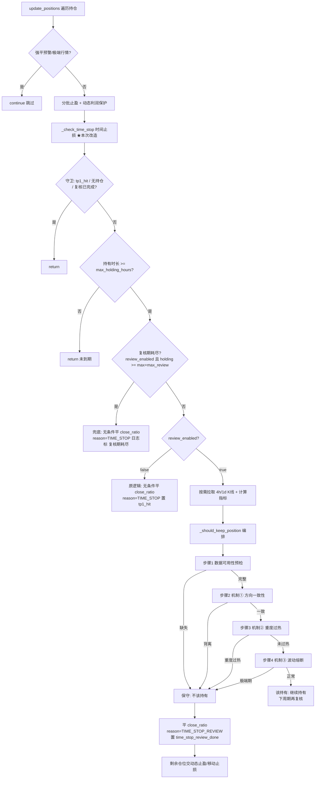

# MTPCS 策略：时间平仓复核制（TIME_STOP_REVIEW）技术方案

## 文档信息

| 项目 | 内容 |
|------|------|
| 方案版本 | v1.0 |
| 对应需求 | `docs/requirements/btc_eth/v6.27_时间平仓复核制需求文档.md` |
| 代码基线 | v6.26（对应实现 v6.27 已完成并通过测试） |
| 涉及文件 | `strategies/btc_eth/strategy.py`、`strategies/btc_eth/config.yaml` |
| 编写日期 | 2026-09-01 |
| 文档状态 | **已实现** |

### 已确认设计决策（评审前冻结，本方案按此落地）

| 编号 | 决策 | 说明 |
|------|------|------|
| D1 | 复核数据来源：**方案 A（复核时按 symbol 按需拉取）** | 仅在进入复核期时拉取 4h/1d K 线并计算指标，不破坏主循环架构 |
| D2 | 防重复标记：**新增独立字段 `time_stop_review_done`** | 不复用 `tp1_hit`（其被动态止盈 `also_on_tp1` 使用，见 1.5） |
| D3 | 数据可用性预检：关键指标任一缺失 → **保守平仓** | EMA21/EMA55/RSI/ATR/ATR_long 任一缺失按「不该持有」处理 |
| D4 | 兜底：`holding_hours >= max_holding_hours + max_review_hours` **无条件平 `close_ratio`** | reason 用 `TIME_STOP` 统一语义，日志以「复核期耗尽」标识区分 |
| D5 | 量价确认（`_check_volume_confirm`）**不参与**持仓复核 | 仅复用三机制（方向/过热/波动） |
| D6 | `review_enabled: false` 时**完全恢复原逻辑** | 无条件到点平仓，`close_reason="TIME_STOP"`，行为与 v6.26 及以前逐字节一致 |
| D7 | 新增编排函数 `_should_keep_position(symbol, position, indicators, klines) -> (keep, reason)`（async） | 内部依序调用三机制，任一「不该持有」→ `keep=False` |

---

## 一、代码事实核验（开发前必读，避免幻觉）

> 本节为本文档编写时对 strategy.py / config.yaml / shared 的实际核验结果。**与 PRD 的描述存在 2 处签名差异，以本节为准**（见 1.4）。

### 1.1 主循环执行顺序

[main.py `run_strategy`](file:///Users/yl/vscode/Binance_quantitative_trading/strategies/btc_eth/main.py#L129-L161)：

1. `await strategy.update_positions()`（L142）—— 持仓管理（含时间止损）
2. 逐 symbol `await strategy.analyze(symbol)`（L159）—— 生成新信号

**关键结论：** `update_positions()` 先于 `analyze()` 执行，因此在 `update_positions()` 阶段**不存在** `analyze()` 已算好的指标可复用 → 复核数据只能「按需拉取」（决策 D1，方案 A）。

### 1.2 `update_positions()` 主循环（strategy.py L2759-2793）

逐 symbol 遍历 `self.positions`，每个 symbol 的执行顺序：

| 顺序 | 调用 | 说明 | 触发后行为 |
|------|------|------|-----------|
| 1 | `_get_current_price(symbol)` | 获取当前价；`None` → `continue` | 跳过该 symbol |
| 2 | `_check_liquidation_warning(symbol, position)` | 强平预警 | `continue`（跳过后续全部） |
| 3 | `_check_extreme_market(symbol, position, current_price)` | 极端行情 | `continue`（跳过后续全部） |
| 4 | 更新 `highest_price` / `lowest_price` | — | — |
| 5 | `_check_partial_take_profit(symbol, position, current_price)` | 分批止盈 | — |
| 6 | `_check_dynamic_trailing(symbol, position, current_price)` | 动态利润保护 | — |
| 7 | `_check_time_stop(symbol, position)` | **时间止损（本次改造点）** | — |

**关键结论：** 主循环内部仅有 `current_price`，**没有** `indicators` / `klines`。改造后 `_check_time_stop` 签名**保持不变**（`(symbol, position)`），复核所需数据在 `_check_time_stop` 内部按需拉取（见 5.2），主循环调用点（L2793）无需改动。

### 1.3 三机制函数真实签名（签名差异提醒）

| 函数 | 实际签名 | 位置 | 返回语义 |
|------|---------|------|---------|
| `_check_direction_alignment` | `(direction, indicators, ranging_config)` → `(bool, str)` | [strategy.py L1638](file:///Users/yl/vscode/Binance_quantitative_trading/strategies/btc_eth/strategy.py#L1638-L1662)（staticmethod） | 方向背离/均线缺失/粘合 → `(False, reason)` |
| `_check_overheat_ban` | `(direction, indicators, klines, ranging_config)` → `(bool, str)` | [strategy.py L1715](file:///Users/yl/vscode/Binance_quantitative_trading/strategies/btc_eth/strategy.py#L1715-L1723)（实例方法） | 重度过热 → `(False, reason)` |
| `_check_volatility_regime` | `(symbol, indicators, ranging_config)` → `(bool, str)` | [strategy.py L1770](file:///Users/yl/vscode/Binance_quantitative_trading/strategies/btc_eth/strategy.py#L1770-L1801)（实例方法） | 极端期 → `(False, reason)`，会写 `symbol_extreme_pause_until` |
| `_check_volume_confirm` | `(direction, indicators, klines, ranging_config)` → `(bool, str)` | [strategy.py L1741](file:///Users/yl/vscode/Binance_quantitative_trading/strategies/btc_eth/strategy.py#L1741-L1768)（staticmethod） | 量价确认（**不参与复核**） |

**⚠️ 签名差异提醒（实现时以本节为准）：**

PRD 4.3 表格已按实际签名列出。实现时需特别注意 `_check_volatility_regime` 与其它机制不一致的参数形式：

1. `_check_volatility_regime` 的**第一个参数是 `symbol`，不是 direction**，且**没有 `klines` 参数**。`_should_keep_position` 调用时必须传 `symbol`（见 5.1 步骤 4）。
2. `_check_direction_alignment` **没有 `klines` 参数**；仅 `_check_overheat_ban` 有 `klines` 参数。
3. `_check_direction_alignment` / `_check_volume_confirm` 为 `staticmethod`，`_check_overheat_ban` / `_check_volatility_regime` 为实例方法（无 `@staticmethod`），`_should_keep_position` 内以 `self.` 调用均可。

### 1.4 指标获取方式（analyze 主流程，strategy.py L626，指标拉取与构建 L686-705）

```python
klines = await self.kline_service.get_multi_timeframe_data(
    symbol=symbol, intervals=self.timeframes)          # self.timeframes = ['1h','4h','1d']
indicators = self._build_indicators(klines)            # v6.27：公共指标构建（原 for 循环已提取，见 5.4）
```

- 原「拉取 → DataFrame + to_numeric → `calculate_all`」循环在 v6.27 被提取为公共函数 `_build_indicators`（strategy.py L3863），`analyze()` 与复核路径共用，消除重复代码。
- `TechnicalIndicators.calculate_all` 产出字段含 `EMA21` / `EMA55` / `RSI` / `ATR` / `ATR_long`（[shared/indicators.py L297-342](file:///Users/yl/vscode/Binance_quantitative_trading/shared/indicators.py#L297-L342)）。
- `ATR_long` 周期必须与生产一致：从 `risk.ranging_strategy.volatility_regime.atr_long_period` 读取（config.yaml L504，默认 50）。
- `self.timeframes` 定义于 [strategy.py L555](file:///Users/yl/vscode/Binance_quantitative_trading/strategies/btc_eth/strategy.py#L555)，来自 `config['strategy']['timeframes']`（config.yaml L18-21）。
- 复核按需拉取时**复用上述同一套做法**（`_get_review_market_data` 内部调用 `_build_indicators`），保证与 `analyze()` 口径完全一致（生产与回测统一）。

### 1.5 其它已核实事实

| 事实 | 位置 | 说明 |
|------|------|------|
| `_check_time_stop` 改造后 | [strategy.py L3906-3955](file:///Users/yl/vscode/Binance_quantitative_trading/strategies/btc_eth/strategy.py#L3906-L3955) | 守卫 `tp1_hit or current_quantity<=0 or time_stop_review_done`；未到期 return；兜底（`review_exhausted`）/原逻辑（`set_tp1_hit`）/复核三分支见 5.2 |
| `_close_position` | [strategy.py L2831](file:///Users/yl/vscode/Binance_quantitative_trading/strategies/btc_eth/strategy.py#L2831-L2838) | `(symbol, position, close_quantity, close_reason, current_price=None) -> bool` |
| `_get_grade_risk` | [strategy.py L1872](file:///Users/yl/vscode/Binance_quantitative_trading/strategies/btc_eth/strategy.py#L1872-L1884) | `signal_levels.get(grade, signal_levels.get('A', self.risk_config))` |
| `_safe_last(indicators, tf, field)` | [strategy.py L32](file:///Users/yl/vscode/Binance_quantitative_trading/strategies/btc_eth/strategy.py#L32-L42) | 模块级辅助：缺失/空/NaN → `None`，用于数据预检 |
| `symbol_extreme_pause_until` | [strategy.py L605](file:///Users/yl/vscode/Binance_quantitative_trading/strategies/btc_eth/strategy.py#L605) | `Dict[str, datetime]`，`_check_volatility_regime` 会写入（副作用） |
| `tp1_hit` 被动态止盈使用 | [strategy.py L3458](file:///Users/yl/vscode/Binance_quantitative_trading/strategies/btc_eth/strategy.py#L3458) | `tp1_activated = activation_config.get('also_on_tp1', True) and position.tp1_hit` → **复用 `tp1_hit` 会误激活动态止盈**（决策 D2 的依据） |
| `time_stop` 配置 | config.yaml L168-172(S)、L201-205(A)、L234-238(B)、L267-271(C) | `max_holding_hours` / `close_ratio`（原有）+ `review_enabled` / `max_review_hours`（v6.27 新增，当前默认 `review_enabled: false`） |
| `ranging_strategy` 配置 | config.yaml L441-502 | 三机制阈值均在 `risk.ranging_strategy` 下，v6.26 已就绪 |

---

## 二、总体架构

### 2.1 改造定位

时间平仓复核制**只改造 `_check_time_stop` 一条路径**：将「到期无条件平仓」升级为「到期进入复核期 → 每周期三机制复核 → 不该持有才平 / 兜底强制平」。不触及入场、止盈、止损、强平预警、极端行情等其他路径。



### 2.2 数据流

```
复核触发 → _get_review_market_data(symbol)
        → kline_service.get_multi_timeframe_data(symbol, ['1h','4h','1d'])
        → _build_indicators(klines)  # DataFrame + to_numeric + calculate_all，口径与 analyze 一致
        → 产出 EMA21/EMA55/RSI/ATR/ATR_long
        → _should_keep_position(symbol, position, indicators, klines)
        → (keep, reason)
```

---

## 三、时序设计

### 3.1 完整时序（复核触发 → 数据拉取 → 预检 → 三机制判定 → 平仓/继续）

```mermaid
sequenceDiagram
    participant U as update_positions
    participant T as _check_time_stop
    participant M as _get_review_market_data
    participant K as kline_service
    participant S as _should_keep_position
    participant M1 as 机制①方向
    participant M2 as 机制②过热
    participant M3 as 机制③波动

    U->>T: _check_time_stop(symbol, position)
    Note over T: 守卫: tp1_hit 或 current_quantity<=0 或 time_stop_review_done → return
    T->>T: 读 time_stop 配置<br/>max_holding_hours / close_ratio / review_enabled / max_review_hours
    T->>T: holding_hours < max_holding_hours ? → return（未到期）
    alt 复核期耗尽（review_enabled 且 holding >= max+max_review）
        T->>T: 兜底无条件平仓（reason=TIME_STOP，日志标「复核期耗尽」）→ return
    else review_enabled == false
        T->>T: 原逻辑无条件平仓（reason=TIME_STOP，置 tp1_hit）→ return
    else 进入复核期（review_enabled == true）
        T->>M: _get_review_market_data(symbol)
        M->>K: get_multi_timeframe_data(symbol, ['1h','4h','1d'])
        K-->>M: klines
        M->>M: 计算 indicators（_build_indicators，口径与 analyze 一致）
        M-->>T: (indicators, klines) 或 (None, None)
        alt 数据拉取失败
            T->>T: 保守平仓（reason=TIME_STOP_REVIEW，trigger=数据获取失败）
        else 数据可用
            T->>S: await _should_keep_position(symbol, position, indicators, klines)
                S->>S: 步骤1 数据可用性预检（任一关键指标缺失 → 不该持有）
                S->>M1: _check_direction_alignment(direction, indicators, config)
                alt 方向背离/粘合
                    M1-->>S: (False, reason)
                else 一致
                    S->>M2: _check_overheat_ban(direction, indicators, klines, config)
                    alt 重度过热
                        M2-->>S: (False, reason)
                    else 未过热
                        S->>M3: _check_volatility_regime(symbol, indicators, config)
                        alt 极端期
                            M3-->>S: (False, reason)
                        else 正常
                            M3-->>S: (True, "")
                        end
                    end
                end
                S-->>T: (keep, reason)
                alt keep == False（不该持有）
                    T->>T: 平 close_ratio，reason=TIME_STOP_REVIEW<br/>成功置 time_stop_review_done=True
                    T-->>U: 剩余仓位交动态止盈/移动止损
                else keep == True（该持有）
                    T->>T: 记录复核日志（机制明细）→ return，下周期再复核
                end
            end
        end
    end
```

### 3.2 时序要点

1. **复核触发顺序**：强平预警 → 极端行情 → 分批止盈 → 动态止盈 → 时间止损（保持现有顺序，复核嵌入最后一步，不改变已有优先级）。
2. **数据按需拉取**：只有「已到期 + review_enabled + 未完成复核 + 未到兜底」的持仓才触发 `_get_review_market_data`，其余持仓零数据开销。
3. **兜底优先**：复核期耗尽判定在「进入复核」之前，即使上一周期刚判定「该持有」，达到兜底时间线也强制平仓。
4. **预检在机制调用之前**：保证「数据缺失 → 保守平仓」不依赖各机制内部对缺失的 fallback 行为差异（`_check_overheat_ban`/`_check_volatility_regime` 内部对缺失是放行，`_check_direction_alignment` 对缺失是拒绝，口径不一，必须由编排层统一）。

---

## 四、PositionState 字段变更

在 [PositionState.__init__](file:///Users/yl/vscode/Binance_quantitative_trading/strategies/btc_eth/strategy.py#L65-L98) 末尾（`self.grade` 之后）新增：

```python
self.time_stop_review_done: bool = False  # v6.27：时间平仓复核是否已完成（防重复；不复用 tp1_hit，避免误激活动态止盈 also_on_tp1）
```

**设计约束（决策 D2）：**

- `TIME_STOP_REVIEW` 平仓成功后**只置 `time_stop_review_done = True`，不置 `tp1_hit`**。
  - 原因：`tp1_hit` 被动态止盈 [L3458](file:///Users/yl/vscode/Binance_quantitative_trading/strategies/btc_eth/strategy.py#L3458) 的 `also_on_tp1` 使用，若置位会误激活「TP1 已触发」语义。
  - 剩余仓位（`1 - close_ratio`）仍由动态止盈的**浮盈激活路径**（`min_profit_pct`）正常接管，无需 `tp1_hit`。
- `review_enabled: false` 路径平仓成功后**置 `tp1_hit = True`**（与改造前原逻辑行为逐字节一致，现位于 `_do_time_stop_close` 的 `set_tp1_hit` 分支 L3858-3859，决策 D6）。
- 兜底路径（reason=`TIME_STOP`）平仓成功后置 `time_stop_review_done = True` 防重复；不置 `tp1_hit`（与复核路径一致，避免误激活）。

---

## 五、函数设计

### 5.1 新增编排函数 `_should_keep_position`（async，函数体无 I/O）

```python
async def _should_keep_position(self, symbol: str, position: PositionState,
                                indicators: Dict, klines: Dict) -> Tuple[bool, str]:
    """v6.27 时间平仓复核编排：数据预检 + 依序复用三机制。

    返回:
        (True, "")   = 三机制全部放行，该持有
        (False, reason) = 任一机制判定风险过高，不该持有

    注：仅编排，不重写三机制逻辑；三机制参数顺序按实际签名调用
    （_check_volatility_regime 第一参数为 symbol，非 direction）。
    """
    ranging_config = self.risk_config.get('ranging_strategy', {})
    try:
        # 步骤1：数据可用性预检（保守：任一关键指标缺失 → 不该持有）
        required = [
            ('1d', 'EMA21'), ('1d', 'EMA55'),
            ('4h', 'RSI'), ('4h', 'ATR'), ('4h', 'ATR_long'),
        ]
        for tf, field in required:
            if _safe_last(indicators, tf, field) is None:
                return False, f"复核数据缺失：{tf}.{field}，无法评估风险，保守平仓"
        if not klines.get('1d') or not klines.get('4h'):
            return False, "复核K线数据为空，无法评估风险，保守平仓"

        # 步骤2：机制① 方向一致性对齐（逐机制记录日志，满足 7.4 可观测性）
        ok, reason = self._check_direction_alignment(
            position.direction, indicators, ranging_config)
        logger.info(f"{symbol} 时间平仓复核·机制①方向一致性",
                    ok=ok, reason=reason,
                    ema21=_safe_last(indicators, '1d', 'EMA21'),
                    ema55=_safe_last(indicators, '1d', 'EMA55'))
        if not ok:
            return False, reason

        # 步骤3：机制② 重度过热
        ok, reason = self._check_overheat_ban(
            position.direction, indicators, klines, ranging_config)
        logger.info(f"{symbol} 时间平仓复核·机制②重度过热",
                    ok=ok, reason=reason,
                    rsi_4h=_safe_last(indicators, '4h', 'RSI'))
        if not ok:
            return False, reason

        # 步骤4：机制③ 波动熔断（第一参数为 symbol，会写 symbol_extreme_pause_until，属预期）
        ok, reason = self._check_volatility_regime(symbol, indicators, ranging_config)
        logger.info(f"{symbol} 时间平仓复核·机制③波动熔断",
                    ok=ok, reason=reason,
                    atr=_safe_last(indicators, '4h', 'ATR'),
                    atr_long=_safe_last(indicators, '4h', 'ATR_long'))
        if not ok:
            return False, reason

        return True, ""
    except Exception as e:
        # 编排层兜底：任何异常 → 保守「不该持有」，不允许中断主循环
        logger.error(f"{symbol} 时间平仓复核异常，保守平仓", error=str(e))
        return False, f"复核异常：{e}"
```

要点：

- 数据预检用 `_safe_last`（模块级辅助，处理缺失/NaN/空返回 `None`），**禁止裸 `iloc[-1]`**。
- 预检集合与需求文档 CP-4 一致（EMA21/EMA55/RSI/ATR/ATR_long + 1d/4h K 线非空）。
- 量价确认 `_check_volume_confirm` **不调用**（决策 D5）。
- 满足「单函数 ≤ 50 行」：实际约 45 行。
- 逐机制记录日志（机制名、结论、关键指标当前值 vs 阈值），满足需求文档 7.4 可观测性。
- 无幽灵参数：`symbol`（步骤4 使用）、`position`（direction 使用）、`indicators`/`klines`（预检与三机制使用）。

### 5.2 改造 `_check_time_stop`（签名不变，内部扩展）

```python
async def _check_time_stop(self, symbol: str, position: PositionState):
    """检查并执行时间止损（v6.27：时间平仓复核制）。

    流程：未到期 → return；review_enabled=false → 原逻辑无条件平仓；
    复核期耗尽 → 兜底无条件平仓；未完成复核 → 按需拉数据 + 三机制复核。
    """
    # 守卫（维持现状 + v6.27 复核已完成标记）：TP1已触发/无持仓/复核已完成 → 不检查
    if position.tp1_hit or position.current_quantity <= 0 or position.time_stop_review_done:
        return

    grade_risk = self._get_grade_risk(position.grade)
    time_stop_config = grade_risk['time_stop']
    max_holding_hours = time_stop_config['max_holding_hours']
    close_ratio = Decimal(str(time_stop_config['close_ratio']))
    review_enabled = time_stop_config.get('review_enabled', False)
    max_review_hours = time_stop_config.get('max_review_hours', 0)

    holding_hours = (datetime.now() - position.entry_time).total_seconds() / 3600
    if holding_hours < max_holding_hours:
        return  # 未到时间平仓阈值

    # 兜底（最高优先级）：复核期耗尽，无条件强制释放（reason 与 review_enabled=false 统一）
    if review_enabled and holding_hours >= max_holding_hours + max_review_hours:
        await self._do_time_stop_close(
            symbol, position, close_ratio,
            reason="TIME_STOP", review_exhausted=True)
        return

    # review_enabled=false：完全恢复原逻辑（无条件到点平仓，置 tp1_hit）
    if not review_enabled:
        await self._do_time_stop_close(
            symbol, position, close_ratio,
            reason="TIME_STOP", set_tp1_hit=True)
        return

    # 复核已完成防重复已并入上方守卫；进入复核期：按需拉取数据（决策 D1 方案 A）
    indicators, klines = await self._get_review_market_data(symbol)
    if indicators is None or klines is None:
        await self._do_time_stop_close(
            symbol, position, close_ratio,
            reason="TIME_STOP_REVIEW", trigger_reason="复核数据获取失败")
        return

    keep, reason = await self._should_keep_position(symbol, position, indicators, klines)
    if keep:
        logger.info(
            f"{symbol} 时间平仓复核：该持有，继续持有",
            holding_hours=holding_hours,
            max_holding_hours=max_holding_hours,
            review_enabled=review_enabled)
        return

    # 不该持有 → 平 close_ratio
    await self._do_time_stop_close(
        symbol, position, close_ratio,
        reason="TIME_STOP_REVIEW", trigger_reason=reason)
```

**行为对照（含兜底分支可观测性）：**

| 分支 | 平仓量 | close_reason | 防重复标记 | 日志标识 |
|------|--------|--------------|-----------|---------|
| `review_enabled=false` 到点 | `close_ratio` | `TIME_STOP` | `tp1_hit=True`（与原逻辑一致） | 常规 |
| 复核期判定「不该持有」 | `close_ratio` | `TIME_STOP_REVIEW` | `time_stop_review_done=True` | 含触发机制 reason |
| 复核期耗尽兜底 | `close_ratio` | `TIME_STOP` | `time_stop_review_done=True` | **含「复核期耗尽」** |
| 复核数据获取失败 | `close_ratio` | `TIME_STOP_REVIEW` | `time_stop_review_done=True` | 含「复核数据获取失败」 |

### 5.3 新增公共平仓执行 `_do_time_stop_close`（消除重复代码）

三处平仓（原逻辑 / 复核 / 兜底）平仓动作完全一致，按「禁止重复代码」规范提取公共函数：

```python
async def _do_time_stop_close(self, symbol: str, position: PositionState,
                              close_ratio: Decimal, reason: str,
                              trigger_reason: str = "",
                              review_exhausted: bool = False,
                              set_tp1_hit: bool = False) -> None:
    """执行时间平仓（原逻辑 / 复核 / 兜底共用）。

    成功：置位防重复标记（复核与兜底置 time_stop_review_done；
    review_enabled=false 原逻辑额外置 tp1_hit 保持现状）。
    失败：保持持仓状态与复核状态，下周期幂等重试（不重复计数、不重复触发）。
    """
    close_quantity = position.current_quantity * close_ratio
    log_fields = {
        "holding_hours": (datetime.now() - position.entry_time).total_seconds() / 3600,
        "close_quantity": float(close_quantity),
        "reason": reason,
    }
    if trigger_reason:
        log_fields["trigger"] = trigger_reason
    if review_exhausted:
        log_fields["note"] = "复核期耗尽"
    logger.info(f"{symbol} 触发时间平仓", **log_fields)

    success = await self._close_position(
        symbol=symbol,
        position=position,
        close_quantity=close_quantity,
        close_reason=reason,
        current_price=None,
    )
    if success:
        position.time_stop_review_done = True  # v6.27 独立防重复标记
        if set_tp1_hit:
            position.tp1_hit = True  # 仅 review_enabled=false 路径保持原逻辑（D6）
    else:
        logger.error(f"{symbol} 时间平仓失败，保持持仓状态", reason=reason)
```

### 5.4 新增数据拉取辅助 `_get_review_market_data`

```python
async def _get_review_market_data(self, symbol: str) -> Tuple[Optional[Dict], Optional[Dict]]:
    """复核期按需拉取多周期 K 线并计算指标（决策 D1 方案 A）。

    口径与 analyze() 完全一致：同 kline_service、同 _build_indicators（atr_long_period 同源）。
    返回 (indicators, klines)；任一失败返回 (None, None)，由调用方保守平仓。
    """
    try:
        klines = await self.kline_service.get_multi_timeframe_data(
            symbol=symbol, intervals=self.timeframes)
        if not klines or not klines.get('4h') or not klines.get('1d'):
            logger.warning(f"{symbol} 复核K线数据不完整")
            return None, None

        indicators = self._build_indicators(klines)
        return indicators, klines
    except Exception as e:
        logger.error(f"{symbol} 复核数据获取失败", error=str(e))
        return None, None
```

**实现前提（幻觉核验）：**

- `self.kline_service` / `self.timeframes` / `self.risk_config` 均为既有属性（strategy.py L549/L555/L556 附近）。
- `TechnicalIndicators` / `pd` 已在文件顶部导入（[L17](file:///Users/yl/vscode/Binance_quantitative_trading/strategies/btc_eth/strategy.py#L14-L21) 附近）。

### 5.4.1 新增公共指标构建 `_build_indicators`（同步）

```python
def _build_indicators(self, klines: Dict) -> Dict:
    """由多时间框架 K 线构建技术指标（v6.27 提取公共逻辑，analyze 与复核共用）。

    Args:
        klines: 多时间框架 K 线数据 {timeframe: [K线记录]}

    Returns:
        各时间框架技术指标字典 {timeframe: indicators}
    """
    # v6.26：长周期ATR周期从配置读取（CP-4），生产与回测统一口径
    atr_long_period = self.risk_config.get('ranging_strategy', {}).get(
        'volatility_regime', {}).get('atr_long_period', 50)
    indicators = {}
    for timeframe, data in klines.items():
        df = pd.DataFrame(data)
        for col in ('open', 'high', 'low', 'close', 'volume'):
            df[col] = pd.to_numeric(df[col], errors='coerce')
        indicators[timeframe] = TechnicalIndicators.calculate_all(
            df, atr_long_period=atr_long_period)
    return indicators
```

要点：

- v6.27 将「K 线 → DataFrame → `calculate_all`」的公共逻辑从 `analyze()` 内联处提取为独立函数，`analyze()`（L705）与 `_get_review_market_data`（L3900）共用，消除重复代码（符合「禁止重复代码」规范）。
- `atr_long_period` 从 `risk.ranging_strategy.volatility_regime.atr_long_period` 读取（默认 50），与生产口径一致。

### 5.5 函数清单汇总

| 函数 | 动作 | 行数（约） | 是否 async |
|------|------|-----------|-----------|
| `_should_keep_position` | 新增 | ~45 | 是（声明 async，函数体无 I/O） |
| `_check_time_stop` | 改造 | ~50 | 是 |
| `_do_time_stop_close` | 新增 | ~25 | 是 |
| `_get_review_market_data` | 新增 | ~25 | 是 |
| `_build_indicators` | 新增 | ~25 | 否 |
| `_check_direction_alignment` / `_check_overheat_ban` / `_check_volatility_regime` | 复用（不修改） | — | 否 |
| `_check_volume_confirm` | 不调用 | — | — |

---

## 六、config schema

### 6.1 新增配置（追加到 `risk.signal_levels.<grade>.time_stop` 下，四个等级结构相同）

```yaml
risk:
  signal_levels:
    S:
      time_stop:
        max_holding_hours: 96        # 原有不变（时间平仓阈值，小时）
        close_ratio: 0.50            # 原有不变（部分平仓比例）
        review_enabled: false        # 【v6.27 新增】时间平仓复核制总开关；当前默认 false=保持无条件到点平仓，true=开启复核
        max_review_hours: 24         # 【v6.27 新增】复核期上限（小时）；超过后无条件平仓兜底
```

### 6.2 各等级默认值一览

| 等级 | max_holding_hours（原值） | close_ratio（原值） | review_enabled（新增，当前默认 false） | max_review_hours（新增） |
|------|--------------------------|--------------------|------------------------|--------------------------|
| S | 96 | 0.50 | false | 24 |
| A | 72 | 0.50 | false | 24 |
| B | 48 | 0.60 | false | 24 |
| C | 24 | 0.80 | false | 24 |

### 6.3 配置说明

1. 四个键均位于 `risk.signal_levels.<grade>.time_stop` 下；`review_enabled` / `max_review_hours` 为新增键，`max_holding_hours` / `close_ratio` 值不变。
2. 键命名 snake_case，与现有风格一致；每个新增键带中文注释（7.1 强制）。
3. `review_enabled` 支持按等级独立控制（如仅对 S/A 开启复核、B/C 维持原逻辑）。
4. **读取默认值语义**：代码用 `time_stop_config.get('review_enabled', False)` / `get('max_review_hours', 0)`。配置缺失时行为 = 原逻辑（`review_enabled=false`），保证**向后兼容**——即使配置文件未更新，也不会出现意外行为。**当前生产默认值**：四个等级 `review_enabled` 均为 `false`（v6.27 落地为默认关闭，作安全回退；需开启复核按等级改为 `true`）。
5. 三机制阈值复用 `risk.ranging_strategy`（config.yaml L441-502），本次不新增任何阈值项。
6. `max_review_hours: 0` 时，`holding_hours >= max_holding_hours + 0` 立即触发兜底 → 行为等价于原逻辑（reason 仍为 `TIME_STOP`），可作为「关闭复核但不关总开关」的等级级回退手段。

---

## 七、异常路径

| # | 异常场景 | 处理 | 结果 |
|---|---------|------|------|
| E1 | 复核 K 线拉取失败 / 不完整（4h 或 1d 缺失） | `_get_review_market_data` 返回 `(None, None)` | 保守平 `close_ratio`，`TIME_STOP_REVIEW` |
| E2 | 关键指标缺失 / NaN / 序列为空（EMA21/EMA55/RSI/ATR/ATR_long） | `_safe_last` 返回 `None` → 预检拒绝 | 保守平 `close_ratio`，`TIME_STOP_REVIEW` |
| E3 | 三机制内部异常（如配置缺键、数据异常） | `_should_keep_position` try/except 捕获 | 保守平 `close_ratio`，`TIME_STOP_REVIEW`，不中断主循环 |
| E4 | 平仓失败 | `_close_position` 返回 False → error 日志 | **保持持仓状态与复核状态**，下周期幂等重试，不重复计数、不重复触发 |
| E5 | `review_enabled` / `max_review_hours` 配置缺失 | `.get` 默认值（False / 0） | 行为 = 原逻辑，向后兼容 |
| E6 | `entry_time` 为 None | 兜底计算 `holding_hours` 抛异常 | 被 `update_positions` 外层 try/except（L2758 / L2795-2800）捕获，主循环不中断；建议在 `_check_time_stop` 增加 `entry_time` None 守卫（return），与现状一致 |
| E7 | 三机制全部 disabled | 各机制内部 `enabled=false` 返回 `(True,"")` | 复核恒「该持有」，最终靠兜底强制平仓（可观测：日志显示各机制放行） |
| E8 | 极端期副作用 | `_check_volatility_regime` 写 `symbol_extreme_pause_until` | 预期行为：极端期既不持有也不入场，注释中说明，不规避 |

---

## 八、与现有机制交互（先后顺序与冲突规避）

### 8.1 主循环内先后顺序（update_positions L2746-2809，保持不变）

```
强平预警(_check_liquidation_warning) → 极端行情(_check_extreme_market)
→ 更新高低价 → 分批止盈(_check_partial_take_profit) → 动态利润保护(_check_dynamic_trailing)
→ 时间止损(_check_time_stop ★复核制嵌入最后)
```

### 8.2 各机制交互明细

| 交互对象 | 关系 | 冲突规避 |
|---------|------|---------|
| **强平预警** | 先于时间止损执行；触发则 `continue` | 强平已平仓 → 时间止损 `current_quantity<=0` 守卫拦截；未平完 → 复核仍正常执行 |
| **极端行情** | 先于时间止损执行；触发则 `continue` | 同上 |
| **分批止盈** | 先于时间止损执行 | 同周期内分批止盈可能已平仓 → 时间止损守卫拦截；未平完 → 时间止损独立判定，两者平仓量互不重叠（分批止盈按 TP 条件，时间止损按时间条件） |
| **动态利润保护（动态止盈）** | 先于时间止损执行；`also_on_tp1` 依赖 `tp1_hit` | **核心冲突规避（决策 D2）**：复核平仓/兜底只置 `time_stop_review_done`，不置 `tp1_hit` → 不误激活 `also_on_tp1`（L3470）。剩余仓位由浮盈激活路径（`min_profit_pct`）正常接管 |
| **TP1/TP2 分批止盈状态** | `tp1_hit` 守卫 | 到期时 TP1 已触发 → 不进入 time_stop/复核（R5-1，维持现状） |
| **`_check_volatility_regime` 极端期暂停** | 复核复用会写 `symbol_extreme_pause_until` | 预期行为：极端期既不应持有也不应入场，无需规避（代码注释说明） |

### 8.3 复核平仓后的仓位归属

`TIME_STOP_REVIEW` / 兜底平仓 `close_ratio` 后，剩余仓位（`1 - close_ratio`）交由既有动态止盈 / 移动止损管理，**不再反复砍**（`time_stop_review_done=True` 阻断后续复核）。与需求文档 R3/R5-4 一致。

---

## 九、性能考虑

1. **按需拉取（核心）**：仅「已到期 + `review_enabled=true` + 未完成复核 + 未到兜底」的持仓触发 `_get_review_market_data`。主循环其余持仓（未到期 / 已复核完成 / `review_enabled=false`）**零额外数据开销**，避免每周期全量拉取（需求文档 7.3 强制）。
2. **口径复用**：指标计算复用 `TechnicalIndicators.calculate_all`，与 `analyze()` 完全一致；`ATR_long` 周期从配置读取（默认 50），不引入第二套指标实现。
3. **计算量**：复核为 O(1) 指标读取 + O(n) 指标计算（n≈K线数），单 symbol 毫秒级；不引入多进程/多线程（7.3 强制）。
4. **网络开销**：每次复核多一次 `get_multi_timeframe_data`（3 个周期的并发 `asyncio.gather`，见 kline_service L290-295）。复核期最多每小时 1 次，且仅限复核中持仓，成本可控。数据缺失/拉取失败走保守平仓，不会反复重试消耗。
5. **幂等**：平仓失败不累积计数，下周期重试一次，无指数退避或重复请求。

---

## 十、测试要点

### 10.1 单元测试（`_should_keep_position`）

| # | 用例 | 预期 |
|---|------|------|
| T1 | 全部指标完整 + 三机制放行（LONG 持仓 + 多头排列 + 未过热 + 非极端期） | `(True, "")` |
| T2 | `EMA21` 缺失 / NaN / 空序列 | `(False, 含「复核数据缺失」)` |
| T3 | `EMA55` / `RSI` / `ATR` / `ATR_long` 各自缺失 | 同上 |
| T4 | 1d 或 4h K 线为空 | `(False, 含「复核K线数据为空」)` |
| T5 | LONG 持仓 + 空头排列（`EMA21<EMA55`） | `(False, 机制① reason)` |
| T6 | SHORT 持仓 + 多头排列（`EMA21>EMA55`） | `(False, 机制① reason)` |
| T7 | 均线粘合（`\|EMA21-EMA55\|/EMA55 ≤ stick_threshold_pct`） | `(False, 机制① 粘合)` |
| T8 | LONG 持仓 + 重度过热（`bias_fast ≥ ban_pct` / `bias_slow ≥ ban_pct` / `RSI_4h > rsi_extreme_long`） | `(False, 机制② reason)` |
| T9 | SHORT 持仓 + 对称重度过热 | `(False, 机制② reason)` |
| T10 | 仅轻度过热（downgrade 区间） | `(True, "")`（复核只认重度过热档） |
| T11 | `ATR_short/ATR_long > spike_ratio` | `(False, 机制③ reason)` |
| T12 | `symbol_extreme_pause_until[symbol]` 未到期（已处极端期） | `(False, 机制③ reason)` |
| T13 | 三机制 mock 抛异常 | `(False, 含「复核异常」)`，不向外抛 |
| T14 | mock/spy 断言 `_check_volume_confirm` **未被调用** | 验证决策 D5 |

### 10.2 单元测试（`_check_time_stop`）

| # | 用例 | 预期 |
|---|------|------|
| T20 | `tp1_hit=True` 或 `current_quantity<=0` | 直接 return，不触发任何平仓 |
| T21 | `holding_hours < max_holding_hours` | return，不触发 |
| T22 | `review_enabled=false` + 到期 | 平 `close_ratio`，`TIME_STOP`，置 `tp1_hit=True`（回归：与 v6.26 一致，AC-2/AC-17） |
| T23 | `review_enabled=true` + 到期 + 未完成复核 + 数据完整 + 三机制放行 | 不平仓，继续持有，日志「该持有」（AC-1/AC-8） |
| T24 | 同上 + 三机制任一拒绝 | 平 `close_ratio`，`TIME_STOP_REVIEW`，置 `time_stop_review_done=True`，**不置 tp1_hit**（AC-3~6） |
| T25 | 复核成功后再次调用 | 因 `time_stop_review_done=True` 直接 return，不再复核/平仓（AC-10） |
| T26 | `holding_hours >= max_holding_hours + max_review_hours` | 无条件平 `close_ratio`，`TIME_STOP`，日志含「复核期耗尽」，置 `time_stop_review_done=True`（AC-9） |
| T27 | 数据拉取失败（mock kline_service 抛异常 / 返回空） | 保守平 `TIME_STOP_REVIEW`，不抛异常（AC-12） |
| T28 | `_close_position` 返回 False | 保持持仓状态与复核状态，下周期重试，无重复计数（AC-14） |
| T29 | mock 断言 `_check_volatility_regime` 调用时第一参数为 symbol（非 direction） | 验证签名按实际代码调用 |

### 10.3 集成 / 交互测试

| # | 用例 | 预期 |
|---|------|------|
| T30 | TP1 已触发 + 到期 | 不进入 time_stop/复核（AC-11） |
| T31 | 复核平仓后剩余仓位 + 浮盈达标 | 动态止盈正常激活（不依赖 `tp1_hit`），验证不与 `also_on_tp1` 冲突 |
| T32 | 复核平仓后 `tp1_hit` 仍为 False | 断言 mock 动态止盈未因 `also_on_tp1` 误激活（决策 D2） |
| T33 | `review_enabled=false` 全链路回归 | 行为与 v6.26 一致（AC-17） |
| T34 | 极端期触发后 `symbol_extreme_pause_until` 被写入且震荡反转入场暂停 | 副作用符合预期（AC-6 + 8.2） |
| T35 | `current_quantity<=0` 复核守卫 | 不触发（AC-13） |

### 10.4 覆盖率要求（对照需求文档 4.5）

- 新增函数 `_should_keep_position` / `_do_time_stop_close` / `_get_review_market_data`：**核心逻辑与全部条件分支 100% 覆盖**（T1-T14、T20-T29）。
- 边界：空列表 / None / NaN / 0 值 / 极值 / 异常 mock 全覆盖（T2-T4、T13、T27-T28）。
- 配置路径：`review_enabled` true/false、`max_review_hours` 0/正数、配置缺失（`.get` 默认值）至少各覆盖一次。
- 三机制通过 mock 复用真实函数签名验证（确保**复用而非复制**，AC-16）。

### 10.5 回测口径

- 回测引擎需同步实现复核制逻辑，且指标口径与生产一致（同一 `TechnicalIndicators.calculate_all`、同一 `atr_long_period`），避免回测与生产偏差（需求文档 9.2）。

---

## 十一、验收标准映射

| 需求文档 AC | 本方案落实点 | 测试用例 |
|------------|-------------|---------|
| AC-1 到期进入复核期 | 5.2 `_check_time_stop` 复核分支 | T23 |
| AC-2 `review_enabled=false` 恢复原逻辑 | 5.2 / 5.3 `set_tp1_hit=True` | T22、T33 |
| AC-3/4 方向对齐判定 | 5.1 步骤2 | T5-T7 |
| AC-5 重度过热 | 5.1 步骤3 | T8-T10 |
| AC-6 波动熔断 + 极端期 | 5.1 步骤4 | T11-T12、T34 |
| AC-7 量价确认不参与 | 5.1 不调用 | T14 |
| AC-8 该持有继续持有 + 跨周期 | 5.2 `keep=True` 分支 | T23 |
| AC-9 兜底 | 5.2 兜底分支（D4） | T26 |
| AC-10 防重复 | 5.3 `time_stop_review_done` | T25 |
| AC-11 TP1 守卫 | 5.2 守卫 | T20、T30 |
| AC-12 数据缺失保守平仓 | 5.1 预检 + 5.2 数据失败 | T2-T4、T27 |
| AC-13 无持仓守卫 | 5.2 守卫 | T20、T35 |
| AC-14 平仓失败幂等 | 5.3 `success=False` 分支 | T28 |
| AC-15 规范检查 | 见 12.1 | 静态检查 |
| AC-16 测试覆盖 | 见 10.4 | 全部 |
| AC-17 回归 | 见 10.3 T33 | T22、T33 |
| AC-18 日志可观测 | 见 12.3 | 日志断言 |

---

## 十二、非功能落地要点

### 12.1 编码规范（对应需求文档 7.1）

- **禁止硬编码**：`review_enabled` / `max_review_hours` / `max_holding_hours` / `close_ratio` 一律从 `risk.signal_levels.<grade>.time_stop` 读取；三机制阈值从 `risk.ranging_strategy` 读取（`_should_keep_position` 内 `ranging_config` 传参，不写死任何阈值）。
- **禁止重复代码**：三机制只调用不复制；三处平仓动作提取 `_do_time_stop_close` 共用。
- **禁止幽灵参数**：`_should_keep_position(symbol, position, indicators, klines)` 四个参数均在体内引用（见 5.1 要点）；`_do_time_stop_close` 的 `set_tp1_hit` / `review_exhausted` / `trigger_reason` 均被使用。
- **单函数 ≤ 50 行**：5.5 已核验各新增/改造函数行数。
- **中文注释 / 日志**：全部中文。

### 12.2 可观测性（对应需求文档 7.4）

| 事件 | 日志内容 |
|------|---------|
| 进入复核期 | `holding_hours`、`max_holding_hours`、等级、`review_enabled` |
| 每次复核（该持有 / 不该持有） | 编排层逐机制日志：机制名、结论（`ok`）、`reason`、关键指标当前值（EMA21/EMA55/RSI/ATR/ATR_long） |
| `TIME_STOP_REVIEW` 平仓 | `trigger_reason`（触发机制）、`close_quantity`、`reason` |
| 兜底平仓 | `note="复核期耗尽"` 标识，与 `review_enabled=false` 路径可区分 |
| 平仓失败 | error 日志，含 reason，保持持仓状态 |

### 12.3 配置一致性

- 新增键与现有 `time_stop` 块风格一致（snake_case + 中文注释）。
- 部署前校验配置合并结果，确保与 `tuning_overrides/` 无冲突（如有）。

---

## 十三、待评审确认项（CP）

> 实现说明：以下 CP 均已按「默认」落地（v6.27 已实现并通过测试）。

| 编号 | 问题 | 本方案默认（按此编写） | 待确认影响 |
|------|------|------------------------|-----------|
| CP-1 | 兜底 `close_reason` 用 `TIME_STOP`（与 `review_enabled=false` 统一）还是新增 `TIME_STOP_REVIEW_FORCED`？ | 默认 `TIME_STOP`，日志「复核期耗尽」区分（决策 D4，需求文档 CP-1 默认） | 日志/统计 reason 口径 |
| CP-2 | 复核数据来源方案 A（按需拉取）vs 方案 B（复用 analyze 指标）？ | 默认 A（决策 D1）。**补充：因 main.py 先 `update_positions` 后 `analyze`，方案 B 需调整主循环顺序，风险高，不推荐** | 主循环架构与性能 |
| CP-3 | 防重复标记独立字段 vs 复用 `tp1_hit`？ | 默认独立 `time_stop_review_done`（决策 D2，避免 `also_on_tp1` 误激活） | `PositionState` 结构 |
| CP-4 | 预检关键指标集合是否覆盖全部复核所需字段？ | 默认覆盖 EMA21/EMA55/RSI/ATR/ATR_long + 1d/4h K 线（决策 D3）；未来复核维度增加需同步扩展 | 保守平仓触发面 |
| CP-5 | 复核平仓/兜底成功后是否置 `tp1_hit`？ | 默认**不置**（仅置 `time_stop_review_done`），避免动态止盈 `also_on_tp1` 误激活；剩余仓位由浮盈激活路径接管 | 剩余仓位动态止盈行为 |
| CP-6 | `max_review_hours: 0` 语义？ | 默认「立即触发兜底 → 等价原逻辑」，作为等级级回退手段 | 兜底时间线 |

---

## 十四、实施顺序与改动清单

| 步骤 | 改动 | 文件 |
|------|------|------|
| 1 | `PositionState` 新增 `time_stop_review_done` 字段 | `strategies/btc_eth/strategy.py` |
| 2 | 新增 `_should_keep_position` / `_do_time_stop_close` / `_get_review_market_data` | `strategies/btc_eth/strategy.py` |
| 3 | 改造 `_check_time_stop`（按 5.2 流程图） | `strategies/btc_eth/strategy.py` |
| 4 | config.yaml 四等级 `time_stop` 追加 `review_enabled` / `max_review_hours` | `strategies/btc_eth/config.yaml` |
| 5 | 单元 / 集成测试（第十节） | `tests/`（按项目测试目录） |
| 6 | 回测引擎同步复核逻辑（若适用） | `backtest/` |

**注意：** 步骤 1-3 均在 `strategies/btc_eth/strategy.py` 内完成，不改动 `shared/`、不改动 `analyze()`、不改动 `update_positions()` 主循环结构（仅 `_check_time_stop` 内部逻辑变化），改动面最小化。

---

## 附录：关键词与文件索引

- 需求文档：`docs/requirements/btc_eth/v6.27_时间平仓复核制需求文档.md`
- 关联需求：`docs/requirements/btc_eth/v6.26_MTPCS震荡反转风控三机制需求文档.md`
- 策略主文件：`strategies/btc_eth/strategy.py`（`_should_keep_position` L3778、`_do_time_stop_close` L3825、`_build_indicators` L3863、`_get_review_market_data` L3888、`_check_time_stop` L3906、三机制 L1638/L1715/L1770、`_close_position` L2831、`_get_grade_risk` L1872、`_safe_last` L32）
- 指标计算：`shared/indicators.py` → `TechnicalIndicators.calculate_all`（含 EMA21/ATR_long）
- 多周期数据：`shared/kline_service.py` → `get_multi_timeframe_data`（L261）
- 配置：`strategies/btc_eth/config.yaml` → `risk.signal_levels.<grade>.time_stop`（新增键 `review_enabled`/`max_review_hours`）、`risk.ranging_strategy`（三机制配置，v6.26 就绪）
