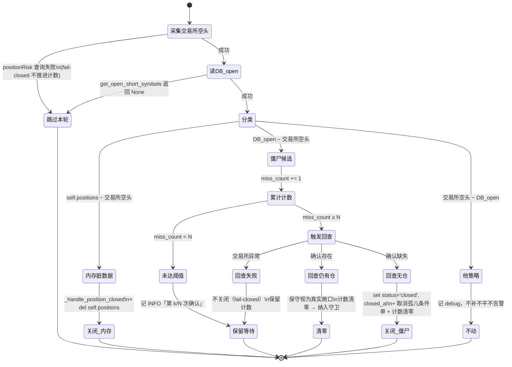
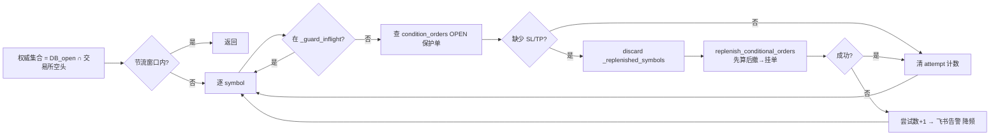

# P0 补漏架构方案：new_coin 未保护持仓对账 + kline 表存在性死代码 + 读路径静默化契约

## 1. 文档信息

| 项 | 内容 |
|----|------|
| 文档名称 | P0 补漏架构方案：new_coin 未保护持仓对账 + kline 表存在性死代码 + 读路径静默化契约 |
| 版本 | v1.0 |
| 作者 | backend-architect |
| 创建日期 | 2026-10-01 |
| 上游输入 | `docs/plans/fix-2026-10-01-p0-remaining-unprotected-positions-requirements.md`（21 条 AC）、`docs/plans/fix-2026-09-30-p0-protection-orders-missing-architecture.md`（上一轮架构，本轮为其补漏） |
| 下游环节 | python-engineer（编码）→ code-specification-inspector（检测）→ 强制测试 |
| 适用范围 | 仅需求 §4 的问题 A / B / C；需求 §8「不在本轮范围」不涉及 |
| 约束 | 遵守 `coding-standards.md`（禁硬编码/重复代码/幽灵参数、单函数 ≤50 行、单行 ≤120 字符、中文注释）、`deployment.md`（根 `shared/**` 变更触发全部 10 镜像重建）、`CLAUDE.md` |

> 本文档只做架构设计与接口约定，不含业务实现；涉及契约与状态机处给出伪代码级描述。

---

## 2. 架构定论（先给结论，后文论证）

| 编号 | 结论 | 依据 |
|------|------|------|
| **D1（单一事实来源）** | 补全/守卫的权威集合统一为 **`权威集合 = DB_open ∩ 交易所实际空头`**。`self.positions` 降级为**缓存**，不再作为候选集来源；归属判定仍唯一复用 `get_open_short_symbols()`（DB open），**不新增第二套归属口径** | 需求 §10-1；R-A1/R-A2 |
| **D2（对账范围）** | `_sync_positions_from_exchange` 的 stale 判定由「只遍历 `self.positions`」改为**遍历全集三元组**：`DB_open − 交易所空头`（僵尸）/ `self.positions − 交易所空头`（内存脏数据）/ `交易所空头 − DB_open`（他策略，一律不动） | R-A3；需求 A-2 |
| **D3（僵尸关闭安全边界）** | 僵尸关闭需 **连续 N 周期无仓（N 来自配置）+ 关闭前一次交易所回查**；任一环节异常（含首查 `positionRisk` 失败）**整轮跳过、只计数不关闭**（fail-closed）。宁可保留僵尸，不误关真实敞口 | 需求 §10-3；AC-P0-A-AC2 |
| **D4（持续守卫替代一次性）** | 移除 `_replenish_done` 一次性语义，改为按配置周期的**持续保护守卫**：对每个权威标的核验「OPEN STOP_LOSS ≥1（及按配置的 TP）」，缺失才补挂；缺口不置完成、下周期重试并告警 | 需求 A-3/A-4；AC-P0-A-AC4 |
| **D5（幂等与并发）** | 守卫在周期内**串行**遍历；每 symbol 用 `_guard_inflight` 集合防重入；补挂前 `discard(_replenished_symbols[symbol])` 以允许「后续失去保护再自愈」，`_replenished_symbols` 仅用于**同轮内**防重复下单 | 需求 A-5/A-7 |
| **D6（响应契约）** | 用**显式异常类型**替代 `detail` 文案匹配：`TableNameFormatError`→400；`SymbolNotCollectedError`→200 空（不告警）；`TableUnavailableError`→503+告警。**不再用 `"不在白名单" in detail` 之类字符串判定** | 需求 C-1/C-2；R-C1 |
| **D7（调用方不静默）** | `shared/kline_service.py::get_klines` 在非 200 时**已抛 `KLineServiceError`**（携带 `status_code`）；调用方 `_calculate_atr` 增显式 `except KLineServiceError` → ERROR + 降频告警；200 空 list 保持 warning（数据不足）。**客户端无需改动** | 需求 C-3；R-C2 |
| **D8（kline 存在性统一）** | 新增 kline-service 内**唯一**存在性助手 `table_exists(conn, name)`，SQL 用 `SELECT to_regclass(:table_name) IS NOT NULL`（尊重 search_path、参数化、异常上抛由调用方 fail-closed）。`routes.py`/`collector.py`×2/`src/main.py` 四处全部改调该助手，消除 `table_schema='public'` 硬编码 | 需求 B-1/B-2/B-3；R-B1/R-B3 |
| **D9（部署影响面）** | **不触达项目根 `shared/**`**。A/B/C 全部落在 `strategies/new_coin/**` 与 `services/kline_service/**` → 仅重建 `trading-new-coin`、`trading-kline-service` 两个镜像 | `deployment.md` §2.2；A1/A2 口径延续 |

---

## 3. 总体方案

### 3.1 问题 A：new_coin 持仓-条件单一致性

#### 3.1.1 权威集合口径（D1）

```
own_open      = get_open_short_symbols()        # DB new_coin.short_positions status='open'（唯一归属来源）
exchange_short = positionRisk 中 positionAmt<0 的 symbol 集合
权威集合 authoritative = own_open ∩ exchange_short      # 真实敞口，纳入保护守卫
僵尸集合 zombies       = own_open − exchange_short      # DB open 但交易所无仓 → 对账关闭
他策略集合 others      = exchange_short − own_open      # 一律不动（PM 账户归属口径）
```

- `own_open` 查询异常返回 `None` → **本轮跳过对账与守卫**（fail-closed，保守），下周期重试；
- `positionRisk` 查询异常 → 同上；
- 权威集合由策略层统一计算一次，传入对账与守卫，避免两处各自查询导致口径漂移。

#### 3.1.2 僵尸对账（D2/D3）

将现有 `_sync_positions_from_exchange`（`strategy.py:995-1031`）升级为 `_reconcile_positions_with_exchange()`，伪代码：

```
async def _reconcile_positions_with_exchange():
    exchange_short = await _fetch_exchange_short_symbols()   # 失败 → 记 warning，整轮 return
    own_open = await get_open_short_symbols()                # None → 记 warning，整轮 return
    if exchange_short is None or own_open is None: return    # fail-closed，不推进任何计数

    # (1) 内存脏数据（保持既有行为）
    for s in [x for x in self.positions if x not in exchange_short]:
        await _handle_position_closed(s, self.positions[s]); del self.positions[s]

    # (2) 僵尸：DB open 但交易所无仓 → 连续 N 周期确认
    zombie_candidates = own_open - exchange_short
    self._zombie_miss_counts = {s: c for s, c in ... if s in zombie_candidates}  # 仅保留候选
    for s in zombie_candidates:
        self._zombie_miss_counts[s] = self._zombie_miss_counts.get(s, 0) + 1
        if self._zombie_miss_counts[s] < zombie_confirm_cycles:
            logger.info("疑似僵尸持仓，第 k/N 次确认", symbol=s, ...); continue
        confirmed = await _reconfirm_symbol_absent(s)    # 关闭前一次交易所回查
        if confirmed is None:                            # 回查失败 → 不关（fail-closed）
            logger.warning("僵尸回查失败，本轮不关闭", symbol=s); continue
        if confirmed:                                    # 确认无仓 → 关闭
            await self._handle_position_closed(s, {from_db})   # 置 closed + closed_at + 清孤儿单
            logger.warning("对账：关闭僵尸持仓记录", symbol=s, confirms=...)
            self._zombie_miss_counts.pop(s, None)
        else:                                            # 回查发现有仓 → 保守清零，视为真实敞口
            self._zombie_miss_counts.pop(s, None)
    await self._save_state()
```

要点：
- `closed_at` 为 naive（复用 `executor._update_short_position_closed`，`executor.py:1385-1395`）；
- 僵尸关闭复用 `_handle_position_closed`（`strategy.py:1033`），它同时完成「置 closed + 取消孤儿条件单 + 清理跟踪 + PnL 回写」，**不新增第二套关闭实现**（禁重复代码）；
- 计数仅内存保存：容器重启后计数归零 → 需重新连续 N 周期，属**保守侧**（宁可不关），与 D3 一致；不引入 state 迁移。

#### 3.1.3 持续保护守卫（D4/D5）

以 `_guard_protection_orders()` 替换 `_execute_cycle` 中 `if not self._replenish_done:` 整段（`strategy.py:546-630`）：

```
async def _guard_protection_orders():
    if now - self._guard_last_run_at < guard_interval_seconds: return   # 配置化节流
    self._guard_last_run_at = now
    authoritative = await _compute_authoritative_symbols()               # = 3.1.1
    if authoritative is None: return
    db_positions = await _load_open_positions_from_db()                  # {symbol: entry_price,...}
    for symbol in sorted(authoritative):
        if symbol in self._guard_inflight: continue                      # 防重入
        self._guard_inflight.add(symbol)
        try:
            missing = await self.trading_executor.find_missing_protection(symbol)  # 例：['STOP_LOSS']
            if missing:
                self._replenished_symbols.discard(symbol)                # 允许自愈
                ok = await self.trading_executor.replenish_conditional_orders(
                    symbol, Decimal(str(db_positions[symbol]['entry_price'])))
                if not ok: await self._notify_protection_issue(symbol, missing, ...)
            else:
                self._protection_gap_attempts.pop(symbol, None)
        except Exception as e:                                           # 逐标的隔离
            logger.warning("保护守卫单标的异常", symbol=symbol, error=str(e))
        finally:
            self._guard_inflight.discard(symbol)
```

- `authoritative` 为空 → 直接返回（无真实敞口，不告警）；
- `replenish_conditional_orders`（`executor.py:3248-3281`）已是「先算后撤 + 撤单失败阻断 + 挂单缺口不置位」的三阶段实现，**本轮不改其内部顺序**，仅由守卫驱动；
- 权威标的初始化 `self.positions` 缓存（仅当 `self.positions` 为空时回填），保证 `_monitor_positions` 仍可跟踪；
- `_replenish_done` 属性（`strategy.py:102`）**删除**，同时删除其全部读写点（`:547/:618/:629`），避免遗留幽灵状态。

#### 3.1.4 `_execute_cycle` 新顺序

```
1) 过期开仓占用清理（保持不变）
2) _reconcile_positions_with_exchange()      # 先对账（清僵尸/脏数据）
3) 基线未就绪重试（保持不变）
4) _guard_protection_orders()                # 再守护真实敞口
5) 检测/分析/开仓（保持不变）
6) _monitor_positions()（保持不变）
```

> 顺序理由：必须先关闭僵尸、确定真实敞口，守卫才有正确的目标集合；基线重试聚集交易所查询。

#### 3.1.5 告警与降频（需求 C-4/C-6）

- 统一出口 `_notify_protection_issue(symbol, reasons, attempt)`（策略层）：
  - 走 `self.notification_client.send(..., level="error", project=config.notification.project)`（复用现有飞书通道，`shared/notification.py:138`）；
  - 文案含 symbol、缺失类型、累计重试次数、最近一次时间；全中文。
- 降频：把现有「同币种重复开仓」的 `_duplicate_notify_ts`（`executor.py:974-981`）提炼为**通用节流助手**，以 `(kind, symbol)` 为键、窗口来自配置，供「保护缺口」「ATR 不可用」复用（禁重复代码）。

### 3.2 问题 B：kline 表存在性判断尊重 search_path

#### 3.2.1 唯一实现（D8）

在 kline-service 内新增单一助手（建议 `services/kline_service/shared/utils/table_exists.py`）：

```python
async def table_exists(conn, table_name: str) -> bool:
    """尊重 search_path 的表存在性判断（参数化；异常不吞，交由调用方 fail-closed）"""
    return bool(await conn.fetch_val(
        "SELECT to_regclass(:table_name) IS NOT NULL", {"table_name": table_name}
    ))
```

四处替换（**同一实现的四处调用**，不留第二套）：

| 位置 | 现实现 | 改后 |
|------|--------|------|
| `api/routes.py:47-55` `_table_exists` | `information_schema + table_schema='public'` | 改调 `table_exists`（保留 `routes` 的 TTL 缓存包装 `_resolve_table_exists`/`_cache_lookup`，缓存值语义不变） |
| `core/collector.py:215-225` `_create_table_if_not_exists` 的存在性段 | 同上硬编码 | 改调 `table_exists` |
| `core/collector.py:291-297` `ensure_table` 的存在性段 | 同上硬编码 | 改调 `table_exists` |
| `src/main.py:97-103` 启动自检 | 同上硬编码 | 改调 `table_exists` |

要点：
- `to_regclass` 对不存在对象返回 NULL，`IS NOT NULL` → False；对 `btc_eth` schema（search_path 命中）下已存在的 `kline_*` 表返回 True → 「表已存在即放行」分支（`table_name_guard.py:215-223`）**变为可达**；
- fail-closed：查询异常**不吞**，由调用方决定（读路径 → `TableUnavailableError`→503；采集/自检 → 记 wanning 并放弃该表/记为缺失）；
- 缓存（`EXISTING_TABLE_CHECK_CACHE_TTL_SECONDS`，默认 0 不缓存）沿用，缓存键仍为表名，语义与「尊重 search_path 的存在性」一致。

#### 3.2.2 写路径不受影响

`build_kline_table_name`（`table_name_guard.py:167-183`）白名单语义**保持不变**；写路径（`/collect/manual`、`registry_routes`）继续走白名单。仅读路径（`/klines/latest`、`/indicators`）经 `build_readable_table_name`。

### 3.3 问题 C：读路径响应契约与可观测性

#### 3.3.1 显式错误类型（D6）

在 `core/table_name_guard.py` 现有 `TableNameValidationError` 基类下新增两个子类（或等价的显式错误枚举），把「拒绝原因」与「文案」解耦：

| 类型 | 语义 | HTTP | 告警 |
|------|------|------|------|
| `TableNameFormatError` | symbol/interval 格式非法（注入风险） | **400** | 否 |
| `SymbolNotCollectedError` | 格式合法、白名单未命中且表不存在（尚未采集） | **200 空** | 否 |
| `TableUnavailableError` | 白名单命中/应采集，但表缺失且建表失败、或存在性查询/DB 异常 | **503** | **是** |

`build_readable_table_name`（`table_name_guard.py:186-224`）按分支抛对应子类：
- 格式/表名层失败 → `TableNameFormatError`；
- 未命中白名单且开关关闭/表不存在 → `SymbolNotCollectedError`；
- 存在性回调抛异常 → `TableUnavailableError`（fail-closed，非静默放行）。

#### 3.3.2 路由层（`api/routes.py`）

- 删除 `except HTTPException` 中的 **`detail` 文案匹配**（`routes.py:254-257`、`344-349`）；
- `_resolve_ready_table`（`routes.py:160-171`）改为**透出错误类型**：`SymbolNotCollectedError` → 返回哨兵（调用方 200 空）；`TableUnavailableError`（含 `_ensure_table_ready` 的建表失败）→ 上抛 → 503 + 告警；
- 新增告警：503 分支记 ERROR 并调用 kline-service 的通知通道（如可用）或至少结构化 ERROR 日志（kline-service 现有告警能力为日志，飞书告警落在策略侧消费者）。

#### 3.3.3 客户端与调用方（D7）

- `shared/kline_service.py::get_klines`（`:100-172`）**不改**：非 200 → 抛 `KLineServiceError(status_code=...)`；200 空 → 返回 `[]`。二者已天然可分。
- `strategies/new_coin/executor.py::_calculate_atr`（`:1634-1697`）：
  - 新增 `except KLineServiceError as e:`（放在通用 `except` 之前）→ `logger.error("K线服务拒绝，ATR 不可用")` + 降频告警；返回 0；
  - 200 空/不足 → 保持 `logger.warning`（数据不足，非服务拒绝）；
  - 需 `from shared.kline_service import KLineServiceError`（**仅新增 import，不修改 shared 文件**）。
- `_warn_invalid_atr`（`executor.py:2297-2319`）在监控路径（移动止盈、动态利润保护）返回 True 时，由调用方补发降频告警（C-5），保证 ATR=0 **既跳过、又可观测**。

---

## 4. 改动清单（文件 + 函数 + 行号区间）

### 4.1 问题 A（`strategies/new_coin/**` → 重建 `trading-new-coin`）

| # | 文件 | 函数/位置 | 行号区间（现状） | 改动 |
|---|------|-----------|------------------|------|
| A-1 | `strategies/new_coin/strategy.py` | `__init__` | `:101-112` | 删除 `_replenish_done`；新增 `_zombie_miss_counts` / `_guard_inflight` / `_guard_last_run_at` / `_protection_gap_attempts`；新增配置读取（§5） |
| A-2 | `strategies/new_coin/strategy.py` | `_execute_cycle` | `:546-630` | 删除 `_replenish_done` 补全块，改为 `_reconcile_positions_with_exchange()` + `_guard_protection_orders()` |
| A-3 | `strategies/new_coin/strategy.py` | `_sync_positions_from_exchange`（改名 `_reconcile_positions_with_exchange`） | `:995-1031` | 三元组对账（僵尸/脏数据/他策略），见 §3.1.2；`_execute_cycle` 调用点 `:653` 同步改名 |
| A-4 | `strategies/new_coin/strategy.py` | 新增 `_guard_protection_orders` | 新增 | §3.1.3 |
| A-5 | `strategies/new_coin/strategy.py` | 新增 `_load_open_positions_from_db`（从 `:554-584` 内联块提炼） | 新增 | 返回 `{symbol: {entry_price, entry_time}}` |
| A-6 | `strategies/new_coin/strategy.py` | 新增 `_notify_protection_issue` | 新增 | §3.1.5（飞书 + 降频） |
| A-7 | `strategies/new_coin/strategy.py` | `_handle_position_closed` | `:1033-1083` | 复用（僵尸关闭调用它），不重写 |
| A-8 | `strategies/new_coin/executor.py` | 新增 `find_missing_protection(symbol)` | 新增 | 查 `condition_orders`（strategy_name='new_coin'）统计 OPEN 的 STOP_LOSS / TAKE_PROFIT，返回缺失类型列表 |
| A-9 | `strategies/new_coin/executor.py` | 提炼通用节流助手 `_should_notify(key)`；改造 `_notify_duplicate_symbol` 复用 | `:960-994` | 消除重复降频逻辑 |
| A-10 | `strategies/new_coin/executor.py` | `_should_skip_replenish` | `:3283-3291` | 保留（同轮幂等），守卫在补挂前 `discard` |
| A-11 | `strategies/new_coin/executor.py` | `_has_open_short_position` / `get_open_short_symbols` | `:912-958` | 复用，作为唯一归属来源 |
| A-12 | `strategies/new_coin/config.yaml` | `trading.replenish` / 新增段 | `:102-108` | 新增配置（§5） |

### 4.2 问题 B（`services/kline_service/**` → 重建 `trading-kline-service`）

| # | 文件 | 函数/位置 | 行号区间 | 改动 |
|---|------|-----------|----------|------|
| B-1 | `services/kline_service/shared/utils/table_exists.py` | 新增 `table_exists` | 新增 | §3.2.1 唯一实现 |
| B-2 | `services/kline_service/api/routes.py` | `_table_exists` | `:47-55` | 改调 `table_exists`；保留 TTL 缓存包装 |
| B-3 | `services/kline_service/core/collector.py` | `_create_table_if_not_exists` | `:215-225` | 改调 `table_exists` |
| B-4 | `services/kline_service/core/collector.py` | `ensure_table` | `:291-297` | 改调 `table_exists` |
| B-5 | `services/kline_service/src/main.py` | 启动自检 | `:97-107` | 改调 `table_exists` |

### 4.3 问题 C（跨两个镜像）

| # | 文件 | 函数/位置 | 行号区间 | 改动 |
|---|------|-----------|----------|------|
| C-1 | `services/kline_service/core/table_name_guard.py` | 新增错误子类；`build_readable_table_name` 分支 | `:186-224` | 三态错误类型（§3.3.1） |
| C-2 | `services/kline_service/api/routes.py` | `_resolve_ready_table` / `_validated_read_table_name` / 两个端点 except | `:123-171`、`:250-258`、`:344-350` | 去文案匹配，改按异常类型；503 分支 |
| C-3 | `strategies/new_coin/executor.py` | `_calculate_atr` | `:1634-1697` | 新增 `except KLineServiceError` → ERROR + 告警 |
| C-4 | `strategies/new_coin/executor.py` | `_warn_invalid_atr` 及两处调用方 | `:2297-2319` | 调用方补发降频告警 |

> 说明：C-1/C-2 落在 kline-service；C-3/C-4 落在 new_coin。二者各自归属镜像，无跨镜像共享新代码。

---

## 5. 关键流程时序（僵尸对账判定状态机）



守护状态机（每周期、串行）：



---

## 6. 配置项清单（新增/修改，全部带默认值，禁止硬编码）

### 6.1 `strategies/new_coin/config.yaml`

| key | 默认值 | 语义 | 段 |
|-----|--------|------|----|
| `trading.reconcile.zombie_confirm_cycles` | `3` | 僵尸关闭所需的连续无仓周期数 N | `trading.reconcile` |
| `trading.reconcile.enabled` | `true` | 是否启用僵尸对账（`false` 回退旧的「仅内存 stale」行为） | `trading.reconcile` |
| `trading.replenish.guard_interval_seconds` | `300` | 持续保护守卫节流窗口（秒） | `trading.replenish` |
| `trading.replenish.require_take_profit` | `true` | 守卫核验时是否要求 OPEN 的 TP 单（`false` 仅核验 STOP_LOSS） | `trading.replenish` |
| `trading.replenish.alert_throttle_seconds` | `3600` | 保护缺口/ATR 告警的同 (kind,symbol) 降频窗口（秒） | `trading.replenish` |

> 沿用既有：`trading.replenish.cancel_after_ready` / `ignore_error_codes` / `skip_symbols`、`kline.*`、`notification.project`、`trading.min_notional`。

### 6.2 `services/kline_service/shared/core/config.py`

| key | 默认值 | 语义 |
|-----|--------|------|
| `ALLOW_EXISTING_TABLE_SYMBOLS` | `true` | 已有，沿用（读路径放行开关） |
| `EXISTING_TABLE_CHECK_CACHE_TTL_SECONDS` | `0` | 已有，沿用（表存在性缓存 TTL，0=实时） |

> 本轮 kline-service **不新增配置**（`to_regclass` 无开关，统一生效）。若审查要求可回退，可加 `TABLE_EXISTS_USE_REGCLASS: bool = True`，但默认建议不加（避免「双实现」）。

---

## 7. 验收标准映射（21 条 → 架构落点）

### 7.1 问题 A（P0-A，9 条）

| AC | 架构落点 |
|----|---------|
| P0-A-AC1 权威集合来源 + 日志来源字段 | §3.1.1；`find_missing_protection`/守卫日志打印 `source=intersection` 与成员 |
| P0-A-AC2 DB open 无仓 → 每周期计数、达 N 关闭并写 `closed_at` | §3.1.2；状态机「触发回查→关闭_僵尸」 |
| P0-A-AC3 真实敞口缺 SL 即补挂 | §3.1.3；`find_missing_protection` + `replenish_conditional_orders` |
| P0-A-AC4 移除一次性 `_replenish_done`，按配置周期核验 | §3.1.3；A-1/A-2 改动；`guard_interval_seconds` |
| P0-A-AC5 缺口不置完成、下周期重试、告警（降频） | §3.1.3 `finally` 不置位；§3.1.5 |
| P0-A-AC6 他策略持仓一律不动 | §3.1.1 `others` 集合；仅遍历 `authoritative` |
| P0-A-AC7 幂等：重复运行不重复挂单、同 symbol 不并发 | §3.1.3 `_guard_inflight` + `discard(_replenished_symbols)` |
| P0-A-AC8 逐标的隔离 | §3.1.3 try/except per symbol |
| P0-A-AC9 僵尸关闭后不再重复出现 | §3.1.2 关闭后 `pop` 计数；僵尸集合每轮从 `DB_open − 交易所空头` 重算，关闭后自然消失 |

### 7.2 问题 B（P0-B，6 条）

| AC | 架构落点 |
|----|---------|
| P0-B-AC1 尊重 search_path、参数化 | §3.2.1 `to_regclass(:table_name)` |
| P0-B-AC2 全仓无硬编码 `table_schema='public'` | 改动清单 B-2..B-5（`grep` 断言 0 命中） |
| P0-B-AC3 表存在即放行可命中（`source=existing_table`） | §3.2.1；`table_name_guard.py:223` 日志 |
| P0-B-AC4 存在性查询异常 fail-closed | §3.3.1 `TableUnavailableError`；§3.2.1 助手异常上抛 |
| P0-B-AC5 缓存不把「已存在」误判为「不存在」 | §3.2.1 缓存语义与 `to_regclass` 结果一致 |
| P0-B-AC6 启动自检不再误报缺表 | 改动清单 B-5 |

### 7.3 问题 C（P0-C，6 条）

| AC | 架构落点 |
|----|---------|
| P0-C-AC1 三类响应契约 | §3.3.1 三态错误类型表 |
| P0-C-AC2 去 `detail` 文案匹配 | §3.3.2；异常类型替代 |
| P0-C-AC3 调用方区分服务拒绝/数据不足 | §3.3.3 `except KLineServiceError` |
| P0-C-AC4 真实敞口缺单必告警（含 symbol/类型/重试） | §3.1.5 `_notify_protection_issue` |
| P0-C-AC5 ATR=0 不按 0 阈值平仓、跳过并告警 | §3.3.3 `_warn_invalid_atr` + 调用方告警 |
| P0-C-AC6 同 symbol 同原因窗口内仅告警一次 | §3.1.5 / A-9 通用节流助手 |

---

## 8. 风险与回滚

| 风险 | 触发条件 | 缓解 | 回滚 |
|------|---------|------|------|
| 误关真实敞口记录 | 交易所 `positionRisk` 返回不完整快照（漏报持仓） | D3：连续 N 周期 + 关闭前回查；首查/回查异常一律不关；计数内存态重启归零（更保守） | `trading.reconcile.enabled: false` 立即回退旧行为（仅内存 stale） |
| 守卫每周期撤挂抖动 | 保护单被反复撤挂 | 守卫**仅在缺口时**触发补挂；无缺口不动；补挂内部 cancel-then-place 幂等 | `trading.replenish.guard_interval_seconds` 调大；必要时 `cancel_after_ready: false` 回退旧顺序 |
| 守卫阻塞主循环 | `authoritative` 大或交易所慢 | 串行 + 逐标的隔离；`guard_interval_seconds` 节流；异常吞于单标的 | 关闭 `reconcile.enabled` 仅保留守卫，或反向 |
| 僵尸关闭引入 PnL 回写噪音 | 复用 `_handle_position_closed` 触发 trade_records 查询 | 僵尸无成交 → 查询返回 None → 静默；日志级别 WARNING 仅在真正关闭时 | 无需回滚（幂等、无害） |
| 读路径 503 影响存量调用方 | 白名单命中但建表失败比例高 | 仅「应采集却不可用」才 503；「未采集」仍 200 空；调用方按 status_code 分类 | kline-service 单镜像回滚（GHCR 上一 tag） |
| `to_regclass` 在异常绑定类型下报错 | 表名含非法字符 | 表名已由 `TABLE_NAME_PATTERN` 严格校验后传入；仍参数化绑定 | 回滚 kline-service 镜像 |
| 部署中断窗口 | 重建 kline-service 短暂中断 | 与上一轮一致：先上 new_coin（守卫先算后撤，K 线不可用不裸奔），再上 kline-service | — |

---

## 9. 测试要点（供幻觉测试 / 覆盖率验证）

### 9.1 幻觉测试 10 项关注点

1. `KLineServiceError` 是否真实存在于 `shared/kline_service.py` 且可导入（executor 新增 import）；
2. `condition_orders` 列名确为 `strategy_name`（非 `strategy`）、`order_type`/`status` 值域；
3. `new_coin.short_positions` 列 `status/closed_at/entry_price/opened_at` 存在（无迁移）；
4. `conn.fetch_val` 在 kline-service `Database` 上存在；`to_regclass` 语法与绑定参数用法；
5. `_handle_position_closed` 的 `closed_at` naive 绑定（`:1393`）；
6. `_replenish_done` 删除后无残留引用（`grep _replenish_done` = 0）；
7. 新增配置键均在 `config.yaml`/`config.py` 落地（无引用未定义 key）；
8. 守卫调用的 `replenish_conditional_orders` 签名 `(symbol, entry_price: Decimal)` 匹配；
9. `notification_client.send(message, level, project)` 参数名与级别枚举（info/warning/error）；
10. 两处 `_warn_invalid_atr` 调用方（移动止盈/动态利润保护）均为 async 上下文，可 `await` 告警。

### 9.2 覆盖率（强制维度）

| 维度 | 用例 |
|------|------|
| 对账三分支 | 僵尸（DB open 无仓）/ 脏数据（内存有仓交易所无）/ 他策略（有仓 DB 无） |
| 僵尸状态机 | 未达 N 保留、达 N 回查成功关闭、回查失败不关、回查发现有仓清零 |
| fail-closed | 首查 `positionRisk` 失败、`get_open_short_symbols` 返回 None → 整轮不动作 |
| 守卫 | 有缺口补挂、无缺口不动、补挂失败不置位 + 告警、逐标的隔离、并发重入拦截 |
| 告警降频 | 同 (kind,symbol) 窗口内 1 次；跨窗口再发 |
| 响应契约 | 格式非法→400；未采集→200 空；应采集不可用→503；文案变更不影响判定 |
| 存在性 | `to_regclass` True/False/异常三分支；缓存 TTL 命中；四处调用一致性 |
| 客户端分类 | `_calculate_atr` 遇 5xx → ERROR+告警；200 空 → warning |

### 9.3 验收命令（沿用上一轮口径）

```bash
# 本地（禁止服务器回测）
pytest -q strategies/new_coin/tests/ -k "reconcile or zombie or guard or protection or atr"
pytest -q services/kline_service/tests/ -k "table_exists or regclass or readable or contract or P0_2"
pytest -q

# 服务器只读核对
ssh root@43.156.242.184 "docker exec trading_system-postgres psql -U trading_user -d trading_platform \
  -c \"SELECT symbol,status,closed_at FROM new_coin.short_positions WHERE symbol IN ('APLDUSDT','AMCUSDT','PATHUSDT','CVNAUSDT');\""
ssh root@43.156.242.184 "docker exec trading_system-kline sh -c \"curl -s -o /dev/null -w '%{http_code}\\n' 'http://127.0.0.1:8000/api/v1/klines/latest?symbol=USDBRLUSDT&interval=1h&limit=18'\""
ssh root@43.156.242.184 "docker logs --since 2h trading_system-new_coin 2>&1 | grep -E '对账|僵尸|保护|守卫'"
```

---

## 10. 部署影响面（是否触达 `shared/**`）

| 变更集 | 目录 | 触发重建镜像 |
|--------|------|-------------|
| 问题 A + C-3/C-4 | `strategies/new_coin/**` | `trading-new-coin` |
| 问题 B + C-1/C-2 | `services/kline_service/**` | `trading-kline-service` |
| 项目根 `shared/**` | **不改动** | — |

**结论：不触达项目根 `shared/**`，仅重建 2 个镜像，不触发全量重建。** 唯一涉及 `shared` 名称的改动是 kline-service **自有** `services/kline_service/shared/`（Dockerfile `:20` 仅 COPY 该目录），与项目根 `shared/` 无关，不扩大重建面。

> 实现注意：`strategies/new_coin/executor.py` 只新增 `from shared.kline_service import KLineServiceError` 的**导入**，不得修改 `shared/kline_service.py` 内容；一旦修改该方法即触发全部 10 镜像重建，违背 D9。

---

## 11. 待办清单（供 python-engineer 原子执行）

### 第一批：`strategies/new_coin/**` → 重建 `trading-new-coin`

| ID | 任务 | 文件 | 依赖 | 对应 AC |
|----|------|------|------|---------|
| N01 | 配置读取 + 属性改造（删 `_replenish_done`，加对账/守卫状态） | `strategy.py`、`config.yaml` | — | P0-A-AC1/AC4 |
| N02 | `_reconcile_positions_with_exchange`（三元组 + 僵尸状态机）+ `_handle_position_closed` 复用 | `strategy.py` | N01 | P0-A-AC2/AC6/AC9 |
| N03 | `find_missing_protection` + `_guard_protection_orders` + `_execute_cycle` 顺序改造 | `strategy.py`、`executor.py` | N01/N02 | P0-A-AC3/AC5/AC7/AC8 |
| N04 | 通用节流助手 + `_notify_protection_issue` + `_warn_invalid_atr` 调用方告警 | `strategy.py`、`executor.py` | N03 | P0-C-AC4/AC5/AC6 |
| N05 | `_calculate_atr` 增 `except KLineServiceError`（含导入） | `executor.py` | — | P0-C-AC3 |
| N06 | 单测（对账状态机 / 守卫 / 告警降频 / ATR 分类） | `strategies/new_coin/tests/` | N01-N05 | §7.1/§7.3 |

### 第二批：`services/kline_service/**` → 重建 `trading-kline-service`

| ID | 任务 | 文件 | 依赖 | 对应 AC |
|----|------|------|------|---------|
| K01 | 新增 `table_exists` 唯一助手 | `shared/utils/table_exists.py` | — | P0-B-AC1/AC4 |
| K02 | 四处替换（routes×1、collector×2、main×1） | `api/routes.py`、`core/collector.py`、`src/main.py` | K01 | P0-B-AC2/AC3/AC5/AC6 |
| K03 | 三态错误类型 + `build_readable_table_name` 分支 + 路由去文案匹配 + 503 分支 | `core/table_name_guard.py`、`api/routes.py` | — | P0-C-AC1/AC2 |
| K04 | 单测（存在性三分支/缓存 / 三态契约 / 放行命中断言） | `services/kline_service/tests/` | K01-K03 | §7.2/§7.3 |

> 幻觉测试与覆盖率验证在两批完成后各执行一次；两批可分两次 push，或一次 push 同 Run 重建 2 镜像。

---

（文档结束）
