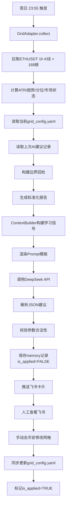

基于我们达成的共识——**网格策略作为"开环配置顾问"，不依赖任何API数据，仅基于公开K线提供每周参数建议**——下面是完整的落地实施方案。

---

## 网格策略AI调优系统 —— 落地实施方案

### 一、系统定位

| 项目 | 说明 |
|:---|:---|
| **策略类型** | 币安官方网格机器人（ETHUSDT） |
| **数据来源** | 仅使用币安公开K线API（无需任何API权限） |
| **调优模式** | 开环配置顾问（无效果回填，无闭环验证） |
| **输出形式** | 每周日生成参数建议，推送飞书，人工手动修改网格 |
| **学习机制** | 基于"区间突破检测"的隐性反馈（非收益驱动） |


### 二、目录结构（与现有系统统一）

```text
/ai_tuner/
├── adapters/
│   ├── base_adapter.py
│   ├── new_coin_adapter.py
│   ├── hrs_adapter.py
│   └── grid_adapter.py          # 新增：网格策略适配器
├── memory/
│   ├── db_handler.py            # 复用现有
│   └── context_builder.py       # 复用现有（需增强，见下文）
├── prompts/
│   ├── new_coin_system.txt
│   ├── new_coin_user.txt
│   ├── hrs_system.txt
│   ├── hrs_user.txt
│   ├── grid_system.txt          # 新增
│   └── grid_user.txt            # 新增
├── engine/
│   ├── llm_client.py            # 复用
│   └── response_parser.py       # 复用
├── analyzers/                   # 新增：行情分析模块
│   ├── kline_fetcher.py         # 拉取ETHUSDT K线
│   └── market_analyzer.py       # 计算ATR/趋势/分位等指标
├── deploy/
│   ├── config_operator.py       # 复用
│   └── diff_generator.py        # 复用
├── notifier/
│   └── messenger.py             # 复用
└── scheduler/
    ├── weekly_job.py            # 复用，增加grid策略
    └── monthly_job.py           # 复用
```


### 三、核心模块详细设计

#### 模块1：行情分析器（MarketAnalyzer）

**文件**：`analyzers/market_analyzer.py`

**职责**：拉取ETHUSDT 1小时K线，计算每周调优所需的所有行情指标。

```python
class MarketAnalyzer:
    def __init__(self, symbol="ETHUSDT", interval="1h"):
        self.symbol = symbol
        self.interval = interval
        self.client = Client()  # python-binance

    def fetch_weekly_klines(self, lookback_days=7) -> pd.DataFrame:
        """拉取最近N天的1小时K线"""
        klines = self.client.futures_klines(
            symbol=self.symbol,
            interval=self.interval,
            limit=lookback_days * 24
        )
        df = pd.DataFrame(klines, columns=[
            'open_time', 'open', 'high', 'low', 'close', 'volume',
            'close_time', 'quote_volume', 'trades', 'taker_buy_vol',
            'taker_buy_quote_vol', 'ignore'
        ])
        df['close'] = df['close'].astype(float)
        df['high'] = df['high'].astype(float)
        df['low'] = df['low'].astype(float)
        df['open'] = df['open'].astype(float)
        return df

    def analyze(self, df: pd.DataFrame) -> dict:
        """计算所有核心指标"""
        close = df['close']
        high = df['high']
        low = df['low']

        # 1. 基础统计
        current_price = close.iloc[-1]
        week_open = close.iloc[0]
        week_high = high.max()
        week_low = low.min()
        week_close = close.iloc[-1]

        # 2. 波动率（ATR）
        tr1 = high - low
        tr2 = (high - close.shift()).abs()
        tr3 = (low - close.shift()).abs()
        tr = pd.concat([tr1, tr2, tr3], axis=1).max(axis=1)
        atr = tr.rolling(14).mean().iloc[-1]

        # 3. ATR相对值（占价格百分比）
        atr_pct = atr / current_price * 100

        # 4. 趋势强度（简单EMA偏离）
        ema20 = close.ewm(span=20, adjust=False).mean().iloc[-1]
        ema50 = close.ewm(span=50, adjust=False).mean().iloc[-1]
        trend_direction = "UP" if ema20 > ema50 else "DOWN"
        trend_strength = abs(ema20 - ema50) / current_price * 100  # 偏离百分比

        # 5. 价格分位（近30天）
        df_30d = self.fetch_weekly_klines(lookback_days=30)
        high_30d = df_30d['high'].max()
        low_30d = df_30d['low'].min()
        price_percentile = (current_price - low_30d) / (high_30d - low_30d) * 100

        # 6. 市场状态分类
        if trend_strength > 5 and trend_direction == "UP":
            regime = "STRONG_UPTREND"
        elif trend_strength > 5 and trend_direction == "DOWN":
            regime = "STRONG_DOWNTREND"
        elif atr_pct > 3:
            regime = "HIGH_VOLATILITY_RANGING"
        else:
            regime = "LOW_VOLATILITY_RANGING"

        # 7. 上周价格区间（用于边界回检）
        last_week_high = high.iloc[-168:].max() if len(high) >= 168 else high.max()
        last_week_low = low.iloc[-168:].min() if len(low) >= 168 else low.min()

        return {
            "current_price": round(current_price, 2),
            "week_open": round(week_open, 2),
            "week_high": round(week_high, 2),
            "week_low": round(week_low, 2),
            "week_close": round(week_close, 2),
            "week_change_pct": round((week_close - week_open) / week_open * 100, 2),
            "week_amplitude_pct": round((week_high - week_low) / week_low * 100, 2),
            "atr": round(atr, 2),
            "atr_pct": round(atr_pct, 2),
            "trend_direction": trend_direction,
            "trend_strength_pct": round(trend_strength, 2),
            "price_percentile_30d": round(price_percentile, 1),
            "regime": regime,
            "last_week_high": round(last_week_high, 2),
            "last_week_low": round(last_week_low, 2),
        }
```


#### 模块2：网格适配器（GridAdapter）

**文件**：`adapters/grid_adapter.py`

**职责**：调用MarketAnalyzer获取数据，格式化为标准报告，供AI使用。

```python
class GridAdapter(BaseAdapter):
    def __init__(self):
        self.analyzer = MarketAnalyzer()
        self.current_params = self._load_current_params()

    def _load_current_params(self) -> dict:
        """读取当前网格参数（从配置文件或手动维护的yaml）"""
        # 假设有一个 grid_config.yaml 手动维护当前运行的参数
        with open("configs/grid_config.yaml", "r") as f:
            return yaml.safe_load(f)

    async def collect(self) -> dict:
        """采集本周数据，生成标准化报告"""
        df = self.analyzer.fetch_weekly_klines(lookback_days=7)
        metrics = self.analyzer.analyze(df)

        # 获取上次AI建议的边界（用于回检）
        last_suggestion = await self._get_last_suggestion()

        report = {
            "strategy_id": "grid_eth",
            "version": self.current_params.get("version", "manual"),
            "collect_time": datetime.now().isoformat(),
            "market": {
                **metrics
            },
            "current_grid_params": {
                "lower_price": self.current_params.get("lower", 0),
                "upper_price": self.current_params.get("upper", 0),
                "grid_count": self.current_params.get("grid_count", 50),
                "grid_spacing_pct": self.current_params.get("spacing_pct", 0.5),
                "per_grid_amount": self.current_params.get("per_grid_amount", 100)
            },
            "last_suggestion_boundary_check": self._build_boundary_check(metrics, last_suggestion),
            "anomalies": self._detect_anomalies(metrics)
        }
        return report

    def _build_boundary_check(self, metrics: dict, last_suggestion: dict) -> dict:
        """构建边界回检：AI上次建议的区间是否被突破"""
        if not last_suggestion:
            return {"has_history": False}

        suggested_upper = last_suggestion.get("suggested_upper", 0)
        suggested_lower = last_suggestion.get("suggested_lower", 0)
        actual_high = metrics["week_high"]
        actual_low = metrics["week_low"]

        return {
            "has_history": True,
            "suggested_upper": suggested_upper,
            "suggested_lower": suggested_lower,
            "actual_high": actual_high,
            "actual_low": actual_low,
            "upper_broken": actual_high > suggested_upper,
            "lower_broken": actual_low < suggested_lower,
            "broken_summary": self._format_broken_summary(actual_high, actual_low, suggested_upper, suggested_lower)
        }

    def _format_broken_summary(self, actual_high, actual_low, suggested_upper, suggested_lower) -> str:
        parts = []
        if actual_high > suggested_upper:
            parts.append(f"上界被突破：建议{suggested_upper}，实际最高{actual_high}（↑{round((actual_high-suggested_upper)/suggested_upper*100,1)}%）")
        if actual_low < suggested_lower:
            parts.append(f"下界被突破：建议{suggested_lower}，实际最低{actual_low}（↓{round((suggested_lower-actual_low)/suggested_lower*100,1)}%）")
        if not parts:
            return "✅ 价格运行在建议区间内，边界设置合理"
        return "⚠️ " + "；".join(parts)

    def _detect_anomalies(self, metrics: dict) -> list:
        """检测异常行情信号"""
        anomalies = []
        if metrics["atr_pct"] > 5:
            anomalies.append(f"⚠️ 波动率异常放大（ATR={metrics['atr_pct']}%），注意网格可能被单边击穿")
        if metrics["week_amplitude_pct"] < 1.5:
            anomalies.append(f"⚠️ 周振幅过小（{metrics['week_amplitude_pct']}%），网格可能无法成交")
        return anomalies
```


#### 模块3：网格专用Prompt模板

**System Prompt**（`prompts/grid_system.txt`）：

```text
你是一名量化网格策略配置顾问，专门为ETHUSDT永续合约设计币安官方网格机器人的参数。

你的核心能力：
1. 读懂行情指标（ATR、趋势、价格分位、波动率分类）
2. 将行情特征转化为具体的网格参数建议
3. 从"边界是否被突破"中学习，持续改进建议质量

你必须遵守的原则：
1. 区间上界必须 ≥ 当前价格 × 1.05（至少留5%上行空间）
2. 区间下界必须 ≤ 当前价格 × 0.95（至少留5%下行空间）
3. 网格间距不得小于 0.2%（防止手续费吞噬利润）
4. 网格间距不得大于 2.0%（防止网格过疏无法成交）
5. 单边趋势中，倾向于将网格区间向趋势方向偏移
6. 高波动环境中，适当扩大网格间距
7. 低波动环境中，适当缩小网格间距
8. 如果上次建议的边界被突破，本次必须在相应方向扩大区间

输出格式：严格JSON，包含 reasoning, adjustments, expected_behavior。
```

**User Prompt**（`prompts/grid_user.txt`）：

```text
## 本周ETHUSDT行情报告

### 价格概览
- 开盘: {{ market.week_open }}
- 收盘: {{ market.week_close }}
- 最高: {{ market.week_high }}
- 最低: {{ market.week_low }}
- 周涨跌幅: {{ market.week_change_pct }}%
- 周振幅: {{ market.week_amplitude_pct }}%

### 波动与趋势
- ATR(14): {{ market.atr }} ({{ market.atr_pct }}%)
- 趋势方向: {{ market.trend_direction }}
- 趋势强度(EMA偏离): {{ market.trend_strength_pct }}%
- 价格分位(30天): {{ market.price_percentile_30d }}%
- 市场状态分类: {{ market.regime }}

### 当前网格参数
- 区间: {{ current_grid_params.lower_price }} - {{ current_grid_params.upper_price }}
- 网格数: {{ current_grid_params.grid_count }}
- 网格间距: {{ current_grid_params.grid_spacing_pct }}%
- 每格资金: {{ current_grid_params.per_grid_amount }} USDT

### 上次建议边界回检
{{ last_suggestion_boundary_check.broken_summary }}

### 异常告警

- {{ anomaly }}


## 你的任务

请基于以上行情数据，给出本周ETHUSDT网格参数的调整建议。

重点考虑：
1. 当前网格区间是否适配本周的波动范围和趋势方向？
2. 网格间距是否需要根据ATR调整？
3. 是否有任何边界需要向趋势方向偏移？
4. 如果上次建议被突破，本次如何修正？

输出JSON格式：
{
  "reasoning": "详细分析过程（100-200字）",
  "adjustments": {
    "lower_price": 建议下界,
    "upper_price": 建议上界,
    "grid_spacing_pct": 建议网格间距(%),
    "grid_count": 建议网格数,
    "per_grid_amount": 建议每格资金,
    "version": "V{{ today }}"
  },
  "expected_behavior": "预期本周行情下该参数的表现",
  "risk_note": "需要注意的风险点"
}
```


#### 模块4：隐性反馈的学习机制

**文件**：`memory/context_builder.py`（增强部分）

在 `context_builder.py` 中，针对网格策略增加一个特殊的上下文构建逻辑：

```python
async def build_grid_context(self, strategy_id: str, current_report: dict) -> str:
    """为网格策略构建包含边界回检的上下文"""
    
    # 1. 获取上次调优记录
    last_memory = await self.db.get_last_memory(strategy_id)
    
    if not last_memory:
        return "（暂无历史调优记录，本次将基于纯行情数据给出建议）"
    
    # 2. 从当前报告中提取"边界回检"信息
    boundary_check = current_report.get("last_suggestion_boundary_check", {})
    
    if not boundary_check.get("has_history"):
        return "（上次调优记录无边界数据，无法做回检）"
    
    # 3. 构建学习信号
    lines = []
    lines.append("## 📝 上次建议的边界回检结果")
    lines.append("")
    lines.append(f"**上次建议区间**：{boundary_check['suggested_lower']} - {boundary_check['suggested_upper']}")
    lines.append(f"**本周实际极值**：最低 {boundary_check['actual_low']}，最高 {boundary_check['actual_high']}")
    lines.append("")
    
    if boundary_check["upper_broken"] and boundary_check["lower_broken"]:
        lines.append("🔴 **学习信号：上下界均被突破**")
        lines.append("→ 说明市场波动远超预期，网格区间严重不足。")
        lines.append("→ 本次建议：大幅扩大区间（至少扩大20%），并加大网格间距。")
    elif boundary_check["upper_broken"]:
        lines.append("🟡 **学习信号：上界被突破**")
        lines.append("→ 说明多头力量强劲，网格区间偏下。")
        lines.append("→ 本次建议：上移区间，或在区间设置上给予更多上行空间。")
    elif boundary_check["lower_broken"]:
        lines.append("🟡 **学习信号：下界被突破**")
        lines.append("→ 说明空头力量强劲，网格区间偏上。")
        lines.append("→ 本次建议：下移区间，或在区间设置上给予更多下行空间。")
    else:
        lines.append("🟢 **学习信号：边界未被突破**")
        lines.append("→ 当前区间适配性良好。")
        lines.append("→ 本次建议：若其他指标（ATR/趋势）无重大变化，可维持区间不变或微调。")
    
    lines.append("")
    lines.append("**请基于以上隐性反馈，调整你的建议策略。**")
    
    return "\n".join(lines)
```


#### 模块5：配置文件模板

**文件**：`configs/grid_config.yaml`（手动维护当前运行的网格参数）

```yaml
# ETHUSDT网格策略当前参数
# 由AI每周生成建议，人工确认后手动修改币安官网，并同步更新此文件

version: "V20260821"
symbol: "ETHUSDT"
lower_price: 2850
upper_price: 3450
grid_count: 50
spacing_pct: 0.6
per_grid_amount: 100
last_updated: "2026-08-21 10:00:00"
```


### 四、完整工作流（每周日执行）




### 五、飞书推送卡片设计

```json
{
  "title": "📊 ETHUSDT 网格策略周报 & 调优建议",
  "content": {
    "市场概览": "本周涨跌幅: +3.2% | 振幅: 7.8% | ATR: 2.3%",
    "市场状态": "高波动震荡 (价格分位 78%)",
    "当前参数": "区间 2850-3450 | 间距 0.6% | 50格",
    "边界回检": "上界被突破：建议3450，实际最高3520（↑2.0%）",
    "AI建议": {
      "新区间": "2900 - 3600",
      "新间距": "0.8%",
      "新网格数": "45",
      "理由": "本周波动率放大且上界被突破，建议扩大区间并增加间距"
    },
    "风险提示": "当前波动率偏高，注意网格可能被单边击穿"
  },
  "actions": [
    {"label": "确认应用", "value": "confirm_grid_V20260828"},
    {"label": "忽略此建议", "value": "ignore_grid"}
  ]
}
```


### 六、部署与验证清单

| 序号 | 任务 | 验证方法 |
|:---|:---|:---|
| 1 | 安装 `python-binance` 库 | `pip list \| grep python-binance` |
| 2 | 实现 `MarketAnalyzer.fetch_weekly_klines()` | 单独运行，能拉出168根K线 |
| 3 | 实现 `MarketAnalyzer.analyze()` | 输出指标合不合理（肉眼判断） |
| 4 | 实现 `GridAdapter.collect()` | 生成完整报告，检查JSON格式 |
| 5 | 测试API调用 | 用Postman模拟一次请求，看DeepSeek返回JSON |
| 6 | 实现飞书推送 | 收到卡片消息 |
| 7 | 配置Cron | `0 23 * * 0 cd /ai_tuner && python weekly_job.py --strategy grid` |
| 8 | 手动验证完整闭环 | 跑完一次完整周报，人工在币安改参数后，同步更新yaml |


### 七、总结

这套方案的核心优势：

1. **零API依赖**：不需要币安的任何授权API，只需要公开的K线数据
2. **极简开发**：核心代码不超过300行，一周内可完成
3. **完全融入现有系统**：复用memory、notifier、scheduler模块
4. **隐性学习机制**：通过"边界回检"让AI持续进化，虽无收益反馈，但有"方向性反馈"
5. **安全可控**：所有变更需人工在币安官网手动修改，AI只提供建议，不触碰任何资金

**现在就差你一声令下，我开始写代码了。**