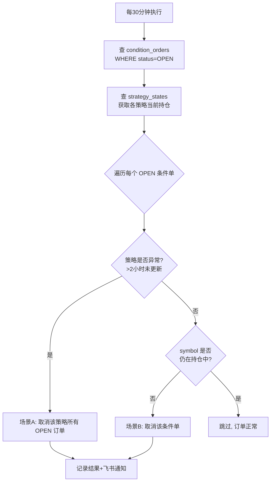

# 孤儿单清理阶段二：实际取消订单

## 1. 背景

当前 `orphan_cleanup` 仅检测策略异常并发通知（阶段一），未实际执行取消操作。用户要求增加实际取消订单功能（阶段二），覆盖两个场景：

| 场景 | 说明 | 示例 |
|------|------|------|
| **A. 策略崩溃** | 策略容器异常，>2小时未更新状态 | 容器OOM退出，持仓订单无人管理 |
| **B. 持仓已平仓但条件单未取消** | 策略正常运行，但平仓后条件单未取消 | 平仓后止损单/止盈单仍挂在服务器上 |

## 2. 方案设计

### 2.1 核心思路

引入 `condition_orders` 数据库表，持久化记录所有策略创建的条件单，独立于 `strategy_states`（持仓状态）。这样即使平仓后 symbol 从持仓中移除，条件单记录仍可追溯用于清理。

```
策略创建条件单  →  写入 condition_orders 表（status=OPEN）
                    ↓
平仓后移除 position  →  condition_orders 表仍保留记录
                    ↓
orphan_cleanup 每30分钟：
  查询 condition_orders 中 status=OPEN 的记录
  对比 strategy_states 当前持仓
  不在持仓中  →  取消该订单，status→CANCELED
  策略异常    →  取消该策略所有 OPEN 订单，status→CANCELED
```

### 2.2 数据表设计

```sql
CREATE TABLE IF NOT EXISTS condition_orders (
    id SERIAL PRIMARY KEY,
    strategy_name VARCHAR(50) NOT NULL,  -- btc_eth / hrs / new_coin
    symbol VARCHAR(20) NOT NULL,          -- BTCUSDT
    algo_id BIGINT,                       -- 条件单 ID（HRS/新币用）
    order_id BIGINT,                      -- 普通订单 ID（BTC_ETH用）
    order_type VARCHAR(20) NOT NULL,      -- STOP_LOSS / TAKE_PROFIT / ENTRY
    status VARCHAR(20) NOT NULL DEFAULT 'OPEN', -- OPEN / CANCELED / EXECUTED
    created_at TIMESTAMP NOT NULL DEFAULT NOW(),
    updated_at TIMESTAMP NOT NULL DEFAULT NOW()
);
CREATE INDEX IF NOT EXISTS idx_co_status ON condition_orders(status);
CREATE INDEX IF NOT EXISTS idx_co_strategy ON condition_orders(strategy_name);
```

### 2.3 清理逻辑



### 2.4 各策略订单类型

| 策略 | 条件单类型 | 存储字段 | 取消 API |
|------|-----------|---------|---------|
| **btc_eth** | 普通限价单（stop_loss/tp1/tp2） | `order_id` | `cancel_order(symbol, order_id)` |
| **hrs** | 条件单（sl/tp1/tp2） | `algo_id` | `cancel_algo_order(symbol, algo_id)` |
| **new_coin** | 条件单（sl/tp1/tp2） | `algo_id` | `cancel_algo_order(symbol, algo_id)` |

## 3. 修改文件清单

| 文件 | 操作 | 说明 |
|------|------|------|
| `shared/condition_orders.py` | **新建** | 提供 `record_condition_order()`、`get_open_orders()`、`mark_canceled()` 等函数 |
| `strategies/btc_eth/strategy.py` | **修改** | 创建止损/止盈时调用 `record_condition_order()` |
| `strategies/hrs/position_manager.py` | **修改** | 添加条件单时调用 `record_condition_order()` |
| `strategies/new_coin/executor.py` | **修改** | 创建条件单时调用 `record_condition_order()` |
| `ai_tuner/cleanup/orphan_cleanup.py` | **修改** | 全面重写，实现场景A+B的实际取消逻辑 |
| `ai_tuner/main.py` | **修改** | 将 BinanceClient 传递给 OrphanCleanupJob |
| `ai_tuner/config.yaml` | **修改** | 添加清理相关配置项 |

## 4. 详细设计

### 4.1 shared/condition_orders.py

```python
"""
共享模块：条件单持久化记录
各策略创建条件单时调用，orphan_cleanup 用于清理孤儿单。
"""

async def ensure_table(db):
    """创建 condition_orders 表（幂等）"""
    ...

async def record_condition_order(db, strategy_name, symbol, algo_id=None, order_id=None, order_type="STOP_LOSS"):
    """记录条件单到数据库，status=OPEN"""
    ...

async def mark_order_canceled(db, order_id, algo_id=None):
    """标记条件单为已取消，status=CANCELED"""
    ...

async def mark_order_executed(db, order_id, algo_id=None):
    """标记条件单为已执行，status=EXECUTED"""
    ...

async def get_open_orders(db, strategy_name=None):
    """查询所有或指定策略的 OPEN 条件单"""
    ...
```

### 4.2 orphan_cleanup.py 核心逻辑

```python
class OrphanCleanupJob:
    def __init__(self, db, binance_client, notification_client, stale_hours=2):
        self.db = db
        self.binance = binance_client
        self.notifier = notification_client
        self.stale_hours = stale_hours

    async def execute(self):
        results = {"canceled": [], "failed": []}
        
        # 1. 查询所有 OPEN 条件单
        open_orders = await get_open_orders(self.db)
        if not open_orders:
            return
        
        # 2. 查询各策略当前持仓
        strategy_states = await self._query_strategy_states()
        now = datetime.utcnow()
        
        for order in open_orders:
            sn = order["strategy_name"]
            symbol = order["symbol"]
            state = strategy_states.get(sn)
            
            # 场景A: 策略崩溃（>2小时未更新）
            if not state or self._is_stale(state, now):
                ok = await self._cancel_order(order)
                ...
            
            # 场景B: 正常策略但 symbol 不在持仓中
            elif symbol not in state.get("symbols", set()):
                ok = await self._cancel_order(order)
                ...
        
        # 3. 飞书通知
        if results["canceled"] or results["failed"]:
            await self._notify(results)
```

### 4.3 幂等性与安全保护

| 保护措施 | 实现方式 |
|---------|---------|
| **避免重复取消** | 每次取消后更新 `status=CANCELED`，查询时只查 `status=OPEN` |
| **误操作保护** | 场景A：仅取消超过 `stale_hours` 未更新的策略；场景B：仅取消持仓中已不存在的 symbol |
| **重试机制** | 取消失败时重试 1 次，间隔 5 秒 |
| **异常隔离** | 单个订单取消失败不影响其他订单 |
| **日志记录** | 详细记录每次取消操作的内容和结果 |

### 4.4 飞书通知格式

```
⚠️ 孤儿条件单自动清理完成

本次清理：5 个条件单
├─ ✅ 成功取消：3 个
│  ├─ HRS | BTCUSDT | tp1 (algoId: 123456) | 场景B: 持仓已平仓
│  ├─ BTC_ETH | ETHUSDT | sl (orderId: 789012) | 场景B: 持仓已平仓
│  └─ NEW_COIN | SOLUSDT | tp2 (algoId: 345678) | 场景A: 策略崩溃
└─ ❌ 失败：2 个
   └─ HRS | XRPUSDT | sl (algoId: 901234) | 错误: 订单不存在

处理时间：2026-07-17 12:30:00 UTC
```

## 5. 风险与注意事项

1. **condition_orders 表记录完整性**：各策略创建条件单时必须同步写入，漏写会导致孤儿单无法被检测。需在代码审查中重点检查。
2. **高并发写入**：策略创建条件单时可能多线程并发，使用 `INSERT ... ON CONFLICT` 处理重复。
3. **BinanceClient 共享**：ai-tuner 中已有 BinanceClient 实例，直接复用。
4. **取消失败处理**：订单已被执行（algoId 无效）时，Binance 返回错误，更新 status=EXECUTED。

---

**版本：** v2.0
**日期：** 2026-07-17