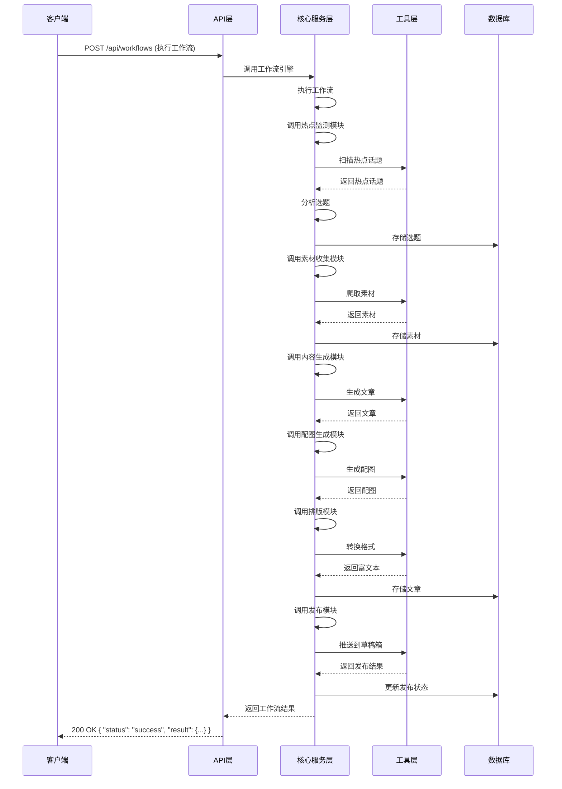
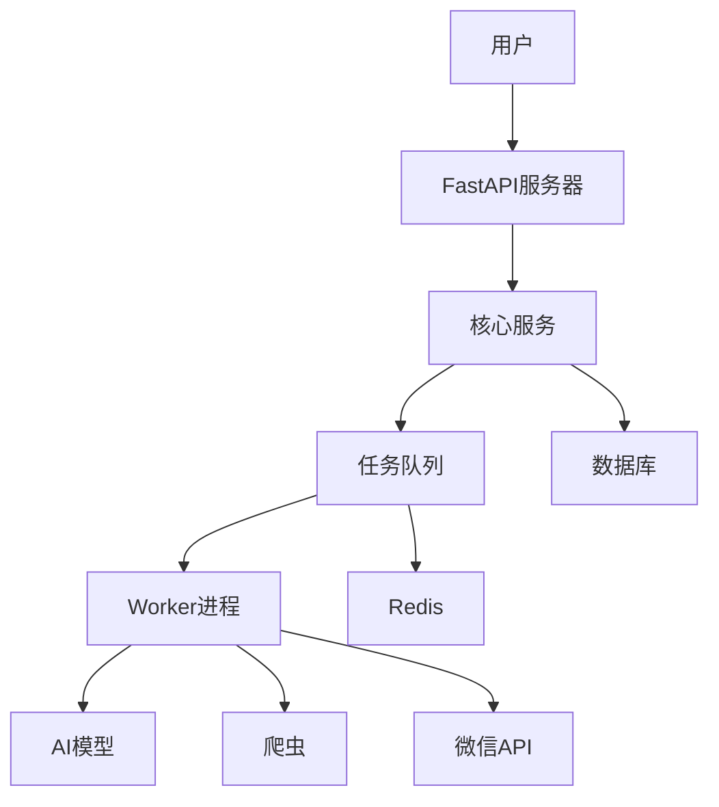
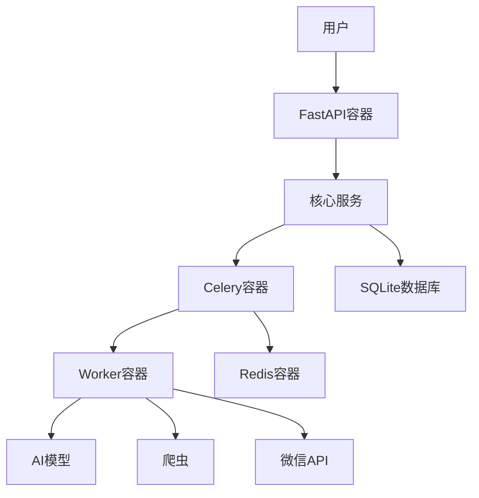

# AI编辑部系统架构设计文档

## 1. 架构概述

AI编辑部系统采用模块化、分层架构设计，确保系统的可扩展性、可维护性和可靠性。系统分为API层、核心服务层、工具层和数据层四个主要层次，各层次之间通过明确的接口进行通信。

## 2. 系统分层

### 2.1 API层

API层是系统的外部接口，负责处理HTTP请求和响应，提供RESTful API接口给客户端使用。

- **主要组件**：
  - FastAPI应用实例
  - API路由和端点
  - 请求验证和响应格式化

- **核心功能**：
  - 接收和处理客户端请求
  - 验证请求参数
  - 调用核心服务层的功能
  - 返回格式化的响应

### 2.2 核心服务层

核心服务层包含系统的核心业务逻辑，负责协调各个模块的工作，实现系统的主要功能。

- **主要组件**：
  - 任务管理器
  - 工作流引擎
  - 事件总线
  - 各个功能模块（热点监测、素材收集、内容生成等）

- **核心功能**：
  - 管理和协调系统任务
  - 执行工作流程
  - 处理系统事件
  - 实现各个功能模块的业务逻辑

### 2.3 工具层

工具层提供各种工具和服务，支持核心服务层的功能实现。

- **主要组件**：
  - AI模型客户端（MiniMax API、Stable Diffusion）
  - 爬虫工具
  - 图像处理工具
  - 排版工具（wenyan-cli）
  - 微信API客户端

- **核心功能**：
  - 调用AI模型生成内容和图像
  - 爬取和解析网页内容
  - 处理和优化图像
  - 转换Markdown为富文本
  - 与微信API交互

### 2.4 数据层

数据层负责数据的存储和管理，为系统提供数据持久化能力。

- **主要组件**：
  - SQLite数据库
  - 数据库连接和管理
  - 数据模型

- **核心功能**：
  - 存储系统配置
  - 存储任务状态
  - 存储用户数据
  - 提供数据查询和修改功能

## 3. 模块设计

### 3.1 热点监测模块

**功能**：自动扫描各大平台的热点话题，分析并选择适合的选题。

**子模块**：
- 热点扫描器：扫描各大平台的热点话题
- 选题分析器：分析热点话题，选择适合的选题
- 热度评估器：评估选题的热度，优先选择高热度的话题

**接口**：
- `scan_hotspots()`：扫描热点话题
- `analyze_topics()`：分析话题，选择适合的选题
- `evaluate_heat()`：评估选题热度

### 3.2 素材收集模块

**功能**：根据选题自动爬取相关素材和信息，整合形成完整的内容库。

**子模块**：
- 爬虫引擎：爬取网页内容
- 素材解析器：解析和提取有用的信息
- 素材整合器：整合来自不同来源的素材

**接口**：
- `crawl_materials()`：爬取素材
- `parse_materials()`：解析素材
- `integrate_materials()`：整合素材

### 3.3 内容生成模块

**功能**：基于收集的素材，自动撰写完整的文章。

**子模块**：
- 内容规划器：规划文章结构
- AI写作引擎：调用MiniMax API生成文章内容
- 内容优化器：优化生成的内容

**接口**：
- `plan_content()`：规划文章结构
- `generate_article()`：生成文章内容
- `optimize_content()`：优化文章内容

### 3.4 配图生成模块

**功能**：使用Stable Diffusion等模型自动生成与文章内容相关的配图。

**子模块**：
- 图像生成器：调用Stable Diffusion生成图像
- 图像优化器：优化生成的图像
- 图像选择器：选择最适合的图像

**接口**：
- `generate_images()`：生成图像
- `optimize_images()`：优化图像
- `select_images()`：选择图像

### 3.5 排版模块

**功能**：将生成的文章从Markdown格式转换为公众号支持的富文本格式，美化文章格式。

**子模块**：
- Markdown转换器：将Markdown转换为富文本
- 排版美化器：美化文章格式
- 图片处理器：处理文章中的图片

**接口**：
- `convert_markdown()`：转换Markdown为富文本
- `beautify_layout()`：美化排版
- `process_images()`：处理图片

### 3.6 发布模块

**功能**：将排版后的文章推送到公众号草稿箱，支持定时发布。

**子模块**：
- 微信API客户端：与微信API交互
- 发布管理器：管理发布任务
- 状态监控器：监控发布状态

**接口**：
- `push_to_draft()`：推送到草稿箱
- `schedule_publish()`：设置定时发布
- `monitor_status()`：监控发布状态

### 3.7 任务管理模块

**功能**：管理和监控系统的各种任务，确保任务的正常执行。

**子模块**：
- 任务创建器：创建任务
- 任务调度器：调度任务执行
- 任务监控器：监控任务状态

**接口**：
- `create_task()`：创建任务
- `schedule_task()`：调度任务
- `monitor_task()`：监控任务状态

### 3.8 工作流引擎模块

**功能**：执行系统的工作流程，协调各个模块的工作。

**子模块**：
- 工作流定义器：定义工作流程
- 工作流执行器：执行工作流程
- 工作流监控器：监控工作流状态

**接口**：
- `define_workflow()`：定义工作流程
- `execute_workflow()`：执行工作流程
- `monitor_workflow()`：监控工作流状态

## 4. 数据模型

### 4.1 任务模型

```python
class Task:
    id: int  # 任务ID
    name: str  # 任务名称
    type: str  # 任务类型（选题、素材收集、内容生成等）
    status: str  # 任务状态（待执行、执行中、完成、失败）
    parameters: dict  # 任务参数
    result: dict  # 任务结果
    created_at: datetime  # 创建时间
    updated_at: datetime  # 更新时间
```

### 4.2 选题模型

```python
class Topic:
    id: int  # 选题ID
    title: str  # 选题标题
    description: str  # 选题描述
   热度: float  # 热度值
    source: str  # 来源
    created_at: datetime  # 创建时间
    updated_at: datetime  # 更新时间
```

### 4.3 素材模型

```python
class Material:
    id: int  # 素材ID
    topic_id: int  # 关联的选题ID
    type: str  # 素材类型（文本、图片、视频等）
    content: str  # 素材内容
    source: str  # 来源
    created_at: datetime  # 创建时间
```

### 4.4 文章模型

```python
class Article:
    id: int  # 文章ID
    topic_id: int  # 关联的选题ID
    title: str  # 文章标题
    content: str  # 文章内容（Markdown格式）
    rich_content: str  # 富文本内容
    status: str  # 文章状态（草稿、已发布等）
    created_at: datetime  # 创建时间
    updated_at: datetime  # 更新时间
```

### 4.5 图片模型

```python
class Image:
    id: int  # 图片ID
    article_id: int  # 关联的文章ID
    url: str  # 图片URL
    path: str  # 本地路径
    description: str  # 图片描述
    created_at: datetime  # 创建时间
```

### 4.6 配置模型

```python
class Config:
    id: int  # 配置ID
    key: str  # 配置键
    value: str  # 配置值
    description: str  # 配置描述
    updated_at: datetime  # 更新时间
```

## 5. 数据流

### 5.1 选题流程

1. 热点监测模块扫描各大平台的热点话题
2. 选题分析器分析热点话题，选择适合的选题
3. 热度评估器评估选题的热度，优先选择高热度的话题
4. 选题数据存储到数据库

### 5.2 内容创作流程

1. 素材收集模块根据选题爬取相关素材
2. 素材解析器解析和提取有用的信息
3. 素材整合器整合来自不同来源的素材
4. 内容规划器规划文章结构
5. AI写作引擎调用MiniMax API生成文章内容
6. 内容优化器优化生成的内容
7. 配图生成模块生成与文章内容相关的配图
8. 排版模块将Markdown转换为富文本，美化文章格式
9. 文章和图片数据存储到数据库

### 5.3 发布流程

1. 发布模块将排版后的文章推送到公众号草稿箱
2. 状态监控器监控发布状态
3. 如有定时发布任务，发布管理器在指定时间执行发布
4. 发布状态更新到数据库

## 6. API设计

### 6.1 任务管理API

- **GET /api/tasks**：获取任务列表
- **GET /api/tasks/{task_id}**：获取任务详情
- **POST /api/tasks**：创建任务
- **PUT /api/tasks/{task_id}**：更新任务
- **DELETE /api/tasks/{task_id}**：删除任务

### 6.2 选题管理API

- **GET /api/topics**：获取选题列表
- **GET /api/topics/{topic_id}**：获取选题详情
- **POST /api/topics**：创建选题
- **PUT /api/topics/{topic_id}**：更新选题
- **DELETE /api/topics/{topic_id}**：删除选题

### 6.3 文章管理API

- **GET /api/articles**：获取文章列表
- **GET /api/articles/{article_id}**：获取文章详情
- **POST /api/articles**：创建文章
- **PUT /api/articles/{article_id}**：更新文章
- **DELETE /api/articles/{article_id}**：删除文章

### 6.4 发布管理API

- **POST /api/publish/draft**：推送到草稿箱
- **POST /api/publish/schedule**：设置定时发布
- **GET /api/publish/status/{publish_id}**：获取发布状态

### 6.5 工作流API

- **POST /api/workflows**：执行工作流
- **GET /api/workflows/{workflow_id}**：获取工作流状态

## 7. 系统交互图



## 8. 部署架构

### 8.1 本地部署架构



### 8.2 容器化部署架构



## 9. 扩展性设计

### 9.1 模块扩展

系统采用模块化设计，支持通过添加新模块来扩展功能。新模块只需实现相应的接口，即可集成到系统中。

### 9.2 插件系统

系统支持插件系统，允许通过插件扩展功能。插件可以是新的AI模型、新的爬虫源、新的排版风格等。

### 9.3 API扩展

系统的API设计支持扩展，新的功能可以通过添加新的API端点来实现。

## 10. 监控与日志

### 10.1 监控系统

系统集成监控系统，监控各模块的运行状态，及时发现和解决问题。

### 10.2 日志系统

系统实现完善的日志系统，记录系统的运行日志，便于问题排查和系统优化。

## 11. 结论

AI编辑部系统采用模块化、分层架构设计，确保系统的可扩展性、可维护性和可靠性。系统的核心功能包括热点监测与选题、素材收集与整理、AI内容生成、配图生成、排版与格式转换、公众号发布等。

通过合理的架构设计和模块划分，系统能够实现公众号运营的全流程自动化，提高运营效率，降低运营成本。同时，系统的扩展性设计使其能够适应不同用户的需求，支持功能的持续扩展和优化。