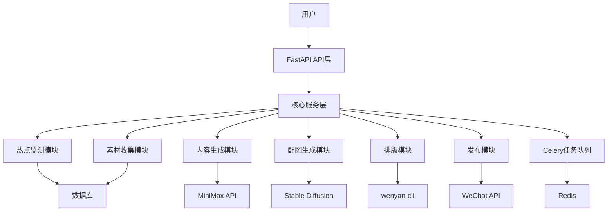

# AI编辑部系统技术栈文档

## 1. 技术栈概述

AI编辑部系统采用现代技术栈，包括后端框架、数据库、异步任务处理、AI模型和工具库等。本文档详细说明系统的技术选型、版本要求和依赖关系。

## 2. 核心技术栈

### 2.1 后端框架

- **FastAPI**：现代化的Python后端框架，提供自动API文档生成、类型提示和高性能
  - 版本：^0.104.1
  - 优势：快速、异步、类型安全、自动API文档
  - 用途：构建RESTful API接口，处理HTTP请求和响应

### 2.2 数据库

- **SQLite**：轻量级嵌入式数据库，无需单独服务器
  - 版本：3.35.0+
  - 优势：轻量级、零配置、易于部署
  - 用途：存储系统配置、任务状态、用户数据等

### 2.3 异步任务处理

- **Celery**：分布式任务队列，用于处理异步任务
  - 版本：^5.3.4
  - 优势：可靠的任务队列、支持定时任务、分布式处理
  - 用途：处理耗时的任务，如内容生成、素材收集等

- **Redis**：内存数据库，用于Celery的消息代理
  - 版本：^7.0+
  - 优势：高性能、支持多种数据结构、持久化
  - 用途：作为Celery的消息代理，存储任务队列

### 2.4 AI模型

- **MiniMax API**：文本生成API，用于文章撰写
  - 版本：最新版
  - 优势：性价比高、响应速度快、生成质量好
  - 用途：生成文章内容、标题、摘要等

- **Stable Diffusion**：图像生成模型，用于配图生成
  - 版本：SDXL 1.0+
  - 优势：高质量图像生成、支持多种风格
  - 用途：生成与文章内容相关的配图

### 2.5 工具库

- **wenyan-cli**：Markdown转富文本工具，用于公众号排版
  - 版本：^1.0.0+
  - 优势：支持Markdown转公众号富文本、代码高亮
  - 用途：将生成的Markdown文章转换为公众号支持的格式

- **Requests**：HTTP客户端库，用于API调用
  - 版本：^2.31.0
  - 优势：简单易用、功能强大
  - 用途：调用各种API，如微信API、MiniMax API等

- **BeautifulSoup4**：HTML解析库，用于爬虫
  - 版本：^4.12.2
  - 优势：灵活的HTML解析、支持多种解析器
  - 用途：爬取和解析网页内容，收集素材

- **Pillow**：图像处理库，用于图片优化
  - 版本：^10.1.0
  - 优势：功能丰富、支持多种图像格式
  - 用途：处理和优化生成的图片

### 2.6 微信API

- **WeChat Official Account API**：微信公众号API，用于文章发布
  - 版本：最新版
  - 优势：官方API、功能完善
  - 用途：将文章推送到公众号草稿箱

## 3. 技术选型理由

### 3.1 后端框架选择

选择FastAPI作为后端框架的理由：
- **高性能**：基于Starlette和Pydantic，支持异步处理，性能优异
- **自动API文档**：自动生成OpenAPI文档，方便前端调用
- **类型提示**：基于Python类型提示，减少错误，提高代码质量
- **现代特性**：支持Python 3.7+的新特性，代码简洁易读

### 3.2 数据库选择

选择SQLite作为数据库的理由：
- **轻量级**：无需单独安装数据库服务器，适合个人部署
- **零配置**：开箱即用，无需复杂的配置
- **易于部署**：可以打包为单个文件，方便分发
- **足够用**：对于个人公众号运营来说，数据量不大，SQLite完全够用

### 3.3 异步任务处理选择

选择Celery + Redis的理由：
- **可靠的任务队列**：确保任务不会丢失，支持任务重试
- **分布式处理**：可以在多个机器上运行，提高处理能力
- **定时任务**：支持设置定时任务，如每天自动发布文章
- **监控和管理**：提供任务监控和管理工具

### 3.4 AI模型选择

选择MiniMax API的理由：
- **性价比高**：相比其他API，价格更实惠
- **响应速度快**：生成文本的速度较快，适合实时应用
- **生成质量好**：生成的文本质量较高，符合公众号的要求

选择Stable Diffusion的理由：
- **高质量图像**：可以生成高质量的图像，适合作为公众号配图
- **本地部署**：可以在本地GPU上运行，避免API调用费用
- **可定制性**：可以根据需要调整模型参数，生成不同风格的图像

### 3.5 工具库选择

选择wenyan-cli的理由：
- **专门为公众号设计**：支持将Markdown转换为公众号支持的富文本格式
- **功能完善**：支持代码高亮、图片处理等功能
- **易于集成**：可以通过命令行调用，方便集成到系统中

选择其他工具库的理由：
- **Requests**：Python中最流行的HTTP客户端库，功能强大，使用简单
- **BeautifulSoup4**：Python中最流行的HTML解析库，适合爬虫任务
- **Pillow**：Python中最流行的图像处理库，功能丰富，支持多种图像格式

## 4. 依赖管理

系统使用pip进行依赖管理，通过requirements.txt文件声明所有依赖。

### 4.1 核心依赖

```
fastapi==0.104.1
uvicorn==0.24.0
sqlite3==3.35.0
celery==5.3.4
redis==5.0.1
requests==2.31.0
beautifulsoup4==4.12.2
pillow==10.1.0
python-dotenv==1.0.0
```

### 4.2 开发依赖

```
pytest==7.4.3
black==23.11.0
flake8==6.1.0
mypy==1.7.1
```

## 5. 部署方案

### 5.1 本地部署

- **硬件要求**：
  - CPU：至少4核
  - 内存：至少8GB
  - GPU：可选，用于Stable Diffusion图像生成
  - 存储空间：至少50GB

- **软件要求**：
  - 操作系统：Ubuntu 20.04+或Windows 10+
  - Python：3.8+
  - Redis：7.0+

### 5.2 容器化部署

- **Docker**：可以使用Docker容器化部署，方便管理和扩展
- **Docker Compose**：使用Docker Compose管理多个容器，如应用服务、Redis等

### 5.3 云部署

- **云服务器**：可以部署在阿里云、腾讯云等云服务提供商的服务器上
- **Serverless**：可以使用Serverless服务，如AWS Lambda、阿里云函数计算等

## 6. 技术架构图



## 7. 技术风险评估

### 7.1 潜在风险

- **AI模型依赖**：系统依赖MiniMax API和Stable Diffusion，这些服务的稳定性和可用性可能影响系统运行
- **微信API限制**：微信API有调用频率限制，可能影响发布频率
- **性能瓶颈**：内容生成和图像生成可能成为性能瓶颈，特别是在处理多个任务时
- **数据安全**：需要妥善保护微信公众号的AppID和AppSecret等敏感信息

### 7.2 风险缓解措施

- **API调用容错**：实现API调用的重试机制，处理API调用失败的情况
- **任务队列管理**：合理配置Celery任务队列，避免任务堆积
- **资源管理**：优化AI模型的使用，减少资源消耗
- **安全措施**：使用环境变量存储敏感信息，避免硬编码

## 8. 结论

AI编辑部系统的技术栈选择充分考虑了系统的功能需求、性能要求和部署便捷性。FastAPI提供了高性能的API服务，SQLite简化了部署，Celery和Redis实现了可靠的异步任务处理，MiniMax API和Stable Diffusion提供了高质量的内容生成能力。

通过合理的技术选型和架构设计，系统能够实现公众号运营的全流程自动化，提高运营效率，降低运营成本。同时，系统的模块化设计和插件系统使其具有良好的可扩展性和可维护性，能够适应不同用户的需求。