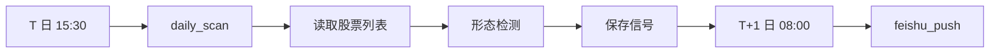

# 设计文档索引

本文档汇总 stockfilter 项目的系统设计和技术架构文档。

## 📁 目录结构

```
designs/
├── README.md                    # 本文档
├── 技术架构文档_V2.1.md         # 完整技术架构
└── K 线数据获取监控指南.md      # 数据同步监控
```

## 📋 文档列表

| 文档名称 | 说明 | 版本 |
|---------|------|------|
| [技术架构文档 V2.1.md](技术架构文档_V2.1.md) | 系统完整技术架构设计 | V1.0 |
| [K 线数据获取监控指南.md](K%20线数据获取监控指南.md) | K 线数据获取监控与进度追踪 | V1.0 |

## 🏗️ 架构概览

### 系统分层

```
┌─────────────────────────────────────┐
│           应用层                     │
│  daily_scan  │  feishu_push  │ ... │
├─────────────────────────────────────┤
│           服务层                     │
│ PatternDetector │ DatabaseManager  │
├─────────────────────────────────────┤
│           数据层                     │
│  PostgreSQL  │   CSV 文件   │ API  │
└─────────────────────────────────────┘
```

### 核心模块

- **PatternDetector**: 形态检测核心（四步流程）
- **BacktesterWithRules_AB**: 回测引擎（方案 A+B）
- **DatabaseManager**: 数据库管理（PostgreSQL）
- **DataSourceManager**: 数据源管理（AKShare/AData/Baostock）
- **StockList**: 股票池管理（过滤规则）

### 数据流程



## 🔧 技术栈

| 层级 | 技术选型 |
|------|---------|
| **开发语言** | Python 3.9+ |
| **数据存储** | PostgreSQL + CSV |
| **数据源** | AKShare、AData、Baostock |
| **部署方式** | Docker 容器化 |
| **通知系统** | 飞书机器人 Webhook |
| **定时任务** | systemd timer / crontab |

## 📊 核心设计原则

### 规划驱动
- 先结构后代码
- 接口先行，实现后补
- 模块化设计，职责分离

### 数据驱动
- 数据与代码分离
- 数据库设计规范化
- 数据质量可追溯

### 自动化优先
- 能自动不手动
- 能配置不硬编码
- 能监控不被动

## 🔗 相关资源

- [需求文档](../requirements/项目需求与迭代.md) - 完整业务需求
- [部署指南](../deployment/服务器部署指南.md) - Docker 部署指南
- [配置方案](../schemes/V2.1%20最终配置方案.md) - V2.1 配置方案
- [Vibe Coding 文档架构技能](../Vibe_Coding 文档架构技能.md) - 文档架构规范

---

**最后更新**: 2026-04-12  
**版本**: V1.0  
**维护者**: StockFilter Team
